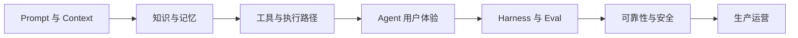

# AI Agent 产品经理实战

一套面向 AI 产品经理的开源中文教程，讨论怎样选择 Agent 场景、定义产品边界，并把模型能力建设成可控、可验证、可持续运营的产品。

[开始阅读](book1/00-introduction.md) · [完整目录](#完整目录) · [参与贡献](CONTRIBUTING.md) · [写作规范](STYLE_GUIDE.md)

> 当前状态：两套教程正文已经完整收录，内容仍在持续校订。仓库优先维护 Markdown 书稿和可编辑图示，暂不维护网站、PDF 或配套工程脚手架。

## 两部分内容，各自解决什么问题

仓库包含两套相互独立、可以分别阅读的内容。

| 内容 | 定位 | 适合解决的问题 | 入口 |
| --- | --- | --- | --- |
| `book1` | 入门篇：Agent 产品方法 | 什么需求值得 Agent 化，产品应该做成什么，怎样评估、上线和运营？ | [入门篇说明](book1/README.md) |
| `book2` | 进阶篇：Agent 产品工程 | 怎样设计 Context、知识、记忆、工具、执行路径、用户控制、评估和生产系统？ | [进阶篇说明](book2/README.md) |

入门篇沿产品生命周期展开，适合系统建立 Agent 产品方法。进阶篇按工程责任组织，适合在实际项目中按问题查阅。两部分可以独立阅读，进阶篇不要求读者先读完入门篇。

## 入门篇：Agent 产品方法

入门篇从机会识别推进到产品定义、评估上线和规模化经营，重点回答四组问题：

1. 什么问题值得 Agent 化？
2. 产品边界、自主等级和人工介入点怎样定义？
3. 怎样证明 Agent 有效、可靠且成本可接受？
4. 上线后怎样运营、迭代并组织跨职能协作？

书稿以客户服务与事务办理 Agent、企业知识与办公 Agent 两条案例线展开。完整章节、案例和写作约定见 [book1/README.md](book1/README.md)。

## 进阶篇：Agent 产品工程

进阶篇沿着 Agent 从理解目标到进入生产的工程链路展开：



现有专题包括：

- Prompt 与 Context Engineering
- Retrieval / Knowledge Engineering
- Memory Engineering
- Tool Loop Engineering
- Graph Engineering
- Agent Experience Engineering
- Harness + Eval Engineering
- Reliability Engineering
- Safety Engineering
- Production Engineering

各专题的顺序、适用场景和阅读路径见 [book2/README.md](book2/README.md)。

## 完整目录

### 入门篇

| 章节 | 核心问题 |
| --- | --- |
| [引言](book1/00-introduction.md) | 为什么 Agent 产品需要独立的产品方法？ |
| [1. AI Agent 产品入门](book1/01-ai-agent-product-basics.md) | 用户需要的是一次回答，还是一个可验证的结果？ |
| [2. 机会识别与场景选择](book1/02-opportunity-and-scenario-selection.md) | 什么需求真正值得 Agent 化？ |
| [3. 用户研究与任务建模](book1/03-user-research-and-task-modeling.md) | 怎样把需求还原成真实任务？ |
| [4. Agent 产品定义](book1/04-agent-product-definition.md) | 怎样定义 MVP、自主等级和人工介入边界？ |
| [5. 交互、信任与控制权](book1/05-interaction-trust-and-control.md) | 怎样让用户理解、控制并接管 Agent？ |
| [6. 从产品需求到能力方案](book1/06-from-requirements-to-capabilities.md) | 怎样把产品要求映射为模型、知识、工具和工作流？ |
| [7. Agent 评估体系](book1/07-agent-evaluation.md) | 怎样证明产品有效，而不只是演示效果好？ |
| [8. 可靠性、安全与成本](book1/08-reliability-safety-and-cost.md) | 怎样管理错误行动、权限、隐私和单位经济性？ |
| [9. 上线、运营与持续迭代](book1/09-launch-operations-and-iteration.md) | 怎样从真实失败和用户反馈中持续改进？ |
| [10. 产品路线图与组织协作](book1/10-roadmap-and-collaboration.md) | 何时扩展能力，团队怎样共同负责结果？ |
| [后记](book1/11-afterword.md) | 做 Agent 产品需要长期坚持哪些判断？ |

### 进阶篇

| 章节 | 核心问题 |
| --- | --- |
| [引言](book2/00-introduction.md) | 产品经理为什么需要理解 Agent 产品工程？ |
| [1. Prompt 与 Context Engineering](book2/01-prompt-and-context-engineering.md) | 模型每一步应该看到什么？ |
| [2. Retrieval / Knowledge Engineering](book2/02-retrieval-and-knowledge-engineering.md) | 什么材料可以成为当前判断的依据？ |
| [3. Memory Engineering](book2/03-memory-engineering.md) | 什么信息应该被记住、更新或遗忘？ |
| [4. Tool Loop Engineering](book2/04-tool-loop-engineering.md) | Agent 怎样行动、观察、继续和停止？ |
| [5. Graph Engineering](book2/05-graph-engineering.md) | 怎样把状态和路径变成可恢复机制？ |
| [6. Agent Experience Engineering](book2/06-agent-experience-engineering.md) | 用户怎样委托、理解和接管长任务？ |
| [7. Harness + Eval Engineering](book2/07-harness-and-eval-engineering.md) | 怎样把质量判断变成发布证据？ |
| [8. Reliability Engineering](book2/08-reliability-engineering.md) | 系统怎样在失败后仍然保持业务正确？ |
| [9. Safety Engineering](book2/09-safety-engineering.md) | 怎样限制 Agent 做出不可接受的行动？ |
| [10. Production Engineering](book2/10-production-engineering.md) | 怎样把版本、发布、观测和运营接成闭环？ |
| [后记](book2/11-afterword.md) | 怎样避免把 Engineering 变成术语清单？ |

## 适合谁阅读

- 希望转向 AI 产品或 Agent 产品的产品经理；
- 正在负责 Agent 产品，希望补齐工程判断能力的从业者；
- 需要与设计、算法、工程、安全和运营团队共同交付 Agent 的项目负责人。

默认读者理解基本产品工作，不要求具备模型训练或 Agent 编程经验。本书也不提供需要搭建环境的完整工程代码。

## 共同的方法

两部分内容都围绕三个坐标展开：

- **目标**：用户真正要完成什么结果？
- **行动**：Agent 可以依据什么信息，采取哪些动作？
- **证据**：团队怎样证明结果正确、风险可控，并能在失败后恢复？

技术术语只有在帮助产品经理做出选择时才进入正文。模型生成的文字、系统记录的状态和外部世界的事实会被明确区分。

## 项目结构

```text
.
├── .github/              # Issue 与 Pull Request 模板
├── assets/               # 全局封面等静态资源
├── book1/                # 入门篇正文与插图
├── book2/                # 进阶篇正文与插图
├── diagrams/
│   ├── source/           # 可编辑 Mermaid 源文件
│   └── svg/              # 正文使用的生成结果
├── references/           # 来源与迁移记录
├── scripts/              # 图示同步与内容检查工具
├── CONTRIBUTING.md       # 贡献流程
├── STYLE_GUIDE.md        # 写作和排版规范
├── README.md
├── LICENSE-CONTENT       # 书稿与插图许可证
└── LICENSE-CODE          # 脚本与图源许可证
```

## 本地检查

阅读和修改正文不需要安装依赖。提交前运行：

```bash
node scripts/check-content.mjs
```

修改 Mermaid 图示后，使用项目锁定的 Mermaid CLI 版本重新生成 SVG：

```bash
node scripts/sync-diagrams.mjs render
```

生成图示需要 `pnpm` 和本地 Chrome 或 Chromium，详细说明见 [diagrams/README.md](diagrams/README.md)。

## 参与贡献

欢迎通过 Issue 或 Pull Request：

- 报告错别字、失效链接和事实错误；
- 提出更清楚的表达建议；
- 补充有代表性的 Agent 产品案例；
- 讨论方法、模板和检查表的适用边界。

提交建议时，请说明对应篇章、章节和问题背景。完整流程和内容边界见 [CONTRIBUTING.md](CONTRIBUTING.md)。

## 来源与致谢

本项目是在原书基础上，面向 AI 产品经理重新组织和改写的独立书稿。内容来源与处理方式见[原书内容迁移表](references/source-migration-map.md)，本仓库不是原作者官方仓库。

原书《[深入理解 AI Agent：设计原理与工程实践](https://github.com/bojieli/ai-agent-book)》由[李博杰（Bojie Li）](https://github.com/bojieli)创作，原项目维护于 [`bojieli/ai-agent-book`](https://github.com/bojieli/ai-agent-book)。

## 许可证

本项目采用双许可证：

- 书稿、说明文档和插图采用 [CC BY-SA 4.0](LICENSE-CONTENT)；
- `scripts/`、`diagrams/source/` 及其他代码采用 [Apache License 2.0](LICENSE-CODE)。

使用或改编内容时请保留本项目与原书署名，并注明修改。原书内容仍受其原始许可证约束，来源与改写关系见[原书内容迁移表](references/source-migration-map.md)，保留署名见 [NOTICE](NOTICE)。
