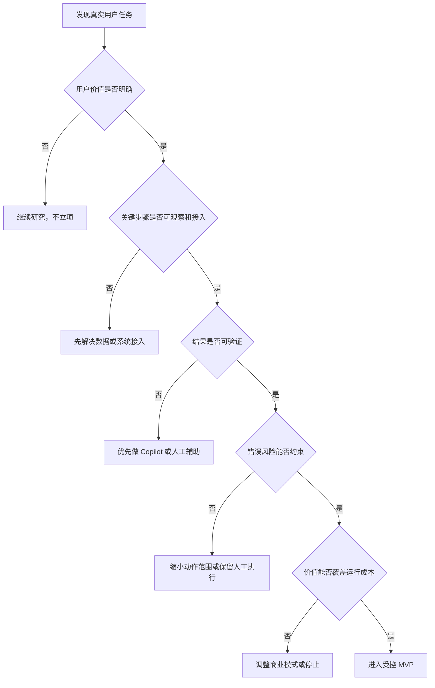

# 机会识别与场景选择

一家公司准备做企业 Agent，收集到的第一批需求通常很热闹：自动回复客户、生成周报、分析合同、安排会议、提交报销、预测销售、操作所有内部系统。每个需求单独看都像机会，放在一起却无法决定先做什么。

这时最危险的做法，是从模型最擅长什么出发寻找场景。团队很容易做出一段令人惊叹的演示，却在上线前才发现用户并不经常需要、关键系统无法接入、成功无法判断，或者一次错误就足以让业务停止使用。

场景选择不是给创意排人气，而是在寻找一个交集：用户确实在意，Agent 相比现有方式有明显优势，结果能够验证，风险和成本又能被当前团队承受。

本章提供一套筛选方法，并用它为两条主案例确定首发场景。

## 不要先问“AI 能做什么”

发现机会时，更有效的起点是观察用户为了完成一件事，正在付出哪些不合理的成本。

有人为了取消一项服务，在网页、电话和邮件之间来回切换；有人为了回答一个内部问题，搜索多个知识库，再去群里确认最新口径；有人每周把相同数据从几个系统复制到表格。这些摩擦未必都需要 Agent，但它们至少来自真实任务，而不是技术想象。

产品经理可以先问四个问题：

1. 用户真正想完成的结果是什么？
2. 现有方式在哪一步最费时间、最容易出错或最依赖经验？
3. 为什么现有搜索、表单、工作流或人工服务没有解决？
4. 如果问题被解决，谁会感受到价值，价值能否被观察？

只有第四个问题有明确答案，机会才可能进入下一轮判断。用户说“希望更智能”不是价值证据；处理时间下降、事务成功率上升、重复咨询减少或员工找到可信答案的时间缩短，才是可以继续验证的价值假设。

## 八个筛选维度

一个场景是否适合 Agent，不能只看技术可行性。下面八个维度共同决定它是否值得进入首期产品。

### 1. 用户痛点

用户是否真的为这个问题投入时间、金钱或情绪？痛点最好能够从行为中观察，例如反复联系人工客服、频繁询问同一问题、在多个系统之间手工搬运信息。

口头兴趣只能说明题目听起来不错，不能说明用户会改变行为。产品经理需要寻找现有替代方案及其成本，因为用户已经付出的成本往往比态度表达更可信。

### 2. 任务频率

高频任务更容易积累数据、形成习惯，也更容易验证改进。但频率不能脱离价值单独判断。一年只发生一次的重大合规审查，仍可能比每天生成一段无关紧要的文案更值得投入。

### 3. 任务价值

任务完成后为用户或业务带来什么结果？价值可以是节省时间、减少损失、提高收入、降低等待、改善体验或释放稀缺专家资源。

不要把“生成了多少内容”直接当成价值。内容只有被使用并推动了后续结果，才进入业务价值链。

### 4. 步骤可观察性

Agent 是否能够获得做决定所需的信息，并看到每一步执行后的反馈？如果关键过程发生在线下、封闭系统或无法读取的第三方渠道，Agent 就无法可靠调整路径。

可观察并不等于收集一切。产品只应获取完成任务所必需、且用户有权授权的信息。

### 5. 结果可验证性

怎样知道任务真的完成？越能通过系统状态、交易记录、引用来源、审批结果或其他外部证据验证，越适合交给 Agent。

如果结果只能靠“看起来不错”判断，产品仍然可以做 Copilot，但不适合在高风险环境中直接自主执行。

### 6. 环境可接入性

Agent 能否合法、稳定地读取信息和执行动作？已有 API、标准文件接口或稳定业务系统，通常比依赖易变网页和人工绕行更适合作为首发环境。

接得上不只是一项工程判断。还要检查授权方式、服务条款、权限粒度、速率限制和故障责任。

### 7. 错误代价

如果 Agent 做错，损失有多大，能否被用户及时发现，能否撤销？错误代价包括金钱、隐私、合规、品牌、业务中断和用户信任。

高风险不等于永远不能做，但它意味着首期需要缩小自主范围、增加验证与人工节点。若团队还没有这些保障，场景就不应成为首发选择。

### 8. 单位经济性

完成一次任务需要多少模型调用、工具费用、人工审核和失败重试？这些成本与节省的人工、带来的收入或改善的留存相比是否合理？

早期无法得到精确数字很正常，但必须建立可验证假设。完全不讨论单位经济性，只讨论模型效果，会让产品在使用量增加后才暴露不可持续的问题。

## 一条从机会到首发场景的判断路径

八个维度不是一道简单的加法题。某些条件属于门槛，只要不满足就应该暂缓；另一些条件可以通过缩小范围或增加控制措施改善。

这条路径刻意把“模型效果好不好”放在后面。因为即使模型能够演示任务，如果没有价值、接入、验证和风险条件，能力也无法变成可经营的产品。

## 三类不适合作为首发 Agent 的需求

### 目标含糊，而且无法验收

“帮我把公司经营得更好”听起来价值巨大，却没有清楚的结束状态。Agent 不知道应该优化收入、利润、现金流还是员工体验，团队也无法判断一次执行是否成功。

更合理的做法，是把它缩小为一个有证据的任务，例如“根据已确认的销售规则，为本周未跟进的商机生成优先级清单”。

### 低频、低价值，却需要高风险权限

某个内部流程一年只发生几次，每次只节省十分钟，却要求 Agent 获得全量财务写权限。即使技术上可行，价值也无法覆盖安全、审计和维护成本。

这种任务更适合保留人工操作，或只做信息整理和操作建议。

### 关键环境完全不可接入

如果任务的核心步骤发生在无法读取状态、没有稳定接口、也不能获得结果凭证的系统中，Agent 只能猜测流程是否完成。基于屏幕操作的方式有时可以扩大接入范围，但它也会增加页面变化、定位错误和异常恢复成本，不应被当作“已经解决接入”。

## 双案例一：从客服需求中选择受控事务

假设团队收集到四类客服需求：解释政策、自动回复投诉、申请标准退款、处理任意复杂纠纷。

解释政策有明确价值和可信知识来源，但不需要动态执行，先做有来源的问答即可。自动回复投诉可以提升客服效率，更适合作为 Copilot，由客服确认语气和方案。任意复杂纠纷价值很高，却包含谈判、法律、金额和大量不可预见情况，不适合作为首期范围。

“取消订阅或申请规则清楚的标准退款”处于更合适的位置：

- 用户痛点真实，现有过程通常需要搜索入口、填写信息或等待客服；
- 任务边界可以限定到指定服务和指定规则；
- 关键状态可以通过服务商页面、确认邮件或交易记录验证；
- 高风险方案可以在接受前交给用户确认；
- 失败时可以转人工，而不是继续猜测。

因此，客户服务案例的首发场景确定为：**在用户授权后，为指定服务办理取消订阅或标准退款；涉及额外费用、权益损失、非标准协商或身份争议时暂停并请求用户决定。**

首期明确不包含：自主接受补偿方案、代表用户作长期承诺、处理法律争议，以及在没有结果凭证时宣称完成。

## 双案例二：从企业办公需求中选择有来源的知识问答

企业团队提出的需求可能包括：搜索制度、自动写周报、审查合同、提交所有审批、替员工操作各类系统。

跨系统自动执行看起来最像 Agent，却同时要求复杂权限、稳定接入和组织责任划分。合同审查价值高，但需要法律专业判断和严格风险控制。自动写周报容易演示，却未必解决高价值问题。

“有来源的内部知识问答”更适合作为首发场景：

- 员工寻找制度、流程和产品资料的需求高频；
- 企业已经拥有可接入的文档和权限体系；
- 回答可以通过引用原文验证；
- 初期只读，不直接改变业务系统；
- 用户纠错能够形成知识治理信号。

因此，企业知识案例的首发场景确定为：**在继承员工现有权限的前提下，检索已纳入治理范围的内部资料，回答问题并提供可核对来源；证据不足、资料冲突或权限不明时明确停止回答。**

首期明确不包含：绕过权限读取文档、把无来源生成内容写成公司政策、自动发送对外材料，以及直接执行高风险业务写操作。

## 两类首发场景的差异

| 维度 | 客户服务与事务办理 Agent | 企业知识与办公 Agent |
| --- | --- | --- |
| 首发任务 | 取消订阅或标准退款 | 有来源的内部知识问答 |
| 首要价值 | 减少用户办理事务的时间与精力 | 缩短员工获得可信答案的时间 |
| 关键接入 | 外部服务商渠道和状态 | 企业文档、身份和权限系统 |
| 完成证据 | 取消状态、确认邮件或退款记录 | 支持答案的文档片段和来源 |
| 首期风险控制 | 关键方案确认、异常转人工 | 只读、权限继承、证据不足时拒答 |
| 暂不扩展 | 非标准谈判与高风险承诺 | 自动对外发送和业务系统写操作 |

两个场景的自主程度不同。事务 Agent 已经包含受控执行；企业知识 Agent 首期更接近带自主检索的问答产品。它们仍然可以放在同一套方法里比较，因为场景选择的目标不是让产品都达到相同自主等级，而是找到当前价值与风险最匹配的形态。

## 常见误区

### 误区一：选择最惊艳的演示

演示偏爱短时间内可见的能力，真实产品却需要处理权限、异常、失败和重复使用。首发场景应该选择可形成闭环的任务，而不是最适合录视频的任务。

### 误区二：给所有维度算一个总分

评分卡可以帮助团队暴露分歧，但不能代替门槛判断。结果不可验证或错误风险无法控制时，其他维度再高也不能简单相加抵消。

### 误区三：把人工介入视为产品失败

首期保留人工不是不够智能，而是在学习真实边界。关键是记录为什么介入、介入发生在哪里，并让这些数据推动后续改进。

### 误区四：先做通用平台，再等业务接入

没有真实任务，团队无法知道需要哪些信息、动作、权限和评估指标。通用能力应该从多个已验证场景中抽取，而不是在场景之前凭空设计。

## 场景评分卡

对每个候选场景使用 1 至 5 分记录判断，并为每一分写出证据。评分用于比较和讨论，不是自动立项公式。

| 维度 | 需要回答的问题 | 当前证据 | 评分 |
| --- | --- | --- | --- |
| 用户痛点 | 用户正在付出什么成本 | 访谈、行为、工单或流程数据 | 1–5 |
| 任务频率 | 多久发生一次，覆盖多少用户 | 业务数据或抽样记录 | 1–5 |
| 任务价值 | 完成后改善什么结果 | 时间、收入、成本、体验或风险指标 | 1–5 |
| 步骤可观察性 | Agent 能否看到关键状态与反馈 | 系统和数据清单 | 1–5 |
| 结果可验证性 | 哪个外部证据代表成功或失败 | 状态、记录、引用或人工验收 | 1–5 |
| 环境可接入性 | 是否有合法、稳定、可维护的接入方式 | API、文件、身份和权限说明 | 1–5 |
| 错误代价 | 错误是否可发现、可撤销、可恢复 | 风险分析和历史事故 | 1–5 |
| 单位经济性 | 单次价值能否覆盖完整运行成本 | 成本估算和价值假设 | 1–5 |

使用评分卡时，团队还应单独标出三类硬门槛：结果不可验证、关键环境不可接入、风险当前不可控制。任何一项成立，都应该先改变产品形态或缩小范围。

## 本章小结

Agent 机会来自真实任务中的高成本摩擦，不来自技术能力清单。场景选择需要同时判断用户痛点、频率、价值、可观察性、可验证性、可接入性、错误代价和单位经济性。

客户服务案例选择受控的取消订阅或标准退款，企业知识案例选择有来源、继承权限的内部问答。二者都刻意放弃了更宏大的范围，因为首期产品首先要建立可验证闭环。

下一章将把这两个首发场景拆成任务模型。只有理解正常路径、异常路径、参与者和完成证据，团队才能开始定义 Agent 的边界。

## 思考题

1. 为你正在考虑的 Agent 场景找出一个硬门槛。它能通过缩小范围解决吗？
2. 一个高频但每次价值很低的任务，需要满足什么条件才值得自动化？
3. 如果某个任务结果只能由用户主观判断，应该如何改变产品形态？
