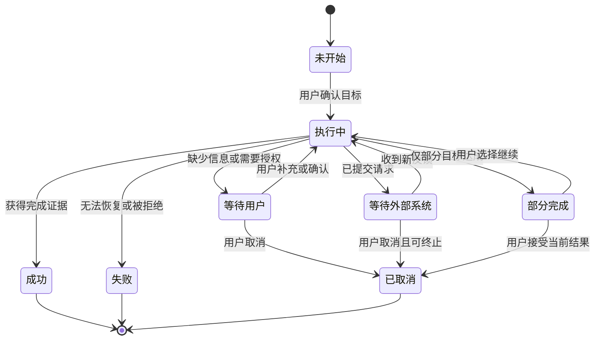
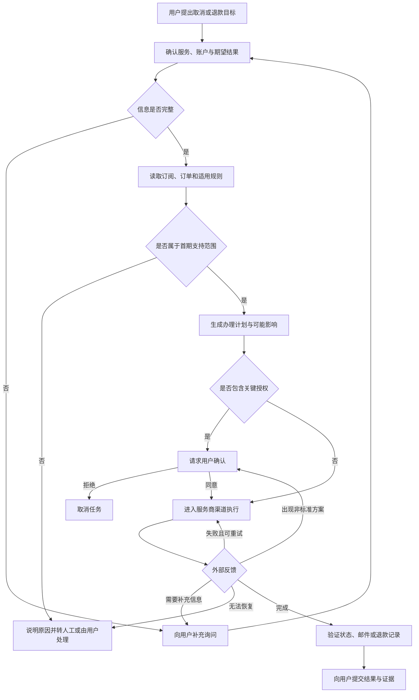
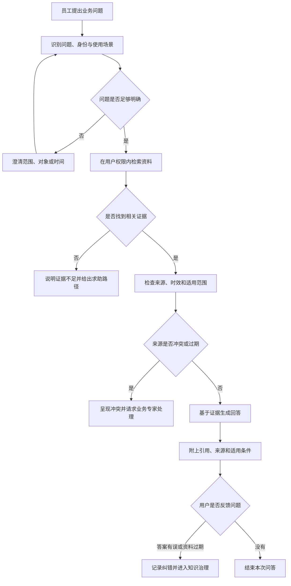

# 用户研究与任务建模

用户说“帮我把退款处理掉”，产品团队很容易立刻想到功能：上传订单、自动填表、调用客服、显示进度。这些功能都可能有用，却没有回答一个更基础的问题：退款这件事在现实中究竟怎样发生，谁会参与，过程可能在哪里改变，什么证据才能说明它已经结束？

传统产品研究经常把注意力放在用户的态度、需求和界面偏好上。Agent 产品还必须研究任务本身。因为 Agent 不只是提供一个页面，它会进入任务过程，替用户做判断和行动。如果团队只理解用户想要什么，却不理解事情怎样完成，就无法定义 Agent 的信息、工具、权限、异常和结束条件。

本章将用户需求转换成任务模型。这个模型会成为后续产品定义、交互设计、能力方案、评估和安全治理的共同底稿。

## 研究对象从“功能”变成“任务”

用户通常用结果描述需求，而不是提供完整流程。“帮我取消订阅”“告诉我公司的差旅政策”都隐藏了大量上下文。

以取消订阅为例，用户可能不知道自己通过哪个渠道订阅，也可能已经错过免费取消日期。他说“直接取消”时，真正关心的可能是不再扣费，而不是立即失去剩余权益。若 Agent 只按字面执行，就可能完成了操作，却损害了用户利益。

企业知识场景也一样。员工问“客户数据能不能导出”，表面上是一个知识问题，背后却可能涉及员工角色、客户合同、数据分类、使用目的和最新政策。产品只优化搜索速度，无法解决答案是否适用于当前用户的问题。

因此，研究不应止于“用户说了什么”，而要追踪：

- 用户希望现实世界发生什么变化；
- 用户当前怎样完成任务；
- 哪些判断依赖经验、规则或临时信息；
- 哪些参与者可以阻止或改变流程；
- 哪一步最容易失败；
- 用户怎样知道任务完成；
- 错误发生后怎样撤销、补救或转交。

这些问题把研究从功能愿望带回真实工作。

## 一份完整的任务模型

任务模型不是一张理想流程图。它需要同时描述正常路径、现实变化和结束状态。至少应包含以下十一个部分。

### 1. 目标

目标描述用户希望得到的结果，而不是系统动作。“提交退款表单”是动作，“在不损失额外权益的前提下停止后续扣费并取回应退金额”才接近目标。

### 2. 触发条件

什么事件让任务开始？可能是用户主动提出请求，也可能是账单到达、知识更新或业务系统发出事件。触发条件决定 Agent 何时可以行动，以及是否需要重新确认用户意图。

### 3. 输入

完成任务需要哪些信息？输入包括用户明确提供的资料，也包括账户状态、订单、企业身份、文档权限和当前时间。每项输入都要标明来源、时效和缺失后的处理方式。

### 4. 参与者

谁会影响任务？除了用户和 Agent，还可能有外部商家、人工客服、审批人、业务专家、身份系统和其他软件。参与者越多，等待、冲突和责任转移越可能发生。

### 5. 步骤

正常情况下，任务会经历哪些阶段？步骤用于建立共同理解，但不能假设每次都严格照此发生。Agent 的价值常常就在于处理步骤之间的变化。

### 6. 决策点

在哪些位置不能只按固定规则向前？例如是否接受商家的挽留方案、两份政策冲突时相信哪一份、资料不足时继续追问还是拒绝回答。

每个决策点都要注明：判断依据是什么，Agent 能否决定，何时必须交给用户或专家。

### 7. 外部工具

Agent 需要读取或改变哪些系统？这里先描述产品能力，不急着指定技术接口。例如“读取订阅状态”“提交退款申请”“检索员工有权访问的制度”，比直接写某个 API 名称更稳定。

### 8. 异常

真实任务如何偏离正常路径？常见异常包括资料缺失、登录失效、权限不足、外部系统无响应、规则冲突、用户改变主意和部分步骤成功。

异常不是上线后的补丁清单，而是任务模型的一部分。

### 9. 人工节点

哪些节点需要用户确认、业务专家判断或人工客服接管？人工节点需要明确触发条件、移交信息和处理后的返回方式，不能只写一句“必要时转人工”。

### 10. 结束状态

任务不只有“成功”和“失败”。还可能等待用户、等待外部系统、部分完成、被用户取消，或者因为风险而主动停止。不同状态对应不同的用户沟通和后续处理。

### 11. 证据

什么外部信息能够证明成功或失败？证据可以是状态字段、确认邮件、交易记录、引用片段、审批编号或人工验收。没有证据，系统无法可靠评估，也无法向用户解释结果。

## 任务状态比对话轮次更重要

聊天界面天然以一问一答组织内容，但真实任务可能持续数分钟、数天甚至更久。用户关闭页面后，任务不一定结束；模型停止输出，也不代表事情已经完成。

产品需要用任务状态管理长流程，而不是把所有进展藏在对话历史里。



这张状态图提供了一个通用起点，但具体产品必须定义每次转换的条件。例如，“收到一封邮件”不一定足以从等待外部系统转为成功，邮件内容可能只是已受理；“工具返回 200”也不一定代表业务完成，它可能只表示请求被服务器接收。

状态必须与业务证据绑定，而不是与模型是否继续说话绑定。

## 如何开展 Agent 任务研究

任务研究最好结合访谈、现场观察和历史记录。三者解决的问题不同。

### 访谈：理解目标和取舍

访谈适合追问用户为什么要完成任务、最担心什么、愿意把哪些判断交给系统。不要只问“你想不想自动化”，而要让用户回忆最近一次真实经历。

可以从以下问题开始：

- 上一次完成这件事是什么时候？
- 从开始到结束，你实际做了什么？
- 哪一步需要等待、查资料或请别人帮忙？
- 当时出现了什么意外？
- 你在哪个节点最不愿意让系统自行决定？
- 最后看到什么，你才确认事情完成？

### 观察：发现用户没有说出的工作

用户会省略已经习惯的细节。例如客服在提交退款前，会下意识检查账户历史；员工回答政策问题时，会先确认文档发布日期，再问同事是否有新通知。这些动作可能没有写进标准流程，却直接影响结果可靠性。

观察的重点不是记录每次点击，而是识别信息来源、判断依据、绕行方式和异常处理。

### 历史记录：理解分布而不是单个故事

工单、搜索日志、审批记录和人工接管原因可以帮助团队判断哪些路径最常见、哪些异常影响最大。使用记录时必须遵守隐私与权限要求，不因研究方便而收集无关敏感数据。

单次访谈能提供深度，历史数据能提供分布。两者结合，才能避免把一个极端案例当成所有用户的正常路径。

## 双案例一：取消订阅或标准退款的任务模型

先沿正常路径看一次事务办理。



这条流程包含几个关键判断。

第一，用户说“取消”不等于目标已经清楚。产品需要确认他最关心的是停止续费、立即终止服务，还是争取退款。不同目标可能对应不同动作和权益影响。

第二，首期范围必须能够被系统判断。例如指定服务、明确订单、符合标准规则。若身份争议、法律纠纷或非标准金额谈判出现，Agent 应停止进入自主路径。

第三，关键授权不是每一步都确认，而是在用户利益可能发生实质变化时确认，例如立即失去剩余权益、接受部分退款或产生额外费用。

第四，完成证据来自服务商，而不是来自 Agent。有效证据可能是订阅状态变为已取消、确认邮件明确生效日期，或支付渠道出现退款记录。

### 事务案例的异常与结束状态

| 情况 | 状态 | Agent 应做什么 | 所需证据 |
| --- | --- | --- | --- |
| 缺少订单或账户信息 | 等待用户 | 说明缺什么以及用途 | 用户补充的信息 |
| 服务商要求重新登录 | 等待用户 | 请求用户完成身份验证 | 登录或授权恢复状态 |
| 出现部分退款方案 | 等待用户 | 展示金额、权益和替代选项 | 用户明确选择 |
| 申请已提交但尚未处理 | 等待外部系统 | 给出预计检查时间并持续跟踪 | 受理编号或状态 |
| 已取消但退款未到账 | 部分完成 | 分开呈现两个子目标 | 取消状态与退款状态 |
| 服务商拒绝且无可用路径 | 失败 | 说明已尝试内容和人工选项 | 拒绝原因或沟通记录 |
| 用户中途改变主意 | 已取消 | 停止尚可取消的动作 | 终止状态与已发生动作 |

## 双案例二：有来源的企业知识问答任务模型

知识问答看起来比退款简单，但可靠答案不只是“检索到一段相似文字”。系统还要判断用户是否有权访问、资料是否有效、多个来源是否冲突，以及证据是否足以支持结论。



这条流程强调三件事。

第一，检索必须继承员工已有权限。Agent 不应因为能够访问一个统一索引，就向用户暴露他原本看不到的文档标题、摘要或内容。

第二，相关不等于可信。产品需要考虑来源类型、发布日期、适用部门和版本。旧政策与新通知冲突时，模型不应自行挑选更像答案的一份。

第三，首期目标是提供有证据的答案，不是自动执行后续业务动作。若员工基于答案准备提交审批，写操作将在后续产品阶段单独定义权限和确认。

### 企业知识案例的异常与结束状态

| 情况 | 状态 | Agent 应做什么 | 所需证据 |
| --- | --- | --- | --- |
| 问题缺少地区、部门或时间范围 | 等待用户 | 请求最少必要澄清 | 用户补充的范围 |
| 没有权限访问可能相关的资料 | 失败或转人工 | 说明权限限制，不暴露受限内容 | 权限系统结果 |
| 没有找到支持答案的资料 | 失败 | 明确说证据不足 | 检索范围和无结果状态 |
| 两份有效资料相互冲突 | 等待专家 | 展示冲突点和各自来源 | 两份来源及版本信息 |
| 找到适用且有效的资料 | 成功 | 回答并附引用与适用条件 | 可访问的文档片段和链接 |
| 用户指出资料已过期 | 部分完成 | 保留本次反馈并进入治理 | 用户反馈及待核查条目 |

## 两种任务模型的差异

| 维度 | 客户服务与事务办理 Agent | 企业知识与办公 Agent |
| --- | --- | --- |
| 主要过程 | 跨渠道执行并跟踪外部结果 | 权限内检索、判断证据并回答 |
| 关键参与者 | 用户、服务商、人工客服、支付渠道 | 员工、文档所有者、业务专家、权限系统 |
| 主要决策点 | 是否属于支持范围、是否接受方案、是否继续重试 | 问题是否明确、来源是否适用、冲突是否需要专家 |
| 不可逆风险 | 权益终止、金额方案、对外承诺 | 敏感信息暴露；首期不执行写操作 |
| 常见等待 | 等待用户授权或服务商处理 | 等待用户澄清或专家解决冲突 |
| 完成证据 | 外部业务状态与交易记录 | 可访问、有效且支持结论的来源 |

事务 Agent 的难点是行动和外部变化，企业知识 Agent 的难点是证据和权限。前者更容易出现“执行到一半”，后者更容易出现“回答看起来合理但没有依据”。这会直接影响后续的产品边界和评估方法。

## 常见误区

### 误区一：把理想流程当成真实任务

流程文档通常只描述正常路径，Agent 上线后却会遇到资料缺失、系统失败、规则冲突和用户改意。没有异常路径的任务模型，只是一张演示脚本。

### 误区二：把界面步骤当成任务步骤

“点击搜索、打开文档、复制答案”描述的是当前界面，不是稳定任务。任务层应该描述“获得适用资料、判断有效性、形成有证据的回答”。界面会变化，任务目标和判断关系更稳定。

### 误区三：用模型停止代替任务完成

模型可能因为工具报错、上下文不足或误判而结束回复。完成必须由业务状态和证据定义。

### 误区四：只写“异常转人工”

转人工需要明确谁接、看到什么、是否能继续原任务，以及处理结果怎样返回 Agent。没有移交契约，用户只会被要求重新解释一遍。

### 误区五：为了自动化删除必要判断

如果现有专家会检查日期、权限或金额，产品不能因为这些判断难以实现就从流程里删掉。难以自动化的关键判断应该成为人工节点，而不是被假装不存在。

## 产品经理模板：Agent 任务模型

为每个候选任务填写以下内容：

```text
任务名称：
目标用户：
用户目标：
触发条件：

必要输入：
- 信息：
- 来源：
- 时效要求：
- 缺失时处理：

参与者：
- 用户：
- 内部角色：
- 外部角色或系统：

正常路径：
1.
2.
3.

关键决策点：
- 决策：
- 判断依据：
- Agent 是否可以决定：
- 需要人工时由谁决定：

所需能力：
- 需要读取的信息：
- 需要执行的动作：

异常路径：
- 资料缺失：
- 权限不足：
- 外部系统失败：
- 规则冲突：
- 用户改变主意：
- 部分成功：

不可逆动作：
人工介入条件：
移交时必须携带的信息：

成功状态：
成功证据：
失败状态：
失败证据：
等待状态：
取消与恢复方式：
```

这份模板不是 PRD 的替代品。它的作用是在写功能之前，让产品、设计、算法、工程、运营和业务专家对“Agent 正在完成什么任务”形成同一理解。

## 本章小结

Agent 产品研究需要同时理解用户和任务。任务模型至少包含目标、触发条件、输入、参与者、步骤、决策点、工具、异常、人工节点、结束状态和证据。

状态管理让产品脱离一问一答的限制；完成证据让团队能够区分真实结果与模型表述；异常和人工节点则把现实世界的不确定性带入产品定义。

下一章将在两条任务模型上进一步划定 MVP、自主等级、允许与禁止的动作，以及每个关键节点的人机责任。

## 思考题

1. 选择一个你熟悉的任务，写出“用户目标”和“系统动作”，检查两者是否被混为一谈。
2. 找出一个正常流程文档没有记录、但熟练员工一定会处理的异常。
3. 为一个长任务定义“部分完成”。此时产品应该向用户呈现什么，允许用户做什么？
