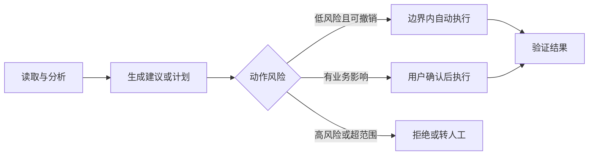

# Agent 产品定义

场景值得做，不等于产品已经被定义。团队常在这一刻跳进功能讨论：要不要接更多工具，要不要做长期记忆，要不要允许自动执行。结果是每个人都在说同一个 Agent，脑中却是不同的产品。

Agent 产品定义的核心，是把一个有价值的任务变成一份责任契约：系统对什么结果负责，可以看到什么，可以做什么，哪些决定必须交还给人，以及什么情况下应该停止。

这份契约比功能列表更重要。功能描述系统“拥有某项能力”，边界则说明系统“何时有权使用这项能力”。

## 从一句愿景变成可交付边界

“打造一个能替用户处理所有客服事务的 Agent”是一句愿景，不是可交付定义。它没有说明支持哪些服务、处理哪些事务、怎样授权、遇到争议怎么办，也没有说明如何判断完成。

一份可执行的产品定义至少需要七个要素：

1. **目标用户**：谁在什么情境下使用；
2. **核心任务**：产品首期对哪个结果负责；
3. **期望结果**：用户和业务分别获得什么价值；
4. **允许行动**：Agent 可以读取、生成、提交或修改什么；
5. **禁止行动**：即使用户提出，也不能由当前产品执行什么；
6. **前置条件**：身份、权限、资料和系统接入需要满足什么；
7. **完成证据**：什么外部状态证明任务结束。

非目标同样重要。它不是为了降低愿景，而是为了让团队知道首期产品在哪些位置必须说“不知道”“不能做”或“需要人工”。没有非目标，所有失败都会在上线后被解释成“模型还需要优化”。

## 自主等级应按动作配置

第 1 章介绍了五级自主性。现在把它变成产品配置，而不是一句“支持 Human-in-the-loop”。

| 等级 | 系统行为 | 用户角色 | 适合动作 |
| --- | --- | --- | --- |
| 1. 只回答 | 提供信息 | 自行判断和执行 | 政策解释、状态查询 |
| 2. 给建议 | 提供方案与依据 | 选择方案并执行 | 文案建议、风险提示 |
| 3. 生成计划 | 拆解步骤和影响 | 批准或修改计划 | 多步骤但尚未执行的任务 |
| 4. 确认后执行 | 获批后完成一组动作 | 在关键节点授权 | 标准退款、材料发送 |
| 5. 边界内自主执行 | 在授权范围内动态行动 | 只处理异常和高风险决定 | 可恢复、可验证的重复任务 |

这五级不是整款产品只能选一个。更合理的做法，是按动作风险配置。

例如，事务 Agent 可以自动读取订单、判断标准规则并填写草稿；提交取消申请前展示影响；若服务商提出部分退款，则再次请求用户决定。企业知识 Agent 可以自动检索有权限的资料并生成回答，但对外发送材料和写入业务系统仍需确认。



自主等级应随着证据变化。团队可以在真实评估显示某类动作稳定、可恢复、风险可控后提高自主性，也可以在外部规则变化后临时降低。它是产品策略，不是一次性的技术参数。

## Human-in-the-loop 不是一个按钮

“关键步骤需要人工确认”听起来正确，却仍然太模糊。产品必须明确四件事。

第一，**为什么触发**。是金额超过阈值、信息不足、规则冲突、系统置信不足，还是动作不可逆？不同原因需要向用户展示不同信息。

第二，**谁来决定**。普通用户、主管、业务专家和安全人员拥有不同权限。把所有问题都交给当前操作用户，可能构成越权。

第三，**决定者看到什么**。确认页面必须展示要执行的动作、关键参数、预期影响、证据和替代选项，而不是只显示“是否继续”。

第四，**确认后发生什么**。授权应绑定具体动作、参数和有效期。用户同意退款 100 元，不代表授权 Agent 接受任何金额方案。

真正的人机协作是一份清楚的决策接口，而不是系统不确定时弹出一个通用确认框。

## 双案例一：事务 Agent 的受控 MVP

### 产品定义

- **目标用户**：希望减少办理取消订阅或标准退款所需时间与沟通成本的个人用户。
- **核心任务**：在指定服务范围内，读取必要账户与订单信息，办理取消订阅或符合明确规则的退款，并持续跟踪到获得结果证据。
- **期望结果**：停止后续扣费，或取得符合标准规则的退款；用户能看到当前状态和外部证据。
- **允许行动**：读取用户授权的订单与订阅状态；查询适用规则；生成办理计划；填写并提交标准申请；追踪状态；向用户请求补充信息。
- **禁止行动**：未经确认接受部分退款或权益损失方案；作出长期对外承诺；处理身份争议、法律纠纷或首期未支持的服务；在无证据时宣称成功。
- **前置条件**：用户完成身份和账户授权；目标服务在支持清单内；订单和规则可读取；关键动作存在结果状态。
- **完成证据**：服务商取消状态、确认邮件、受理编号和退款记录中的适用项。

### 自主边界

事务 Agent 对信息读取和标准规则判断采用等级 5，对计划采用等级 3，对无额外损失的标准申请采用等级 4。出现部分退款、额外费用、权益立即终止或身份争议时，降为人工决定。

这个 MVP 不承诺“解决所有投诉”。它承诺的是在有限服务和规则内完成闭环，并在超出范围时带着已有信息平滑移交。

## 双案例二：企业知识 Agent 的可信 MVP

### 产品定义

- **目标用户**：需要快速获得内部制度、流程和产品资料的员工。
- **核心任务**：在继承员工现有权限的前提下，从纳入治理的资料中形成有来源的回答。
- **期望结果**：员工更快获得可以核对、知道适用范围的答案；组织能够发现知识缺口和过期内容。
- **允许行动**：理解问题；澄清范围；在权限内检索；比较来源；生成回答与引用；记录用户纠错。
- **禁止行动**：暴露受限资料；在没有来源时生成公司政策；自动对外发送材料；直接修改业务系统；自行裁决有效来源之间的重大冲突。
- **前置条件**：员工身份可信；文档已经进入治理范围；权限信息可用；来源具有版本和基本元数据。
- **完成证据**：回答所引用的可访问文档片段、链接、版本和适用条件。

### 自主边界

企业知识 Agent 对问题澄清和权限内检索采用等级 5，对回答生成采用等级 2：它可以主动组织答案，但用户仍需要结合引用判断和使用。首期没有业务写操作，因此不进入等级 4 或 5 的执行范围。

这里有一个重要结论：名字里有 Agent，不代表所有价值都来自自动执行。自主检索、证据判断和动态澄清本身也可以构成 Agent 行为，但产品必须诚实说明它交付的是可信辅助，而不是替员工承担最终业务责任。

## 两类 MVP 的责任差异

| 维度 | 客户服务与事务办理 Agent | 企业知识与办公 Agent |
| --- | --- | --- |
| 首期承诺 | 完成受控事务并取得结果证据 | 提供权限内、有来源的答案 |
| 默认自主性 | 读取与标准判断自主，关键执行需确认 | 检索自主，回答供用户判断 |
| 最重要的非目标 | 非标准谈判与高风险承诺 | 无来源政策和业务写操作 |
| 人工决定者 | 用户或人工客服 | 员工、文档所有者或业务专家 |
| 边界变化依据 | 事务成功率、风险事件、服务覆盖 | 引用支持率、权限事件、知识质量 |

## 常见误区

### 误区一：用能力清单代替产品定义

“支持搜索、记忆和工具调用”没有说明用户得到什么，也没有说明这些能力何时可以行动。能力只有进入任务和边界后才成为产品。

### 误区二：把拒绝和转人工视为不完整

明确拒绝超范围任务，是产品可靠性的一部分。真正不完整的是系统既没有能力完成，也没有能力识别自己不该继续。

### 误区三：全产品使用同一个自主等级

读取公开资料和发送客户邮件的风险完全不同。统一等级要么限制了低风险价值，要么放大了高风险事故。

### 误区四：确认越多越安全

过多确认会让用户习惯性点击同意，反而失去风险识别。确认应集中在后果显著、参数具体且用户能够判断的节点。

## 产品经理工具：Agent 产品定义画布

```text
产品名称：
目标用户：
使用情境：
核心任务：
用户价值：
业务价值：

首期支持范围：
首期非目标：

必要信息：
- 可读取：
- 禁止读取：
- 时效要求：

动作清单：
- 动作：
- 风险等级：
- 自主等级：
- 确认人：
- 完成证据：

人工介入：
- 触发条件：
- 决定者：
- 展示信息：
- 移交内容：

成功状态：
失败与停止条件：
首期指标：
```

画布完成后，团队应该能够用一句话说清产品承诺，也能够列出它不会做什么。如果非目标写不出来，通常说明范围仍然没有真正收敛。

## 本章小结

Agent 产品定义是一份责任契约。它同时明确目标用户、核心任务、期望结果、允许行动、禁止行动、前置条件和完成证据。

自主性应按动作风险配置，人工介入要定义触发原因、决定者、可见信息和授权范围。MVP 的成熟不是看它能处理多少情况，而是看它是否能在支持范围内形成闭环，并在边界外可靠停止。

下一章将进入用户体验：当 Agent 需要等待、授权、失败或被接管时，产品怎样让用户持续理解并掌握控制权。

## 思考题

1. 为同一个 Agent 列出三个不同风险的动作，并分别设置自主等级。
2. 找出一个看似必要、实际无法帮助用户判断的确认步骤，应该怎样重写？
3. 如果产品只能写出支持范围，写不出非目标，最可能缺少哪类研究？
