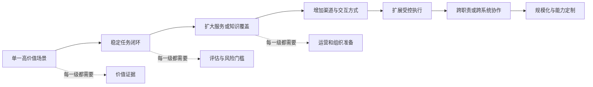
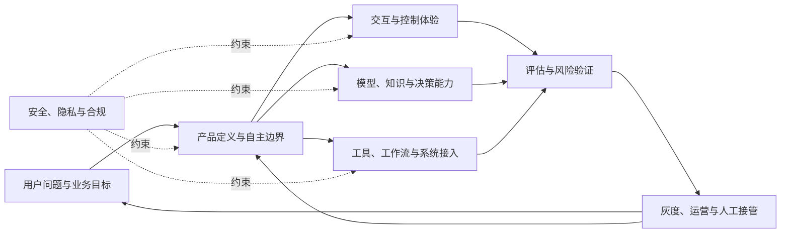

# 产品路线图与组织协作

Agent 产品路线图很容易变成技术名词清单：下一季度上语音，再做 Computer Use，然后拆成多 Agent，最后训练自己的模型。这样的路线图看似前沿，却没有说明用户问题是否已经变化，也没有说明复杂度能否带来可验证收益。

能力扩展应该由已验证瓶颈驱动。只有当当前产品已经证明价值，失败又明确指向某项能力缺口时，新增技术才有产品理由。

与此同时，Agent 产品跨越模型、数据、工具、交互、业务规则、安全和运营。它不可能由一个“AI 团队”独立完成。路线图必须同时描述能力演进和组织责任。

## 路线图从证据出发

每个路线图项目都应回答五个问题：

1. 当前哪个用户问题没有被解决？
2. 哪些真实任务或评估证明这是主要瓶颈？
3. 新能力将改善什么结果？
4. 它会新增什么风险、成本和组织负担？
5. 什么指标或停止条件决定继续、调整或退出？

技术热度、竞品发布和模型更新可以触发研究，却不能单独成为开发优先级。路线图应按用户价值、证据强度、风险承受能力和组织准备度排序。



这不是规定所有产品都必须走到最后。对很多企业知识产品，稳定、可信、低成本的问答可能已经是最优形态。

## 何时扩展语音和 Computer Use

### 语音

语音适合用户无法方便操作屏幕、任务本身依赖沟通，或输入速度明显限制体验的场景。它的主要收益是降低输入负担和支持实时协作。

新增风险包括识别错误、多人环境中的隐私、确认内容难以复核、延迟和通话成本。高风险动作不能因为界面变成语音就降低确认标准，必要时应把关键参数同步到可阅读界面。

采用前应验证：用户是否真的在适合语音的情境使用，任务完成是否提升，误识别是否可被发现和纠正，额外成本是否可承受。

### Computer Use

Computer Use 让 Agent 操作没有合适接口的图形界面，能够扩大系统覆盖。它适合短期无法获得 API、页面相对稳定、动作可观察且有结果验证的场景。

新增风险包括页面变化、视觉定位错误、弹窗和登录状态异常。它不应被当作稳定 API 的等价替代。关键动作仍需参数校验和结果验证，页面无法确认时要安全停止。

采用前应证明：未接入系统确实是主要瓶颈，操作成功率达到任务门槛，页面变化可监控，并有低风险降级路径。

## 何时采用多 Agent

任务复杂并不是充分理由。多 Agent 至少应满足以下一种条件：

- 不同职责必须使用不同权限或隔离信息；
- 子任务可以并行，并各自产生新的外部证据；
- 不同阶段需要独立评估和责任边界；
- 单一上下文无法可靠容纳任务，但可以通过明确交付物移交。

若多个 Agent 只是阅读同一材料、使用同一工具并重复发表意见，收益往往无法覆盖交接、延迟和成本。

产品需求还要定义协作产物，而不是只定义角色名称。例如“研究 Agent 把带来源的证据表交给写作 Agent”，比“研究员与作家协作”更可测试。

采用多 Agent 前需要对比单 Agent 基线，验证任务成功、风险隔离或总耗时确实改善，并计算完整成本。

## 何时考虑模型定制

大多数 Agent 产品应先改进任务定义、上下文、知识、工具、工作流和评估。模型定制只有在以下条件同时接近成立时才值得进入路线图：

- 产品场景和输出协议已经稳定；
- 拥有数量和质量足够、授权清楚的数据；
- 当前失败被证明确实来自模型能力，而不是外围系统；
- 目标行为能够稳定评估；
- 推理成本、延迟、私有部署或特殊能力带来的收益足够大；
- 团队能够承担训练、评估、发布和持续维护。

若目标只是更新事实，优先使用知识库；若目标是快速调整规则，优先使用 Prompt、工作流或 Skill；若工具返回含糊，先修工具。训练不应成为修复所有产品问题的最后借口。

## 双案例一：客户服务与事务办理 Agent 的演进

事务 Agent 的路线图从少量服务的标准取消和退款开始。

第一阶段证明受控事务闭环：目标识别、关键授权、外部执行和结果验证稳定。第二阶段扩大服务覆盖，但仍保持相同任务类型。第三阶段增加邮件或语音渠道，解决用户沟通和外部等待。第四阶段才考虑 Computer Use 覆盖没有接口的服务。

当电话、网页、规则核查和异常处理需要独立权限、可以并行等待并产生各自证据时，团队才评估多 Agent。若大量稳定场景仍受模型判断成本或特定工具协议限制，并积累了高质量数据，再研究模型定制。

每次扩展都必须重新评估金钱、承诺、身份和在途任务风险，不能把旧场景的成功率直接外推。

## 双案例二：企业知识与办公 Agent 的演进

企业知识 Agent 从权限内、有来源的问答开始。第一阶段提升资料覆盖、权限同步和引用支持。第二阶段扩展到基于证据生成内部材料，仍由员工确认。第三阶段接入审批和办公系统，增加受控写操作。

语音只在一线、移动或无屏场景被证实有价值时加入。Computer Use 只用于暂时没有稳定接口的系统。法律、财务等专业域若必须隔离权限、知识和评估，可以形成独立 Agent，但需要清楚的输入输出和责任人。

模型定制只有在术语、格式或特定判断成为稳定瓶颈后考虑；知识时效和权限问题继续由治理系统解决。

## 跨职能协作：每个角色对什么负责

### 产品经理

定义用户问题、范围、自主边界、指标、路线图和跨团队决策，不把技术组件当作需求。

### 设计

设计目标澄清、计划、状态、授权、证据、失败恢复和接管体验，确保用户理解并保有控制权。

### 算法与模型团队

负责模型、Prompt、检索和决策能力，解释能力边界，并通过评估证明改动。

### 工程与平台团队

负责任务状态、工具、工作流、系统接入、可靠性、版本和回滚，让 Agent 的判断能够安全落地。

### 数据与评估团队

建立评估集、指标口径、线上数据质量和实验方法，帮助团队区分真实提升与波动。

### 安全、隐私与合规

定义权限、数据使用、审计、风险门槛和事故响应。其工作应在产品定义阶段开始，而不是上线前签字。

### 运营与业务专家

提供真实任务、规则和异常知识，处理人工接管与知识治理，并把线上变化反馈给产品。



共同交付物比会议数量更重要。任务模型、产品定义画布、能力方案、评估集、风险清单和运营报告让不同角色围绕同一对象协作。

## 常见误区

### 误区一：用技术名词安排季度

“Q3 多 Agent”没有用户问题、成功指标和退出条件，不是一项可管理的路线图。

### 误区二：先建平台，再寻找场景

没有多个已验证场景，团队无法判断哪些能力真正通用。平台应从重复出现的需求中抽取。

### 误区三：产品经理只负责界面和 PRD

Agent 的自主边界、完成证据、评估和风险都是产品定义，不能全部交给技术团队决定。

### 误区四：模型团队为最终效果单独负责

知识过期、工具错误、确认不清和人工接管缓慢都可能让产品失败。最终结果是跨职能系统责任。

## 产品经理模板：能力路线图项目

```text
路线图项目：
目标用户与未解决问题：
现有证据：
当前瓶颈：

拟增加能力：
为什么现有方案不足：
预期用户与业务收益：
新增风险：
新增运行与组织成本：

涉及角色与负责人：
依赖的任务、数据、权限和系统：
离线评估：
灰度指标：
风险护栏：
继续条件：
退出或降级条件：
```

## 本章小结

Agent 产品路线图应由用户价值和已验证瓶颈驱动，而不是追逐能力名称。语音、Computer Use、多 Agent 和模型定制都需要明确采用条件、收益、风险和验证指标。

产品、设计、算法、工程、数据、安全、运营与业务专家共同对最终结果负责。清晰的任务模型、边界、评估和运营交付物，是组织协作的接口。

## 思考题

1. 你当前路线图中的一项技术能力，解决了哪个已被证实的用户瓶颈？
2. 如果采用多 Agent，新增的信息或权限隔离是什么？
3. 哪类产品失败最容易被错误地归因于模型团队？
