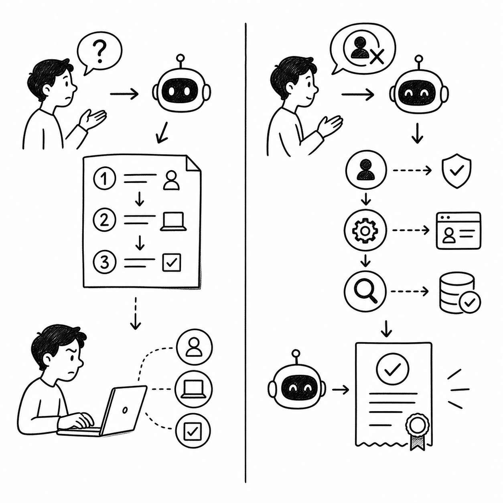
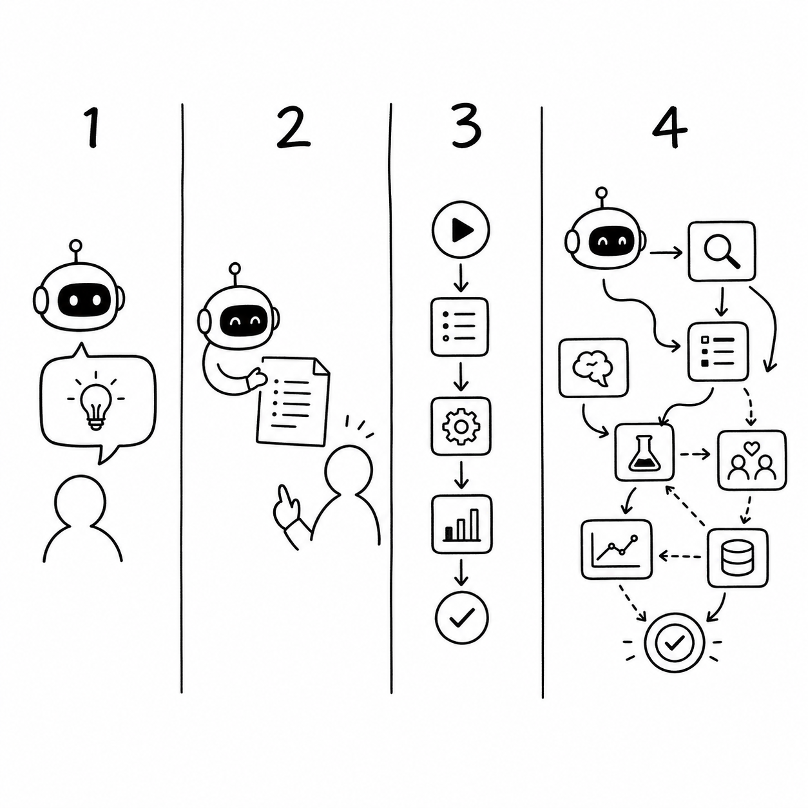

# AI Agent 产品入门

用户说“帮我取消这个订阅”时，他想要的不是一段取消教程，而是订阅真的被取消；员工问“这份合同能不能发给客户”时，他想要的也不只是搜索结果，而是基于公司规则、合同内容和客户状态得到一个可信的判断。

这正是 Agent 产品与普通对话产品的分界线。前者要对一个目标持续负责，后者通常只对当前这轮输出负责。

对产品经理来说，这个区别比“用了哪个模型”重要得多。模型可以生成自然语言，也可以调用工具，但一个产品是否应该被称为 Agent，取决于它是否围绕用户目标形成了完整闭环：理解目标，判断下一步，采取行动，读取结果，再决定是继续、求助还是结束。

本章先建立一张产品地图。读完后，你应该能够判断一个需求需要的是聊天机器人、Copilot、工作流，还是 Agent；也应该能够解释，为什么自主性增加会同时放大价值和风险。

## 用户要的是回答，还是结果

*图：左侧产品交付操作说明，用户仍需自行完成任务；右侧 Agent 持续行动并以外部证据确认结果。*

先看两个看起来很像的请求。

第一个请求是：“告诉我怎样取消某项订阅。”产品找到帮助文档，整理成三步操作，任务就结束了。它交付的是信息。

第二个请求是：“帮我取消这项订阅。”产品需要确认用户身份，找到对应账户，进入服务商渠道，处理可能出现的挽留方案，必要时向用户确认，最后验证订阅是否真的失效。它交付的是现实世界中的结果。

两者都可能使用大语言模型，也都可能有漂亮的对话界面，但它们不是同一种产品。第二个请求包含三个第一种产品不必承担的问题：

- **过程不完全确定**：服务商可能要求补充信息，也可能临时改变页面或规则。
- **行动会产生后果**：点击确认后，订阅权益、账单或数据可能发生变化。
- **完成需要证据**：Agent 说“已经取消”不算完成，服务商返回的状态或确认邮件才算。

因此，Agent 产品的核心不是“会聊天”，而是**在不确定环境中，围绕目标持续做出判断和行动，并用外部反馈确认结果**。

[查看 Mermaid 源码](../diagrams/source/book1-01-ai-agent-product-basics-01.mmd)

这张图里最容易被忽略的是“读取环境反馈”。没有反馈，产品只能按照预设步骤播放一遍；有了反馈，它才能发现登录失效、资料缺失、检索无结果或执行被拒绝，并调整下一步。这也是 Agent 与普通自动化流程最本质的差异之一。

## 四种产品形态不是高低排名

*图：四种产品形态分别交付回答、辅助产物、确定流程结果和动态任务结果。*

聊天机器人、Copilot、工作流和 Agent 经常被当成技术演进的四个阶段，仿佛产品越靠后越先进。这个前提是错的。它们对应的是不同的用户问题和风险结构，没有天然的高低之分。

### 聊天机器人：交付一次回答

聊天机器人接收用户输入并生成回复，常见于咨询、解释和开放式交流。它的主要责任是让当前回答有用、清楚、尽量准确。

如果用户只需要理解一项政策，能够基于可信资料给出有来源的回答，往往已经足够。强行让它自动修改订单，反而会引入不必要的权限和风险。

### Copilot：让用户保持主导

Copilot 为用户提供建议、草稿或下一步操作，但最终判断和执行仍由用户完成。它适合结果需要专业判断、用户希望逐步控制，或者产品暂时无法承担执行责任的场景。

例如，企业办公助手可以起草一封客户邮件、标出可能涉及保密信息的段落，再由员工决定是否发送。产品提高了效率，却没有越过用户的最终控制权。

### 工作流：按确定路径自动执行

工作流把已知步骤和规则固化下来。只要输入满足条件，系统就沿预定路径运行。它适合规则稳定、异常有限、结果容易验证的任务。

工作流并不“低级”。对于金额退款、权限审批、财务记账等高风险步骤，确定性往往比灵活性更重要。成熟的 Agent 产品通常会把稳定步骤交给工作流，只把真正需要理解和判断的部分交给模型。

### Agent：在边界内动态决定路径

Agent 接受的是目标，而不是一条完整操作指令。它根据当前信息选择下一步，在获得新反馈后调整计划，并在达到完成标准、触发人工介入或无法继续时结束。

这种形态适合路径无法事先穷举，但目标、行动范围和完成证据仍然可以定义的任务。如果连“什么算完成”都无法说清，自主执行通常只会把模糊需求放大成不可控结果。

| 产品形态 | 系统主要交付 | 谁决定下一步 | 谁执行关键动作 | 适合的问题 |
| --- | --- | --- | --- | --- |
| 聊天机器人 | 一次回答 | 用户 | 用户 | 解释、咨询、开放交流 |
| Copilot | 建议或草稿 | 用户 | 用户 | 创作、分析、专业辅助 |
| 工作流 | 确定流程的结果 | 预设规则 | 系统 | 稳定、可枚举的流程 |
| Agent | 动态任务的结果 | 系统与用户共同决定 | 系统在授权边界内执行 | 路径变化但目标可验证的任务 |

产品经理真正要做的，不是把所有功能推向最右侧，而是为每个任务选择恰当的形态。一个产品内部也可以同时存在四种模式：先由聊天界面理解问题，用 Copilot 帮用户确认方案，再通过工作流执行高风险步骤，由 Agent 处理过程中的未知情况。

## 从功能列表转向四个产品问题

传统软件通常假设用户知道自己要点哪个按钮，产品经理负责把能力组织成页面和流程。Agent 产品多了一层：系统本身会做判断。因此，功能列表不足以定义产品，还必须回答四个问题。

### 1. 它对什么目标负责

“支持退款”不是一个足够清楚的目标。产品需要明确是解释退款政策、提交申请、协商方案，还是一直负责到资金到账。目标定义得越含糊，Agent 越容易在错误的位置宣布完成。

### 2. 它能看到什么

Agent 的判断依赖当前可见的信息，包括用户输入、任务状态、企业知识、历史记录和外部系统返回。如果它看不到订单状态，就不能可靠判断退款是否成功；如果它看到了不该访问的部门文档，产品又会产生权限问题。

技术团队常把这部分称为上下文、记忆或知识检索。产品经理不必先研究具体实现，但必须定义哪些信息是必要的、哪些是禁止的、信息过期后怎样处理。

### 3. 它可以做什么

能读取政策和能修改订单，是两种完全不同的产品责任。工具为 Agent 提供行动能力，也决定错误的影响范围。产品经理需要为动作划分风险，定义哪些可以自动执行，哪些必须确认，哪些永远禁止。

### 4. 什么证据代表完成

最终回复只是沟通，不是完成证据。取消订阅需要服务商状态，企业知识回答需要可核对的来源，材料发送需要发送记录。没有外部证据，团队就无法区分“模型自信地说完成了”和“任务真实完成了”。

这四个问题可以简化为：**目标、信息、行动、证据**。后续各章会在此基础上加入用户控制、评估、安全和运营。

## 自主性越高，责任越大

自主性不是一个开关，而是一组逐步扩大的产品权限。

1. **只回答**：系统提供信息，不建议行动。
2. **给建议**：系统提出方案，由用户判断。
3. **生成计划**：系统拆解步骤，等待用户选择。
4. **确认后执行**：用户批准关键方案后，系统完成后续动作。
5. **边界内自主执行**：系统在预先授权的范围内自行判断并行动，只在异常或高风险节点求助。

同一个 Agent 不必处于统一等级。企业知识 Agent 可以自动搜索有权限的资料，却必须在发送客户材料前让员工确认；事务办理 Agent 可以自动填写不产生后果的表单，却必须在接受有金额影响的方案前请求授权。

自主性提高会减少用户操作，也会扩大错误影响。产品经理不能只计算“节省了几次点击”，还要同时判断：错误是否可恢复、用户能否及时发现、系统是否知道何时停下，以及失败后由谁承担责任。

## 两条案例线：看起来都叫 Agent，产品重点却不同

本书将持续使用两条虚构案例。它们不代表某个真实企业或真实产品，案例中的流程和数据只用于说明产品方法。

### 客户服务与事务办理 Agent

用户希望产品替自己取消订阅、申请退款或处理投诉。Agent 不只提供建议，还会进入外部渠道、与服务商沟通、提交信息并追踪结果。

它成为 Agent 的条件是：

- 用户交付的是结果目标，而不是固定步骤；
- 外部流程存在变化，需要根据反馈调整；
- 产品能够访问必要渠道并获得执行结果；
- 金额、承诺和不可逆动作有清晰的授权边界；
- 成功能够通过状态、邮件或交易记录验证。

如果产品只能解释退款政策，它是聊天机器人；如果它只生成申诉邮件，它更像 Copilot；如果它只能沿固定 API 提交标准退款，它可能只是工作流。只有当它能够在边界内处理过程变化并持续追踪结果时，才需要 Agent 形态。

### 企业知识与办公 Agent

员工希望产品查找内部知识、整理材料，并在权限允许时完成审批或业务系统操作。

很多企业知识需求首先需要的是可靠搜索，而不是 Agent。如果用户问“差旅标准是多少”，带来源的知识回答就能解决问题。当请求变成“根据差旅政策检查我的申请，补齐缺失信息并提交审批”，系统才需要围绕目标跨越多个步骤。

它成为 Agent 的条件是：

- 任务需要组合多份知识和当前业务状态；
- 系统需要在多个工具之间决定下一步；
- 权限能够随用户、部门和文档动态约束；
- 写操作和对外发送有明确确认机制；
- 输出能够通过来源、审批状态或系统记录验证。

| 决策重点 | 客户服务与事务办理 Agent | 企业知识与办公 Agent |
| --- | --- | --- |
| 主要价值 | 替用户完成外部事务 | 提高内部知识与协作效率 |
| 最大不确定性 | 外部参与者和流程变化 | 知识时效与组织权限 |
| 高风险动作 | 接受金额方案、取消权益、对外承诺 | 访问敏感资料、发送材料、写入业务系统 |
| 主要完成证据 | 服务商状态、确认邮件、交易记录 | 来源引用、审批状态、系统记录 |
| 默认产品姿态 | 受控代理 | 有来源的辅助，逐步扩展执行 |

## 常见误区

### 误区一：只要用了大模型，就是 Agent

模型是能力来源，不是产品形态。一个使用最先进模型的问答框仍然可能只是聊天机器人；一个结合简单模型、确定工作流和少量动态判断的系统，反而可能真正对任务结果负责。

### 误区二：自主程度越高，用户价值越大

用户价值来自更好地解决问题，而不是减少所有确认。对高风险任务，一次恰当的确认会增加信任；取消确认可能只是在把操作成本转换成事故成本。

### 误区三：先接很多工具，再寻找使用场景

工具数量不等于产品能力。没有明确目标、信息边界和完成证据时，更多工具只会扩大错误的行动空间。

### 误区四：Agent 回复“完成”就算成功

Agent 可能误读工具结果，也可能在中间步骤停止。产品必须把完成定义绑定到外部状态或可核对证据。

## 产品经理检查表：这个需求需要 Agent 吗

在决定使用 Agent 前，逐项回答：

- 用户要的是信息、建议，还是现实结果？
- 任务路径是否会根据环境反馈发生变化？
- 如果路径稳定，确定性工作流是否已经足够？
- 目标是否能够被清楚描述？
- 成功和失败是否都有外部证据？
- 系统需要读取哪些信息？这些信息是否可用、及时且有权限？
- 系统需要执行哪些动作？错误后果是什么？
- 哪些动作可以自动完成，哪些必须由用户确认？
- Agent 何时应该停止、求助或转交人工？
- 自主执行带来的价值，是否大于新增的风险、成本和解释负担？

如果“目标可定义、路径会变化、结果可验证、行动可约束”四项中有一项完全不成立，团队应该优先考虑聊天机器人、Copilot 或工作流，而不是强行设计 Agent。

## 本章小结

Agent 产品不以对话界面或模型名称定义，而以目标闭环定义。它围绕用户目标持续判断和行动，根据外部反馈调整路径，并用证据确认结果。

聊天机器人、Copilot、工作流和 Agent 是不同的产品选择，不是能力排行榜。产品经理需要围绕目标、信息、行动和证据选择形态，再为不同风险动作配置不同自主等级。

下一章将继续回答更早的一步：在大量可能的需求中，哪些问题真正值得 Agent 化。

## 思考题

1. 选择你熟悉的一项 AI 功能，它交付的是回答、建议、确定流程的结果，还是动态任务的结果？
2. 如果把一项 Copilot 功能升级为自动执行，新增的用户价值和风险分别是什么？
3. 为同一个产品列出两项可以自动执行的动作，以及两项必须保留用户确认的动作，并说明判断依据。

<!-- chapter-navigation:start -->
---

[上一篇：引言](00-introduction.md) · [篇章目录](README.md) · [下一篇：机会识别与场景选择](02-opportunity-and-scenario-selection.md)
<!-- chapter-navigation:end -->
