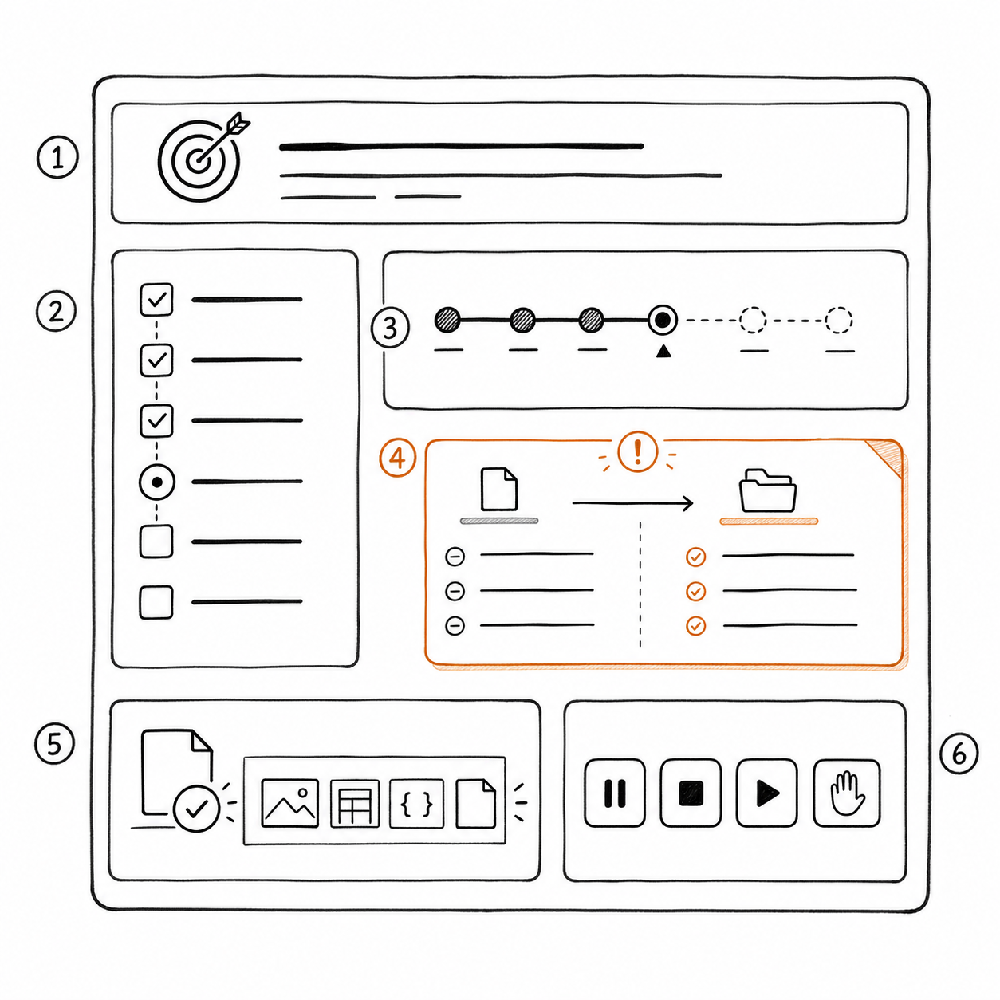

# 交互、信任与控制权

传统软件把控制权放在按钮上：用户点击，系统执行。Agent 产品改变了这个关系。用户给出目标后，系统可能连续做出多个判断，跨越多个页面和工具，甚至在用户离开后继续运行。

因此，Agent 交互不能只设计一个输入框和一条最终回复。真正需要设计的是一段委托关系：用户怎样知道系统理解了什么、准备做什么、正在等什么、何时需要自己决定，以及如何随时收回控制权。

信任也不是靠拟人化语气建立的。信任来自可预期的边界、与风险匹配的确认、真实的进度、可核对的证据，以及失败时仍然可控。

## 从“对话”转向“任务界面”

*图：任务界面同时呈现目标、计划、真实进度、具体确认、完成证据以及暂停、取消、恢复和接管控制。*

一次完整的 Agent 任务通常包含六类信息。

1. **目标理解**：系统怎样理解用户的请求，哪些条件仍不清楚；
2. **计划**：准备采取哪些主要步骤，哪些步骤可能需要确认；
3. **状态**：任务处于执行、等待、部分完成还是失败；
4. **行动记录**：已经读取或改变了什么；
5. **决策请求**：需要用户选择什么，以及不同选择的影响；
6. **结果证据**：外部系统返回了什么，是否满足完成标准。

这些信息不必全部塞进聊天气泡。对长任务，更合适的产品通常同时提供对话区、状态区和结果区。对话用于澄清与协商，状态区承载稳定进度，结果区集中展示最终证据。

如果所有信息都只存在于对话里，用户需要反复向上翻找，系统也很难在任务跨会话后保持一致。

## 计划不是展示思考过程

用户需要知道 Agent 准备做什么，但不需要阅读模型冗长的内部推导。产品应展示可验证的行动计划，而不是未经整理的思考文本。

一个有效计划应回答：

- 目标是什么；
- 主要步骤有哪些；
- 将访问哪些数据或系统；
- 哪些动作会产生外部影响；
- 哪些节点需要用户决定；
- 大致需要多久；
- 如何判断完成。

例如，“我会先查找相关资料，然后思考下一步”几乎没有信息价值。更好的表达是：“我会在你有权访问的差旅制度中核对住宿上限和审批要求；若北京与华北区域文件存在冲突，我会停止并列出两份来源。”

计划的目的是让用户纠正目标和边界，而不是证明模型很聪明。

## 进度必须反映真实状态

“正在处理”不能持续十分钟没有变化。长任务需要可解释的阶段状态，例如正在验证账户、等待服务商回复、需要用户登录、已提交申请但尚未完成。

状态更新应满足三条原则：

- **真实**：来自任务状态或工具反馈，不编造百分比；
- **有行动意义**：用户知道自己是否需要做什么；
- **不过度打扰**：只有状态变化、风险出现或等待超过预期时主动通知。

当等待来自外部系统时，应说明下一次检查时间或通知方式。用户不必保持页面打开，也不应通过重复提问来确认 Agent 是否还在工作。

## 按风险设计控制权

不是所有动作都值得打断用户。可以从可撤销性、影响范围和敏感程度来决定控制方式。

| 动作类型 | 示例 | 推荐控制方式 |
| --- | --- | --- |
| 低风险、可撤销 | 检索资料、生成草稿、保存临时计划 | 自动执行并记录 |
| 中风险、可检查 | 填写表单草稿、创建待审批记录 | 执行后通知或提交前确认 |
| 高风险或不可逆 | 付款、接受退款方案、删除权益、对外发送 | 展示具体影响后确认 |
| 超权限或超范围 | 读取受限资料、作法律承诺 | 拒绝并提供合法路径 |

确认界面必须具体。不要问“是否允许 Agent 继续”，而要问“是否接受 80 元退款并立即终止剩余 20 天权益”。只有动作、参数和影响明确，用户的同意才有意义。

对于批量动作，产品还要防止一次确认被无限扩张。用户批准向三位指定客户发送材料，不代表允许 Agent 向整个客户列表发送。

## 暂停、取消、恢复与接管

用户控制权不只存在于执行前。任务开始后，仍需要四种能力。

### 暂停

暂停阻止系统开始新的外部动作，同时保留当前状态。正在执行且不可中断的动作需要明确显示，不能假装已经停止。

### 取消

取消结束用户不再需要的任务。产品必须说明哪些已发生动作无法撤销，哪些待处理请求已经终止，以及是否仍可能收到外部回复。

### 恢复

恢复不是重新开始。系统应保存目标、已完成步骤、有效授权、等待事件和剩余工作，并检查此前信息是否已经过期。

### 人工接管

接管需要把任务状态、用户目标、已尝试动作、外部反馈和待决定问题一并移交。若用户必须从头解释，产品只是把失败成本推给了用户。

[查看 Mermaid 源码](../diagrams/source/book1-05-interaction-trust-and-control-01.mmd)

这张图表达的是控制关系，不是所有产品都必须拥有完全相同的状态。关键是每次转换都有明确触发条件，而且用户能够理解当前由谁控制。

## 记忆是一项用户权利设计

记忆常被描述为提升个性化的能力，但它同时改变了隐私和控制关系。产品经理应先区分三类信息。

### 当前任务状态

订单号、等待中的外部回复和已批准动作只服务当前任务。任务结束后是否保留，取决于审计、售后和法规要求，不应自动变成长期用户画像。

### 稳定偏好

用户明确表达、且未来任务会重复使用的偏好可以形成记忆，例如“任何产生额外费用的方案都先问我”。这类记忆应允许用户查看、修改和删除。

### 企业权限与业务事实

员工所属部门、文档权限和公司政策不是个人偏好。它们应来自权威系统并动态更新，不能被 Agent 作为“记忆”固化。员工调岗后，旧权限必须立即失效，而不是继续被历史对话召回。

保存记忆前还要回答：用户是否知道会保存，来源是什么，有效期多长，冲突时相信哪一条，删除后哪些派生内容会受到影响。

## 双案例一：事务 Agent 的控制体验

用户发起取消订阅后，Agent 首先回显目标：“停止下个周期扣费，并尽量保留当前已付费权益。”若用户真正想立即终止，应该在执行前纠正。

计划区展示服务、账户、主要步骤、可能影响和完成证据。读取订阅状态与查询规则自动进行；进入身份验证时，产品说明为什么需要用户操作；出现部分退款方案时，确认卡展示金额、权益、生效时间和拒绝后的路径。

执行过程中，用户可以暂停新的动作。若申请已经提交，界面应说明提交不可撤回，但后续协商已暂停。服务商尚未处理时，任务进入“等待外部系统”，并在状态变化后通知用户。

最终结果区分别显示取消状态和退款状态。若取消成功但退款仍在处理中，产品显示“部分完成”，而不是选择一个更好看的成功状态。

## 双案例二：企业知识 Agent 的可信体验

员工提出问题后，Agent 先在必要时澄清部门、地区和时间范围。回答中将结论、引用和适用条件放在一起，不把来源藏在折叠区最深处。

若没有足够证据，产品直接说明检索范围和缺口；若两份有效文件冲突，展示冲突段落、版本和文档负责人，而不是自动拼出一个折中答案。

用户可以对答案标记“引用不支持结论”“资料已经过期”或“缺少适用条件”。这些反馈进入知识治理，不直接让模型把用户一句话永久记成公司规则。

当产品以后扩展到材料发送时，发送前确认必须展示收件人、附件、敏感信息提示和最终内容。当前首期只读范围内，则不应提前制造“自动发送”的交互承诺。

## 两类产品的信任来源

| 维度 | 客户服务与事务办理 Agent | 企业知识与办公 Agent |
| --- | --- | --- |
| 用户最关心 | Agent 会不会替我做错决定 | 答案是否可信且没有越权 |
| 计划重点 | 动作、金额、权益和等待 | 检索范围、来源和适用条件 |
| 关键确认 | 接受方案、产生费用、终止权益 | 对外发送、敏感写操作 |
| 主要证据 | 外部状态与交易记录 | 文档片段、版本和权限 |
| 纠错去向 | 当前任务状态和后续行动 | 当前回答与知识治理 |

## 常见误区

### 误区一：用拟人化代替透明度

亲切语气可以改善体验，却不能替代状态、边界和证据。越像人的表达，越需要防止用户误以为系统拥有它实际上没有的理解和权限。

### 误区二：展示未经整理的思考过程

用户需要行动计划和决策依据，不需要内部推导流水账。原始推导可能冗长、变化或包含不适合展示的信息，也不能作为可审计理由。

### 误区三：只设计成功路径

Agent 最需要交互设计的时刻往往是等待、部分完成、权限不足和失败。只设计最终成功页，会让真实用户在最需要帮助时失去方向。

### 误区四：把所有历史都当作记忆

保留越多不代表个性化越好。过期事实、临时状态和敏感信息会制造错误与隐私风险。

## 产品经理检查表：Agent 交互

- 首次使用时，用户能否理解 Agent 可以和不可以做什么？
- Agent 是否回显目标、范围和关键假设？
- 计划是否说明主要动作、系统访问和完成证据？
- 进度是否来自真实状态，而不是虚构百分比？
- 长时间等待时，用户是否知道原因、预计动作和通知方式？
- 确认是否包含具体动作、参数、影响和替代方案？
- 用户能否暂停新的动作，并知道哪些动作无法中断？
- 取消时是否说明已经发生和仍可能发生的事情？
- 恢复时是否检查授权、数据和外部状态是否仍然有效？
- 部分成功是否被单独呈现？
- 工具失败或权限不足时，是否提供下一条合法路径？
- 人工接管是否携带完整任务状态，避免用户重复解释？
- 长期记忆是否可查看、纠正和删除？
- 最终结果是否附有外部证据？

## 本章小结

Agent 交互设计的对象不是一串消息，而是一段持续的委托关系。产品要让用户理解目标、计划、状态、行动、决策和证据，并在执行前后都保留控制权。

信任来自真实进度、具体授权、可恢复状态、顺畅接管和可核对结果。记忆也不是单纯的能力增强，而是需要用户知情、纠正和删除的权利设计。

下一章将把这些产品要求映射成能力方案：哪些问题需要模型，哪些需要知识、记忆、工具或确定性工作流，以及为什么大多数场景不应从多 Agent 开始。

## 思考题

1. 选择一个高风险确认界面，把“是否继续”改写成用户真正能够判断的问题。
2. 一个外部请求已经提交但尚未生效，此时暂停和取消分别意味着什么？
3. 列出三条你所在产品可能保存的信息，判断它们属于任务状态、稳定偏好还是权威业务事实。

<!-- chapter-navigation:start -->
---

[上一篇：Agent 产品定义](04-agent-product-definition.md) · [篇章目录](README.md) · [下一篇：从产品需求到能力方案](06-from-requirements-to-capabilities.md)
<!-- chapter-navigation:end -->
