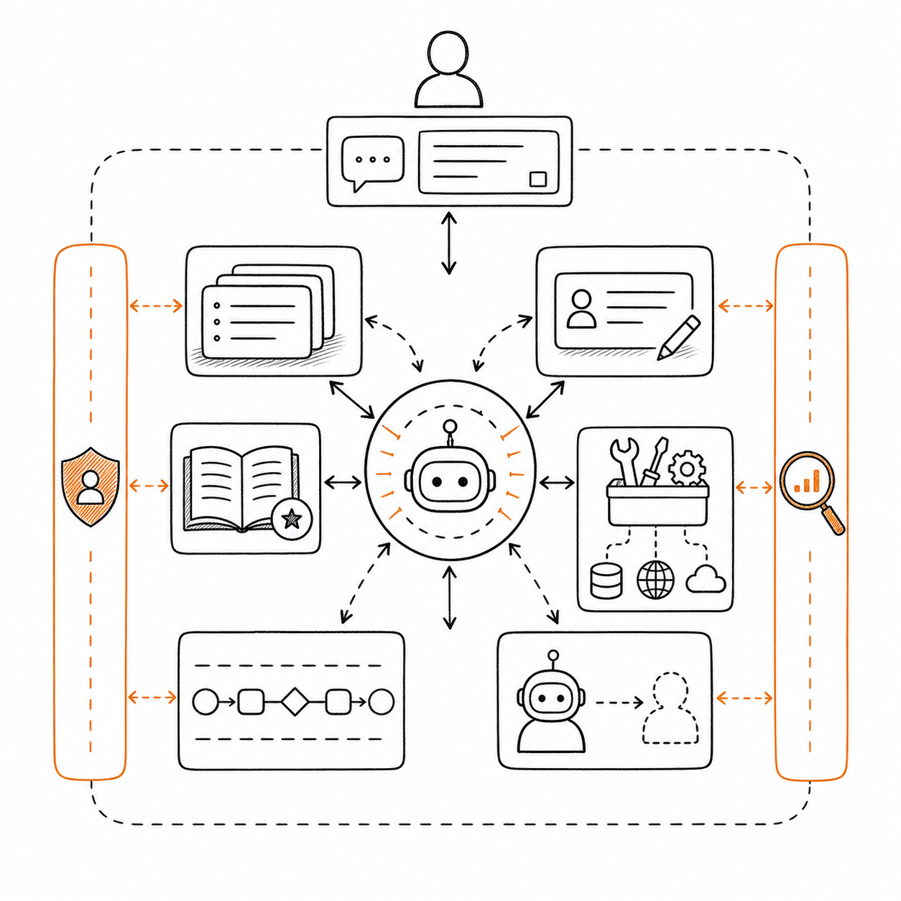

# 从产品需求到能力方案

产品评审会上，“这个需求需要 RAG”“这里应该用多 Agent”“加一个长期记忆”经常比用户问题更早出现。技术名词一旦进入讨论，就会给人一种方案已经变得具体的错觉。

但能力方案的起点不应该是组件，而应该是任务。只有先说明 Agent 需要知道什么、判断什么、做什么、遵守什么规则，团队才能决定哪些部分交给模型，哪些交给确定性系统。

产品经理不需要代替算法和工程团队设计底层实现，却需要把产品责任翻译成可讨论、可验证的能力要求。本章提供这层翻译。

## 七类能力，各自解决什么问题



*图：模型决策与上下文、记忆、知识、工具、工作流和职责隔离协同工作，权限与评估贯穿所有能力。*

### 模型：处理语言和开放判断

模型适合理解自然语言、从非结构化信息中提取含义、生成内容，以及在规则无法穷举时判断下一步。

模型不适合承担必须百分之百确定的业务规则。例如金额上限、权限校验和状态转换，应该由确定性代码或系统负责。产品需求应明确哪些地方允许模型判断，哪些地方只能引用规则结果。

选择模型时不要先问“哪个模型最强”，而要问它在本产品任务上是否达到质量、延迟、成本、数据和工具调用要求。答案必须来自自己的评估集，而不是通用排行榜。

### 上下文：提供当前决策所需信息

上下文是 Agent 此刻能够看到的任务说明、对话、状态、规则和工具结果。产品经理需要定义最小必要信息，以及信息进入决策时的优先级和来源。

上下文不是越长越好。无关历史会稀释关键状态，过期信息会引导错误行动，敏感信息还可能越过权限边界。对产品而言，核心问题是“当前这一步必须看到什么”，而不是“最多能塞多少内容”。

### 记忆：保存跨会话的稳定信息

记忆适合保存经用户同意、未来会重复使用的偏好或事实。它不应替代权威业务系统，也不应把一次任务中的临时信息永久化。

需求必须说明记忆的写入条件、来源、有效期、可见性和删除方式。若团队无法说明一条记忆如何被纠正，就不应让它自动影响高风险行动。

### 知识库：提供可追溯的领域事实

知识库解决模型训练数据不知道、已经过期或无法访问的私有知识。产品要求不应只写“接入 RAG”，而要定义资料范围、权限、时效、版本、引用和证据不足时的行为。

检索到相似文本不等于获得正确答案。产品必须保留来源，让用户或评估系统能够检查结论是否真的被证据支持。

### 工具：让 Agent 读取和改变外部世界

工具可以读取订单、查询状态、提交申请、发送消息或写入业务系统。每个工具都扩大了 Agent 的行动空间，也扩大了错误影响。

产品需求至少要定义工具用途、输入参数、权限、风险等级、成功返回、失败返回、幂等与撤销方式。一个返回“成功”却不包含业务状态的工具，会让 Agent 无法判断任务是否真的完成。

### 工作流：约束稳定、关键的步骤

工作流适合顺序明确、规则稳定、不能跳过的环节。例如身份验证必须发生在读取账户前，发送材料必须发生在审批后。

模型与工作流不是二选一。成熟方案通常让模型处理意图和开放判断，让工作流控制权限、关键顺序和状态变化。

### 多 Agent：隔离真正不同的职责

多 Agent 适合职责、信息或工具需要明确隔离，或者子任务能够并行并产生独立新证据的情况。它不是让同一个问题被多个模型重复讨论，也不是为了让架构看起来先进。

如果一个 Agent 加几个清晰步骤就能完成任务，拆成多个 Agent 只会增加上下文传递、成本、延迟和故障点。产品经理应先证明拆分带来新的信息、权限隔离或可测责任边界。

## 从需求到能力的选择顺序

能力选择可以沿着一条朴素路径进行。



[查看 Mermaid 源码](../diagrams/source/book1-06-from-requirements-to-capabilities-01.mmd)

这条路径先问结果和行动，再问知识、工作流、记忆与隔离。它能避免两类常见浪费：为一个只需要可靠搜索的问题搭建复杂执行系统，或为一条确定流程引入不必要的自主判断。

## 一张产品能力架构图

技术架构图通常展示服务和协议，产品能力架构图则展示责任如何分层。



[查看 Mermaid 源码](../diagrams/source/book1-06-from-requirements-to-capabilities-02.mmd)

图中的交互层负责让用户理解并控制任务；决策层负责处理开放判断；上下文和任务状态维持当前工作的连续性；记忆与知识分别处理跨会话偏好和领域事实；工作流保护稳定规则；工具连接现实系统。身份、安全、评估和成本不是末尾补上的模块，而是贯穿所有层的约束。

产品需求应该能在图中找到责任归属。如果“回答必须附来源”只写在界面稿里，却没有知识和评估要求，最终很可能只得到一个看起来像引用的链接。

## 把需求写成可验证的能力要求

对比两种写法。

模糊写法：

```text
系统需要 RAG、长期记忆和多个专业 Agent，提升回答准确率。
```

可验证写法：

```text
当员工询问内部制度时，系统只能检索其现有权限可访问、且处于有效版本的资料。
回答中的关键结论必须附支持它的原文片段与链接。
没有证据或有效来源冲突时，系统不得生成确定结论，而应说明缺口并转交文档负责人。
首期不保存用户问题为长期偏好，不执行任何业务系统写操作。
```

第二种写法没有指定具体框架，却清楚定义了数据、权限、结果和失败行为。算法与工程团队可以据此比较多种实现，评估团队也知道怎样验收。

## 双案例一：事务 Agent 的能力方案

### 需求映射

- **模型**：理解用户目标、从服务商自然语言反馈中识别状态、在非固定路径中选择下一步。
- **当前上下文**：目标、账户与订单、已授权动作、当前状态、外部反馈和已尝试路径。
- **记忆**：首期只保存用户明确同意的稳定风险偏好，例如“任何额外费用都先确认”；订单与登录状态仍属于任务状态。
- **知识库**：支持服务的办理规则、渠道说明、常见异常和版本信息。
- **工具**：读取订阅或订单、进入服务商渠道、提交标准申请、查询状态、发送用户通知。
- **工作流**：身份验证、授权校验、关键动作确认、结果验证和异常转人工不可跳过。
- **多 Agent**：首期不需要。单 Agent 配合明确工作流足以处理有限服务；未来只有当电话、网页和争议处理需要独立权限或并行等待时再评估拆分。

### 失败降级

页面或接口变化时，不继续猜测按钮；身份失效时等待用户重新授权；出现非标准方案时回到确认；连续失败后带着完整任务状态转人工。降级不是统一回复“抱歉失败”，而是切换到风险更低的产品形态。

## 双案例二：企业知识 Agent 的能力方案

### 需求映射

- **模型**：理解问题、识别需要澄清的范围、组织多份证据并生成自然语言回答。
- **当前上下文**：员工问题、身份、部门、明确的使用场景、检索结果和本次纠错。
- **记忆**：首期不把权限和公司事实保存为用户记忆；只考虑用户主动设置的展示偏好。
- **知识库**：纳入治理的制度、流程和产品资料，包含权限、版本、所有者和有效期。
- **工具**：身份与权限查询、知识检索、原文读取、反馈提交。
- **工作流**：先校验身份与权限，再检索；回答前检查引用；证据不足或来源冲突时停止确定回答。
- **多 Agent**：首期不需要。只有当法律、财务等领域必须由独立权限和独立评估的专业单元处理时，才考虑拆分。

### 失败降级

没有结果时展示已检索范围并提供求助入口；来源冲突时列出冲突和负责人；权限不足时不透露受限文档存在的细节；生成能力不可用时仍可退化为有权限的搜索结果列表。

## 两类方案的能力差异

| 能力 | 客户服务与事务办理 Agent | 企业知识与办公 Agent |
| --- | --- | --- |
| 模型主要判断 | 外部反馈意味着什么，下一步怎样推进 | 问题范围与证据如何组织 |
| 核心状态 | 任务步骤、授权、外部等待和结果 | 问题语境、权限、来源和冲突 |
| 核心工具 | 读取与改变外部业务状态 | 身份、权限、检索和原文读取 |
| 确定性约束 | 授权、动作顺序、金额与结果验证 | 权限过滤、版本检查和引用要求 |
| 首期多 Agent | 不采用 | 不采用 |
| 主要降级 | 转人工办理或由用户继续 | 退化为搜索、拒答或转专家 |

## 常见误区

### 误区一：把组件名写成需求

“需要 RAG”没有说明资料、权限、时效、引用和失败行为。“需要记忆”没有说明写入和删除规则。组件名只能开启技术讨论，不能代替产品定义。

### 误区二：让模型执行确定规则

金额限制、身份权限和关键状态转换不应依赖模型每次重新理解。只要规则稳定且重要，就应由确定性系统执行。

### 误区三：上下文越多越好

无关历史、过期资料和超权限信息都会降低可靠性。Agent 应看到完成当前决策所需的最小信息。

### 误区四：用多 Agent 解决所有复杂性

拆分角色不会自动带来新能力。若多个 Agent 看到相同信息、使用相同工具，只是在增加调用和交接。先证明职责隔离或新证据的价值。

### 误区五：只设计成功返回

Agent 依赖工具反馈调整路径。工具若不区分“请求已接收”“业务已完成”“可重试失败”和“永久失败”，上层再聪明也无法可靠决策。

## 产品经理模板：能力方案说明

```text
用户任务：
完成证据：

模型需要判断：
必须由确定规则判断：

当前决策所需信息：
- 信息：
- 来源：
- 时效：
- 权限：

跨会话信息：
- 是否需要记忆：
- 写入条件：
- 查看、纠正和删除方式：

领域知识：
- 资料范围：
- 权限模型：
- 版本与时效：
- 引用要求：
- 证据不足时的行为：

动作与工具：
- 动作：
- 输入参数：
- 风险等级：
- 成功返回：
- 失败返回：
- 撤销或补偿：

工作流约束：
允许 Agent 动态决定的部分：
是否需要多 Agent，以及必要理由：

失败降级：
成本假设：
验证方法：
```

## 本章小结

能力方案的起点是任务和产品责任，不是技术组件。模型处理语言和开放判断，上下文提供当前信息，记忆保存稳定偏好，知识库提供领域证据，工具执行动作，工作流约束关键步骤，多 Agent 隔离真正不同的职责。

产品经理的责任是写清所需信息、允许判断、动作边界、失败降级和完成证据，让不同技术方案能够在同一需求下被比较和验证。

下一章将建立评估体系，检验前六章的所有假设：产品是否真的完成任务，用户是否获得价值，风险和成本是否在可接受范围内。

## 思考题

1. 找出一个被写成技术组件的需求，把它重写为可验证的产品行为。
2. 在你的产品中，哪项判断必须由确定性规则完成，不能交给模型？
3. 如果删除多 Agent 设计，产品会失去什么独立信息或权限隔离？如果回答不出来，是否仍有必要采用？

<!-- chapter-navigation:start -->
---

[上一篇：交互、信任与控制权](05-interaction-trust-and-control.md) · [篇章目录](README.md) · [下一篇：Agent 评估体系](07-agent-evaluation.md)
<!-- chapter-navigation:end -->
