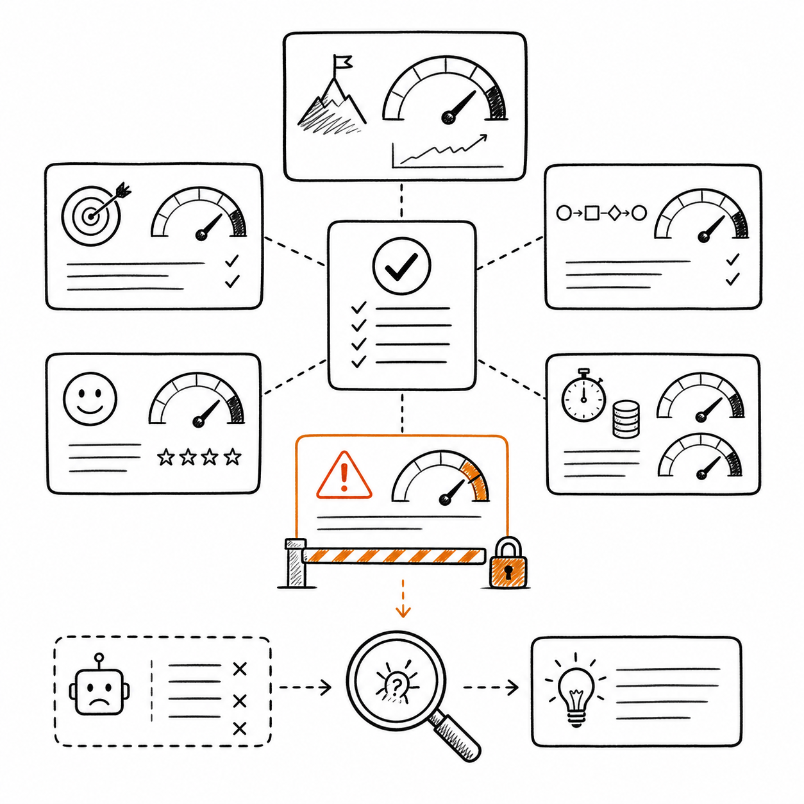

# Agent 评估体系

Agent 完成了一次退款，用户也表示满意。这个结果能证明产品有效吗？不能。它可能只是碰巧遇到了最简单的路径，也可能完成了退款却付出了过高成本，或者在用户没有注意时违反了一项重要规则。

Agent 的输出具有不确定性，任务又会跨越多步行动。只看几个演示、平均评分或用户点赞，很难判断一次改动究竟提升了产品，还是把问题转移到了别处。

评估的目的不是给模型发成绩单，而是让团队能够做决定：这个产品是否达到上线门槛，哪个失败最值得修，换模型是否真的更好，提高自主性是否安全，新增成本是否换来了用户价值。

## Eval 与 PRD 各自定义什么

“Eval 是新的 PRD”强调的是：当一个模型行为问题已经足够明确时，评估用例往往比一段抽象需求更能表达用户需要什么。它不意味着 PRD 已经失去价值，也不意味着所有产品责任都能写成评估样本。

PRD 负责定义产品为什么存在、服务谁、解决什么问题、承担什么责任，并帮助产品、设计、工程、业务、安全和法务对齐范围。Eval 把其中可观察的模型与系统行为转成可重复运行的样本、判断规则和通过门槛。

| 产品问题 | 主要交付物 |
| --- | --- |
| 用户机会、产品愿景和支持范围仍然模糊 | PRD、原型和探索计划 |
| 模型在明确任务中的行为需要改进 | 评估集、Rubric 和对比实验 |
| 权限、状态、工具参数和副作用必须确定 | 系统契约、确定性测试和风险门禁 |
| 跨团队判断是否发布、灰度或回滚 | PRD 中的产品承诺 + Eval Report |
| 线上出现新的失败和任务分布 | Trace、用户反馈和版本化回归集 |

因此，Eval 不是新的全部 PRD，而是模型行为和 Agent 运行结果的可执行需求。好的 PRD 应能指出哪些责任需要 Eval 证明；好的 Eval 也必须回到用户价值和产品边界，而不是只优化容易测量的分数。

## 从业务结果建立指标树



*图：业务结果、任务完成、过程、体验、成本和风险共同支持发布决策；严重风险是门禁，不能被其他平均分抵消。*

一个完整评估体系至少包含六层指标。

### 业务结果

产品最终改善了什么？事务 Agent 可能关注成功办理量、用户节省时间和避免损失；企业知识 Agent 可能关注找到可信答案的时间、重复咨询下降和工作产物采用率。

业务结果是方向，却通常不能单独诊断原因。成功量下降，可能来自模型、工具、权限、外部系统或用户流量变化。

### 任务完成

Agent 是否达到了任务定义中的成功状态，并获得了完成证据？需要区分成功、部分完成、失败、取消和仍在等待，不能把“未报错”当作完成。

### 过程质量

Agent 是否遵守必要步骤、使用正确参数、获取授权、引用有效来源，并在异常时正确停止？两个结果相同的任务，过程风险可能完全不同。

### 用户体验

用户是否理解计划和状态，确认是否有意义，等待是否可接受，失败后能否恢复？满意度有用，但应与具体行为和任务结果结合。

### 成本与延迟

完成一次任务消耗多少模型调用、工具费用、人工时间和等待时间？平均值之外还要看长尾，因为少数极慢或极贵的任务可能决定产品是否可用。

### 风险

是否出现越权访问、错误行动、隐私泄露、无证据断言、未经确认的高风险操作或无法停止的循环？严重风险通常是上线否决项，不能被其他高分抵消。



[查看 Mermaid 源码](../diagrams/source/book1-07-agent-evaluation-01.mmd)

指标树让团队既能看最终价值，也能定位过程瓶颈。不要把所有指标压成一个总分，否则严重风险可能被流畅表达和低延迟掩盖。

## 评估集来自真实任务分布

评估集不是一批“看起来像用户问题”的 Prompt。每个用例都应包含初始状态、用户目标、可逐步透露的信息、可用工具、预期结束状态和验证方式。

一个可用的评估集要覆盖：

- 高频正常路径；
- 信息不完整和表达模糊；
- 权限不足、工具失败和外部等待；
- 规则边界与来源冲突；
- 用户中途改意；
- 高风险诱导和恶意输入；
- 过去线上真实失败的回归用例。

用例需要按任务类型、难度、用户分群和风险等级标注。这样总分变化后，团队才能知道哪一类任务改善或退化。

评估集也要版本化。业务规则变化后，旧答案可能不再正确；只更新系统而不更新评估，会把遵守新规则的行为误判为失败。

## 把一句用户抱怨变成评估用例

用户说“Agent 经常产生幻觉”，还不能直接成为评估样本。它没有说明用户当时要完成什么、Agent 看到了什么、错误发生在哪一步，也没有给出可以验证的预期结果。

产品经理需要先恢复任务现场，再把反馈拆成可行动的问题。

### 第一步：恢复现场

至少追问并记录：用户目标是什么，输入和上下文是什么，当时可以使用哪些工具，Agent 实际做了什么，用户为什么判断它错了，以及正确结果应由什么证据支持。

### 第二步：拆分失败类型

同一句“产生幻觉”，可能对应完全不同的根因：

- 应调用工具却没有调用；
- 调用了错误工具或使用了错误参数；
- 没有检索到所需材料；
- 找到了正确材料却提取了错误事实；
- 来源相互冲突却没有说明；
- 证据不足却给出确定结论；
- 最终回复看似正确，但真实动作或业务状态错误。

分类的目的不是寻找一个方便的标签，而是确定应该修改 Prompt、Context、知识、工具、工作流、交互还是模型，并选择能够验证修复的评估器。

### 第三步：写成可运行用例

例如，用户反馈“Agent 没有按要求输出 JSON”，可以转成：

```yaml
id: create-ticket-json-contract
source: verified-user-feedback
input:
  user_goal: "创建一条高优先级售后工单"
  required_schema: "support_ticket.v2"
expected:
  final_status: completed
  schema_valid: true
  priority: high
  forbidden_fields:
    - internal_admin_note
evidence:
  - json_schema_validation
  - created_ticket_id
metadata:
  task: ticket_creation
  failure_type: output_contract
  risk: medium
```

这条用例不要求输出与某段参考文本完全一致，而是检查结构、关键字段、禁止字段和业务结果。

### 第四步：决定是否进入回归集

不是每条反馈都值得永久保留。进入稳定回归集之前，应确认它代表真实用户价值损失或严重风险，能够复现，预期结果已经由产品或业务责任人核查，并且未来改动可能让它再次发生。

单个反馈可以触发调查，却不能自动代表真实任务分布。多个近似反馈还需要去重和分群，避免少数高频表达挤占评估集，使团队过度优化局部问题。

## 谁来判断：按证据选择方法

### 确定性校验

订单状态、金额、权限、引用链接和工具参数可以由规则直接检查。只要存在客观状态，就优先使用确定性校验，它稳定、便宜、容易复现。

### 人工评审

复杂沟通、品牌语气和专业判断需要人评。人工评审应使用明确 Rubric，记录评审者和理由，并抽查一致性，而不是只问“感觉好不好”。

### LLM-as-a-Judge

模型评委适合规模化检查表达质量、信息完整性和开放式产物，但容易受提示、顺序和自身偏好影响。它不应替代可以直接读取的业务状态，也不应独自裁决高风险合规问题。

### 配对比较

当绝对打分困难时，让评审者比较两个版本更容易发现相对差异。配对比较适合模型、Prompt 或交互文案选型，但仍需防止位置和风格偏差。

### 灰度实验

离线评估通过后，线上灰度用于验证真实用户行为和系统环境。灰度必须预先定义目标指标、风险护栏、分群、观察期和停止条件，不能上线后再寻找有利数字。

## 双案例的评估设计

### 客户服务与事务办理 Agent

每个用例包含虚构订单、用户目标、服务规则、外部系统状态和可能出现的方案。核心检查包括：

- 最终事务状态是否正确；
- 金额、账户和服务对象是否正确；
- 关键方案是否获得具体授权；
- Agent 是否区分已受理、部分完成和最终完成；
- 用户利益是否符合定义；
- 是否出现越权、重复提交或无证据成功声明；
- 单任务时间、人工介入和完整成本。

高风险事件采用否决规则。例如未经授权接受部分退款，即使用户最终拿到钱，也不能被高满意度抵消。

### 企业知识与办公 Agent

每个用例包含虚构员工身份、部门权限、问题、有效与过期文档、冲突来源和期望引用。核心检查包括：

- 关键结论是否被引用直接支持；
- 是否只使用用户有权访问的资料；
- 是否识别过期、无效或不适用来源；
- 证据不足时是否拒绝确定回答；
- 回答是否清楚说明适用条件；
- 用户找到可信答案所需时间；
- 纠错是否进入知识治理，而非直接改写事实。

两类产品都测正确性，但证据不同。事务 Agent 以外部状态为主，知识 Agent 以来源支持为主。

## 从失败到改进，而不是从低分到换模型

一次失败可能来自模型没理解意图、上下文缺信息、知识过期、工具返回模糊、工作流漏掉验证、权限错误或交互确认不清。如果不做归因，团队很容易把所有问题都交给模型升级。



[查看 Mermaid 源码](../diagrams/source/book1-07-agent-evaluation-02.mmd)

每次改动尽量只验证一个主要假设。若同时换模型、改 Prompt、重做工具和调整交互，即使指标提高，也无法知道真正有效的因素。

## 常见误区

### 误区一：只评最终回复

Agent 可能给出漂亮回复，却执行了错误动作；也可能过程正确，只是最终表达普通。评估必须同时读取结果状态和关键轨迹。

### 误区二：只测正常路径

正常路径容易形成虚假信心。真正决定上线安全的，往往是权限不足、规则冲突、外部失败和用户改意。

### 误区三：用平均值掩盖风险

百分之一的越权不能被百分之九十九的顺利回答平均掉。风险指标需要单独门槛和严重级别。

### 误区四：公开 Benchmark 高就直接换模型

通用基准不能代表自己的任务、工具和成本。模型切换必须在同一产品评估集上比较，并检查分群退化。

## 产品经理模板：评估定义

```text
业务目标：
评估版本：

指标：
- 名称：
- 定义：
- 数据来源：
- 分群方式：
- 通过阈值：
- 风险否决项：
- 负责人：

评估用例：
- 初始状态：
- 用户目标：
- 渐进透露的信息：
- 可用工具：
- 预期结束状态：
- 成功证据：
- 必须遵守的过程：
- 失败类别：

上线方式：
- 离线回归范围：
- 灰度人群：
- 观察期：
- 停止条件：
```

## 实践任务：两小时建立第一版评估集

选择一个团队正在使用或内部试用的 Agent，在两小时内完成以下任务：

1. 收集最近 20 条真实任务或试用记录，去除凭据和不必要的个人信息；
2. 选出 5 条成功、5 条失败、3 条边界和 2 条高风险任务；
3. 为每条任务补齐初始状态、用户目标、预期结果、成功证据、必须行为和禁止行为；
4. 将失败归入产品范围、目标理解、Context、知识、工具、工作流、模型或交互；
5. 为 JSON Schema、工具参数、最终状态等客观事实写出至少 3 个确定性检查；
6. 用同一批样本比较当前版本和一个候选版本，关键用例重复运行；
7. 根据分群结果给出发布、限定灰度、不发布或证据不足的结论。

完成标准不是得到一个漂亮总分，而是团队能解释每个失败来自哪里、哪些结论是确定事实、哪些仍是估计，以及下一项改动要验证什么假设。

## 本章小结

Agent 评估需要连接业务结果、任务完成、过程质量、用户体验、成本、延迟和风险。评估集应来自真实任务分布，并随着线上失败和业务规则持续更新。

PRD 定义产品价值、范围与责任，Eval 将可观察行为变成可执行需求。用户反馈只有在恢复现场、完成归因、补齐预期结果并经过责任人核查后，才能成为可靠的评估用例。

选择判断方法时，优先使用外部状态和确定性证据，再按需加入人工评审、模型评委、配对比较和灰度实验。评估的最终产物不是分数，而是下一项可验证的产品决策。

## 思考题

1. 你的 Agent 当前最严重的失败，是否被平均指标掩盖？
2. 选择一个用 LLM-as-a-Judge 评分的指标，它是否存在更客观的业务状态？
3. 如果新模型总分更高，却在高价值用户上退化，应该如何决策？

<!-- chapter-navigation:start -->
---

[上一篇：从产品需求到能力方案](06-from-requirements-to-capabilities.md) · [篇章目录](README.md) · [下一篇：可靠性、安全与成本](08-reliability-safety-and-cost.md)
<!-- chapter-navigation:end -->
