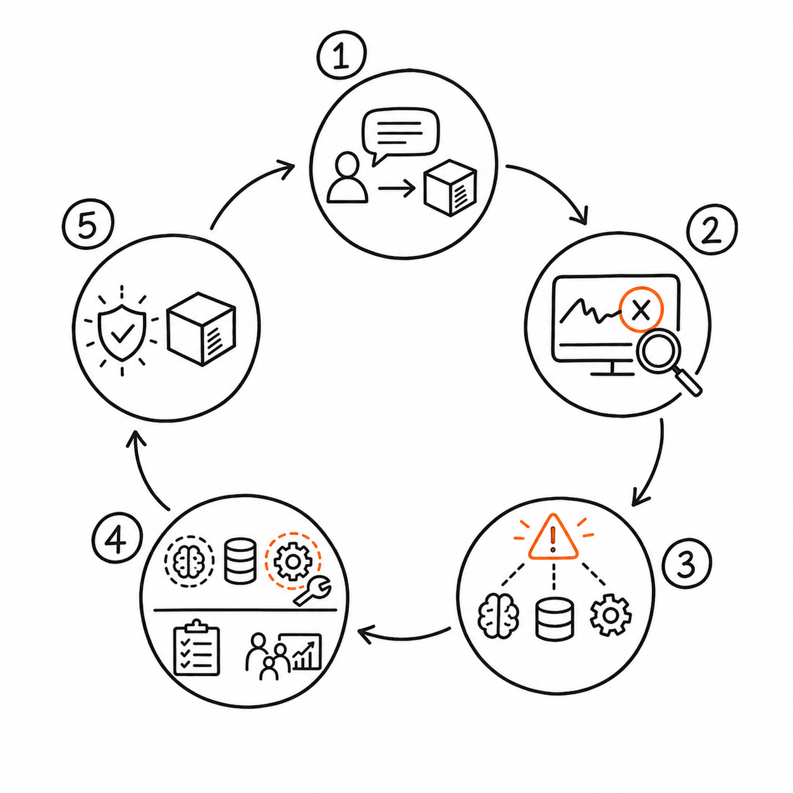

# 上线、运营与持续迭代

Agent 上线不是产品完成，而是第一次进入真实任务分布。用户会用团队没有预料的方式表达目标，业务规则会变化，外部系统会失败，原本罕见的异常会在规模增长后变成每天发生的问题。

因此，Agent 运营不能只看活跃和留存。团队需要知道任务为什么成功或失败，人工在哪些位置接管，哪些知识已经过期，哪项改动真正改善了结果。

持续迭代也不是让 Agent 自动修改自己。任何从失败中形成的新规则、Prompt、知识、工具或 Skill，都需要明确来源、验证和发布过程。

## 渐进上线，而不是一次开放

### 内部试用

由了解业务和产品边界的员工使用，目标是发现明显错误、补齐状态和验证日志。内部试用不能证明普通用户会理解产品，但适合快速暴露基础问题。

### 受控用户

选择任务明确、愿意反馈、风险可控的真实用户。团队提供人工保障，记录每次偏离和接管原因。

### 有限场景

只开放已通过评估的任务、服务、文档范围和动作。产品对超范围请求明确拒绝或降级，不靠模型临场判断是否支持。

### 灰度扩展

按用户、场景、权限或流量逐步扩大。每次扩展绑定指标、观察期、停止条件和回滚方案。

### 规模化运营

只有当主要失败可分类、风险可监控、单位成本可承受、接管能力能够随规模增长时，才进入规模化。

每个阶段都应有进入和退出条件。上线阶段不是时间表，而是证据门槛。

## 可观测性要回答“为什么”

只记录最终回复，无法诊断 Agent。运营至少需要观察：

- 用户目标与支持范围判断；
- 当前任务状态和状态变化时间；
- 关键模型决策的结构化结果；
- 工具名称、参数摘要、返回状态和耗时；
- 授权、拒绝、暂停和人工接管；
- 完成或失败证据；
- 模型、Prompt、知识和工具版本；
- 单任务成本与用户反馈。

记录目的不是保存模型的完整内部思考，也不是无限保留用户数据。日志应满足诊断、评估和审计的最小需要，并遵守权限、脱敏和保留期限。

## 失败分类决定改什么

把失败统一写成“模型回答不好”，团队只会不断换模型。更有用的分类是：

| 失败来源 | 典型现象 | 优先更新对象 |
| --- | --- | --- |
| 产品范围 | 用户任务本就不在支持范围，却被系统接收 | 场景入口、边界和拒绝策略 |
| 目标理解 | 关键条件未澄清 | 交互和 Prompt |
| 当前信息 | 状态或参数没有进入上下文 | 上下文与任务状态 |
| 知识 | 资料缺失、过期或冲突 | 知识治理 |
| 工具 | 返回含糊、参数易错、接口不稳定 | 工具和业务系统 |
| 工作流 | 必要验证或授权可被跳过 | 确定性流程 |
| 模型能力 | 在信息充分、工具清晰时仍无法判断 | 模型、Prompt 或后训练 |
| 交互 | 用户看不懂确认、等待或结果 | 界面与文案 |
| 运营 | 人工接管慢、责任人不清 | 服务流程和组织机制 |

一次问题可能有多个原因，但每次实验应提出一个主要假设。否则修改后无法知道是什么带来了变化。

## 不同更新对象有不同治理方式

### 产品规则

支持范围、自主等级、确认阈值和降级策略由产品与业务负责人维护。它们改变产品承诺，需要评审和清晰发布。

### Prompt

适合调整任务说明、输出结构和模型判断引导。Prompt 变化快，但必须版本化并运行回归，不能在线上直接凭感觉修改。

### 知识

事实、政策和流程进入知识库前，需要来源、所有者、版本和有效期。用户反馈是待核查信号，不应未经确认直接成为新事实。

### 记忆策略

调整写入、检索和删除规则会影响用户长期体验与隐私。修改前要检查旧记忆怎样迁移或失效。

### 工具与工作流

工具更新可能改变真实业务状态，必须兼容在途任务。工作流修改要验证状态迁移、幂等和回滚。

### Skill

Skill 可以封装某类任务的方法、规则和工具用法，适合经常变化但需要结构化指导的能力。它仍然需要版本、适用范围和评估，不是自动生成后立即上线的“经验”。

### 模型

只有当失败确实来自模型能力，而且更换模型或训练的收益超过成本时才升级。模型变化必须通过全量回归和灰度，不能只看几个正向案例。

## 双案例一：客户服务与事务办理 Agent 的运营闭环

事务 Agent 每周按服务、任务类型和状态分析成功率。常见失败可能包括登录失效、服务商页面变化、规则未覆盖、用户没有及时授权、重复提交被拦截和外部处理超时。

页面变化应更新工具或降级策略；规则变化进入知识与工作流；授权等待过长可能需要改进通知；非标准争议占比上升则说明产品范围需要重新评估。

每次人工接管记录触发原因、已完成动作、接管耗时和最终结果。若某类接管逐渐形成稳定路径，团队可以把它整理成规则、工作流或 Skill，再通过历史用例回归，而不是直接让 Agent“记住这次做法”。

## 双案例二：企业知识与办公 Agent 的运营闭环

知识 Agent 每周分析无结果、引用不支持、资料冲突、权限拒绝和用户纠错。无结果可能意味着问题超范围，也可能意味着资料没有进入治理；两者需要不同处理。

文档所有者负责确认过期和冲突，权限团队负责同步问题，产品团队负责回答与反馈体验。用户指出错误后，当前回答可以标记风险，但权威知识只有在责任人核查后更新。

随着产品从问答扩展到材料生成，评估必须新增“引用是否在改写后仍支持结论”；扩展到业务写操作前，还要新增授权、结果验证和回滚能力。新能力不能沿用旧问答指标直接上线。

## 运营闭环



*图：线上任务经过观测、失败分类、针对性修改和受控验证后回到生产，并沉淀为新的发布证据。*


[查看 Mermaid 源码](../diagrams/source/book1-09-launch-operations-and-iteration-01.mmd)

闭环里最重要的一步是更新评估集。若一次真实失败修复后没有成为回归用例，同类问题就可能在下一次模型、Prompt 或工具更新时重新出现。

## 常见误区

### 误区一：上线后只看用户增长

使用量增长可能伴随成功率下降、人工成本上升或风险累积。Agent 运营必须同时观察价值、质量、风险和成本。

### 误区二：把用户反馈直接写入知识或记忆

反馈可能正确，也可能来自误解或局部情境。它应触发核查，而不是绕过治理。

### 误区三：所有失败都通过加 Prompt 修复

权限、工具和业务状态问题无法靠措辞可靠解决。更新对象必须对应根因。

### 误区四：只处理当前任务，不形成回归

一次性补救可以恢复用户，却不会提高系统。可复现失败要进入评估集和版本记录。

## 产品经理模板：Agent 周度运营

```text
统计周期：
当前版本：模型 / Prompt / 知识 / 工具 / 工作流

任务量：
成功 / 部分完成 / 失败 / 取消 / 等待：
核心业务结果：
人工介入率与原因：
风险事件：
成功任务单位成本：

Top 失败类型：
1. 类型 / 影响 / 根因证据 / 负责人
2.
3.

本周已验证改动：
- 假设：
- 评估结果：
- 灰度结果：
- 是否发布：

新增回归用例：
知识或权限待治理项：
下周实验：
```

## 本章小结

Agent 上线是进入真实任务分布的开始。渐进上线用证据控制范围，可观测性帮助团队理解失败，分类则把问题指向正确的更新对象。

持续迭代不是无约束自我修改，而是把真实反馈转成版本化改动，经过离线回归和受控灰度后发布，再把新失败沉淀为评估用例。

## 思考题

1. 你的失败分类里是否有一个过大的“模型问题”类别？可以怎样继续拆分？
2. 一条用户纠错需要经过什么流程才能成为权威知识？
3. 如果工具更新时仍有旧版本任务在执行，产品应如何处理？

<!-- chapter-navigation:start -->
---

[上一篇：可靠性、安全与成本](08-reliability-safety-and-cost.md) · [篇章目录](README.md) · [下一篇：产品路线图与组织协作](10-roadmap-and-collaboration.md)
<!-- chapter-navigation:end -->
