# 引言：从模型能力走向 Agent 产品工程

一个 Agent 在演示中完成了退款。它读懂用户要求，查到订单，调用工具，再回复“退款已完成”。

真正上线前，团队还要回答很多问题：它查到的是当前订单吗？用户确认绑定了具体金额吗？工具超时后会不会重复退款？系统如何证明钱已经退回？用户中途修改目标时，旧授权是否失效？一次成功演示没有覆盖这些问题。

Agent 产品工程处理的正是这段距离。模型提供语言理解、生成、推理和工具选择能力，产品系统负责把能力放进明确的信息、行动、状态、权限和验证边界中。

## 为什么进阶篇按工程问题组织

Agent 的失败很少只属于一个组件。企业知识 Agent 引用旧制度，表面上是回答错误，根因可能在文档版本、权限过滤、检索排序或上下文组装。事务 Agent 重复提交订单，表面上是工具问题，实际可能是恢复状态丢失、幂等边界错误或完成证据不足。

按框架功能学习容易得到零散知识：会写 Prompt、会接向量数据库、会画工作流、会看 Trace。按工程问题学习，团队会追问每个机制承担什么责任，又怎样与其他机制配合。



[查看 Mermaid 源码](../diagrams/source/book2-00-introduction-01.mmd)

这条链路没有一个万能中心。Context 决定模型看到了什么，Retrieval 和 Memory 决定信息从哪里来，Tool Loop 与 Graph 决定怎样行动，Agent Experience 决定用户如何参与，Harness 与 Eval 负责产生证据，Reliability、Safety 和 Production 让系统能长期承担真实责任。

## 产品经理需要理解到什么程度

本书不要求产品经理实现向量索引、调度器或分布式追踪。产品经理需要把业务要求写成工程团队能够实现和验证的契约。

比如“回答必须准确”无法验收。更可执行的要求是：

```text
回答只使用当前有效且用户有权访问的制度；
每个关键结论返回来源与版本；
来源冲突时不自行裁决；
没有足够证据时说明缺失信息并停止给出确定结论。
```

同样，“执行失败后自动重试”也不够。团队需要知道哪些动作可以重试，哪些动作必须先查询外部结果，哪些不确定状态需要用户或人工接管。

## 十个工程专题怎样分工

前五篇解决 Agent 怎样形成一次行动：Prompt 与 Context 组织本轮输入，Retrieval 与 Knowledge 提供外部事实，Memory 管理跨时间信息，Tool Loop 推进行动，Graph 把状态和路径显式化。

第六篇处理人与 Agent 的协作界面。用户是否理解计划、风险、等待和完成状态，会直接影响产品是否可信。

后四篇解决系统怎样被证明并长期运行。Harness 与 Eval 生成可比较证据，Reliability 处理故障和恢复，Safety 约束不可接受行为，Production 把发布、观测、成本、运营和持续改进接起来。

这些边界有意保留交叉。Memory 会进入 Context，Safety 会限制 Tool，Eval 会检查 Reliability。章节划分是为了明确主要责任，不代表系统可以独立建设每一块。

## 阅读时保留三个坐标

每学到一种方法，都可以用三个问题校准：

1. 它改变了用户能够完成什么任务？
2. 它依据哪些状态和证据作出判断？
3. 出错时由谁发现、停止、恢复并承担后果？

如果一个新术语无法改善这三个问题，它可能只是新的表达方式，还不是产品能力。

<!-- chapter-navigation:start -->
---

[项目首页](../README.md) · [篇章目录](README.md) · [下一篇：Prompt 与 Context Engineering：产品经理到底在设计什么](01-prompt-and-context-engineering.md)
<!-- chapter-navigation:end -->
