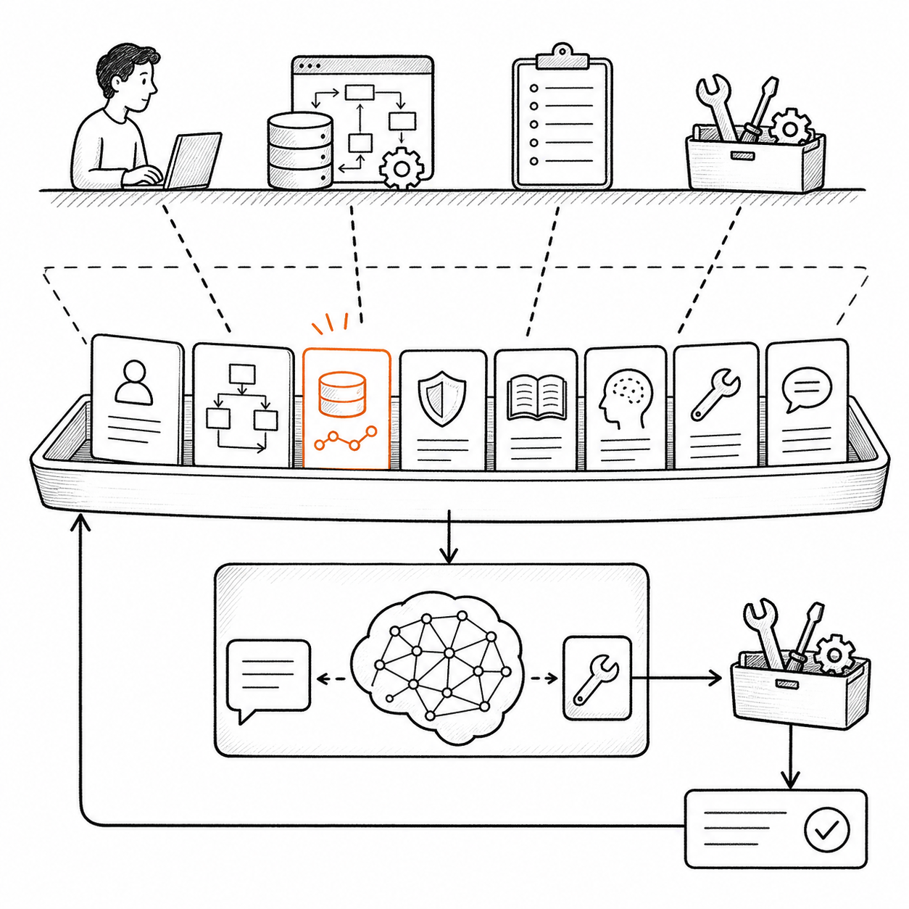
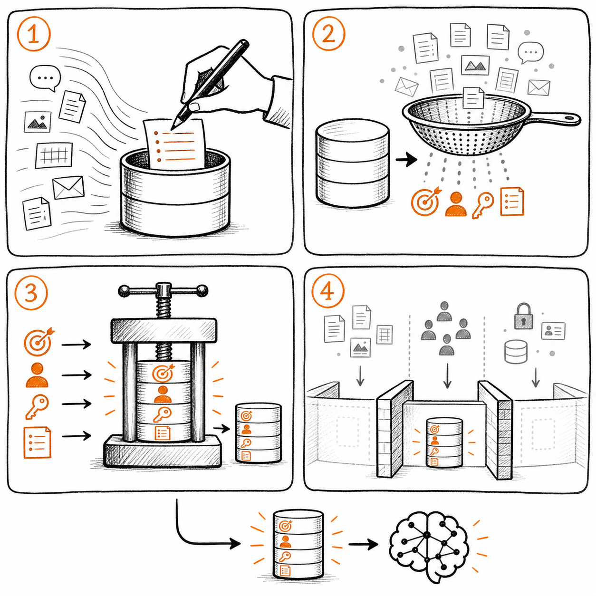

# Prompt 与 Context Engineering：产品经理到底在设计什么

一个企业知识 Agent 经常答错差旅政策。团队第一反应通常是改 Prompt：

```text
请准确回答用户问题，不要编造。回答时必须引用公司制度。
```

这段要求没有错，但它可能完全解决不了问题。模型也许没有拿到有效版本的制度，检索结果混入了其他地区的规则，用户权限没有传入，或者工具返回了十几段相互冲突的材料。此时继续调整措辞，只是在要求模型根据错误或不足的信息表现得更好。

这正是 Prompt Engineering 与 Context Engineering 的分界。

Prompt Engineering 关注如何表达任务、规则和输出要求。Context Engineering 关注模型在每一次决策时实际看到了什么：指令、对话、任务状态、用户信息、检索结果、记忆、工具定义、工具反馈，以及这些内容如何被选择、排序、压缩和隔离。

对于 AI 产品经理，这不是两个竞争概念。Prompt 是 Context 的一部分。真正需要设计的，是一套能让模型在正确时刻获得正确信息，并在信息不足时做出正确降级的产品机制。

## 先理解模型每次决策的输入



*图：模型不直接看见真实世界，只能根据本轮组装的任务、状态、权限、知识、记忆和工具反馈作出判断。*

用户看到的是一次连续对话，Agent 内部看到的却是一连串模型调用。每次调用都基于当时被组装出来的上下文作出下一步判断。



[查看 Mermaid 源码](../diagrams/source/book2-01-prompt-and-context-engineering-01.mmd)

模型不能直接看到“真实世界”。它只能看到系统放入上下文的表示。订单实际上已经退款，但工具只返回“请求成功”，模型就可能把受理误认为完成；公司制度已经更新，但检索仍返回旧版本，模型就可能引用过期规则。

因此，Agent 的很多失败不是模型不会推理，而是输入没有支持正确判断。LangChain 官方文档把常见原因归为两类：模型能力不足，或者没有把正确上下文交给模型。在真实产品中，后者往往更常见。

这给产品经理一个很实用的诊断顺序：

1. 模型是否拿到了完成当前判断所需的信息？
2. 信息是否来自正确来源，且仍然有效？
3. 信息之间是否存在冲突、噪音或权限问题？
4. 输入和输出要求是否表达清楚？
5. 前四项都成立后，模型能力是否仍然不足？

如果跳过前四步，团队很容易把检索、状态、工具和权限问题都归因于 Prompt 或模型。

## Prompt Engineering 解决什么问题

Prompt Engineering 的主要作用，是把产品要求翻译成模型可以执行的指令。它适合解决四类问题。

### 明确角色与任务

模型需要知道当前要完成什么，不负责什么，以及判断的对象是什么。

```text
你正在帮助员工查询公司差旅制度。
你的任务是根据提供的有效制度回答问题，不负责批准例外申请。
```

“你是一个专业助手”没有提供有效边界。角色描述只有在它改变任务选择或行为约束时才有价值。

### 说明决策规则

Prompt 可以规定模型在信息充分、信息冲突和信息不足时分别怎样处理。

```text
只使用标记为“有效”的制度。
若不同来源冲突，列出冲突，不自行选择其中一个。
若现有材料不能支持结论，说明缺少什么信息，并提供对应负责人。
```

但 Prompt 只能说明“如何使用信息”，不能保证系统真的提供了有效制度、冲突来源或负责人。

### 定义输出协议

当下游系统需要稳定字段时，产品经理应定义结构化输出，而不是依赖自然语言格式。

```json
{
  "answer": "结论",
  "sources": ["来源 ID"],
  "confidence": "high | medium | low",
  "needs_human": false
}
```

字段名称不是重点。重点是每个字段如何被业务使用、怎样校验，以及缺失时系统做什么。

### 结构化输出是版本化接口

模型生成 JSON，不等于系统获得了可信业务对象。结构化输出是模型与运行时之间的接口，至少要同时版本化四件事：Prompt、模型、Schema 和解析策略。

```json
{
  "schema_id": "policy_answer",
  "schema_version": "2.1",
  "answer": "结论",
  "source_ids": ["policy_2026_07#section_4"],
  "evidence_status": "supported",
  "next_action": "respond"
}
```

产品经理需要定义：

- 哪些字段必填，哪些字段允许为空；
- 枚举、数值范围、长度和对象结构；
- 字段之间的业务约束，例如 `evidence_status=insufficient` 时不能进入自动提交；
- 解析失败、缺字段、未知枚举和旧版本返回时的处理；
- 模型生成的是候选判断，还是已经由业务系统确认的事实；
- Schema 变更怎样兼容正在运行的任务、评估集和下游消费者。

严格 Schema 可以降低格式漂移，不能证明内容正确。运行时仍要执行结构校验、业务校验、权限校验和证据校验。模型返回的 `completed: true` 只能视为候选判断；只有权威系统状态和完成证据才能把任务标记为完成。

版本绑定也要进入 Trace：一次结果应能还原模型提供方与版本、Prompt 版本、Schema 版本、解析与校验结果。否则字段定义变化后，团队无法区分是模型退化、协议变更还是下游仍按旧语义读取。

### 提供少量示例

示例适合说明抽象规则难以表达的边界，例如什么算“证据不足”，什么情况必须转人工。示例要覆盖高价值边界，而不是堆积大量近似问答。

Prompt Engineering 的产品交付物不是一句“更好的 Prompt”，而是可版本化、可评估的行为协议。团队需要知道改动针对哪类失败，预期改变什么行为，以及有没有引入新的退化。

## Context Engineering 多设计了哪一层



*图：信息先被有条件地保存，再按当前决策选择；压缩必须保留关键约束，不同任务与权限域则需要隔离。*

当 Agent 从一次问答进入多轮对话、工具调用和长任务后，静态 Prompt 已经无法覆盖全部输入。系统必须持续决定哪些信息进入上下文，哪些留在外部，哪些被压缩，哪些不能让模型看到。

LangChain 把常见做法归纳为四类：写入、选择、压缩和隔离。对产品经理而言，可以把它们理解为四个产品问题。

### 写入：什么值得被保存

Agent 可以把计划、任务状态、用户偏好和中间结果写到上下文窗口之外，供后续步骤或未来会话使用。

产品经理需要区分三类信息：

- **当前任务状态**：本次任务进行到哪里，已经尝试什么，正在等待什么；
- **跨会话记忆**：经过用户同意、未来仍有价值的稳定偏好和事实；
- **权威业务数据**：订单、权限、政策和审批状态，继续留在业务系统中。

它们不能混在一起。用户这次说“先不要提交”是任务状态，不应被永久记成偏好；退款状态属于订单系统，不应由模型记忆代替。

### 选择：当前一步需要看到什么

并非保存的信息都应进入每次模型调用。选择的目标是找到当前决策所需的最小充分信息。

例如，一个事务 Agent 正在确认退款金额时，可能需要看到订单、可退款金额、用户授权和当前办理状态，但不需要看到用户三个月前关于旅行计划的对话。

选择机制包括：

- 按任务阶段加载不同规则；
- 按权限过滤知识；
- 按相关性召回记忆；
- 只暴露当前可用工具；
- 在多个来源之间进行版本和权威性排序。

“相关”不是唯一标准。信息还要满足权限、时效、来源和风险要求。语义上最相似的文档，可能恰好是过期版本。

### 压缩：哪些细节可以丢失

长对话和工具结果会不断消耗上下文窗口。常见处理方式是裁剪旧消息、总结历史、压缩工具输出。

压缩不是单纯减少 token，而是在决定什么信息可以被不可逆地丢弃。产品经理需要定义必须保留的内容：

- 用户目标和明确授权；
- 已完成、失败和等待中的关键步骤；
- 金额、时间、对象和业务标识；
- 已发现的风险与冲突；
- 支持最终结论的来源；
- 用户中途修改过的要求。

如果摘要只保留“用户希望退款”，却丢掉“最多接受 80% 且任何费用都要再次确认”，后续 Agent 仍然可能流畅工作，但产品已经失去关键控制条件。

### 隔离：什么不该进入同一个上下文

隔离可以通过任务状态字段、沙盒、子 Agent 或独立权限域实现。目的不是让架构更复杂，而是减少信息污染和越权。

例如：

- 财务 Agent 不应看到与报销无关的人事信息；
- 负责检索的单元可以读取原始文档，但负责生成公开回复的单元只能获得经过脱敏的材料；
- 图片、音频和大型表格可以保存在执行环境中，只把必要结论交给模型；
- 高风险工具只在用户完成授权后进入可用工具列表。

是否采用多 Agent，也应从隔离需求出发。若多个 Agent 共享相同信息、权限和工具，拆分通常只会增加调用成本与交接损失。

## 用状态契约稳定每一轮决策

对话摘要适合帮助模型回忆发生过什么，不能独立承担任务状态。摘要是有损文本，可能省略金额、对象、授权范围和等待原因；任务状态需要稳定字段、来源和校验规则，供运行时恢复与审计。

长任务可以在每次模型调用中提供一份精简的状态视图。它来自权威状态的工作投影，与系统 Prompt 分开管理：

```yaml
task_state:
  goal: "完成退款申请"
  phase: waiting_user
  completed_steps:
    - policy_checked
    - amount_calculated
  current_step: confirm_refund
  pending_questions:
    - "是否确认退回 280 元？"
  constraints:
    max_refund: 280
    confirmation_required: true
  authorization:
    status: pending
    scope: refund_order_123
  evidence_refs:
    - policy_2026_07#refund
  budget:
    remaining_tool_calls: 4
```

字段应来自不同的可信来源。模型可以建议更新计划、当前步骤和待确认问题；订单状态、权限、预算消耗和完成证据由运行时或业务系统写入。模型返回的状态更新先通过 Schema、状态转换和权限校验，再进入持久状态。

状态视图至少需要定义：

- 字段 owner，谁可以创建、修改和确认；
- 数据来源和更新时间，是否仍适用于当前决策；
- 每轮必带字段与按需加载字段；
- 状态冲突、字段缺失和版本不兼容时的处理；
- 暂停、恢复和跨进程重放所需的最小状态；
- 哪些字段可以压缩，哪些只能由新事实覆盖。

状态视图也有上下文成本。高频变化的字段应放在稳定 Prompt 前缀之后，避免一次进度更新使整段静态 Context 的缓存失效。完整历史留在外部存储，模型只看到当前决策需要的状态和引用；需要复核时再按引用读取原始事件。

## Prompt 与 Context 的关系

可以用一张表判断问题应该从哪里入手。

| 产品问题                           | 优先处理方式             |
| ---------------------------------- | ------------------------ |
| 模型不知道自己的任务或边界         | Prompt                   |
| 输出字段不稳定                     | Prompt 与结构化输出      |
| 相同信息下，模型经常选错规则       | Prompt、示例或模型评估   |
| 模型没有拿到当前任务状态           | Context                  |
| 检索结果过期、越权或相互冲突       | Context 与知识治理       |
| 工具太多，模型经常选错             | Context 中的动态工具选择 |
| 长对话后忘记用户约束               | Context 压缩与状态持久化 |
| 不同任务的信息相互污染             | Context 隔离             |
| 输入正确、规则清楚，模型仍无法完成 | 模型能力或任务设计       |

Prompt 更像一份给模型的工作说明，Context Engineering 更像一套实时备料和调度系统。说明写得再清楚，给错材料仍然做不出正确结果；材料齐全但没有工作说明，也会得到不稳定行为。

## 产品经理的 Context 设计框架

设计一个 Agent 场景时，不要从“上下文窗口有多大”开始。先为每个关键决策填写六项内容。

### 1. 当前决策

模型这一刻究竟要判断什么？是理解意图、选择工具、确认参数、判断任务完成，还是生成最终回复？

一个调用承担太多判断，会让上下文需求混在一起。必要时应把高风险判断拆成独立步骤。

### 2. 必要信息

为了完成判断，最少需要哪些信息？每项信息来自用户、业务系统、知识库、记忆还是上一工具结果？

### 3. 可信条件

信息是否需要权限校验、版本检查、有效期、来源等级或用户确认？如果多个来源冲突，谁有最终解释权？

### 4. 生命周期

信息只在当前调用有效、当前任务有效，还是可以跨会话保存？谁可以更正和删除？

### 5. 预算与优先级

上下文不足时，哪些内容必须保留，哪些可以总结，哪些可以重新读取，哪些应该直接丢弃？

### 6. 失败行为

必要信息缺失、过期、冲突或超过预算时，Agent 应该澄清、重试、降级、转人工，还是停止？

这六项共同构成 Context Contract，也就是上下文契约。它比“接入 RAG”“增加记忆”更接近可验收的产品需求。

## 双案例：同一个 Prompt，为什么结果不同

### 客户服务与事务办理 Agent

假设 Prompt 规定：“只有获得用户确认后才能提交退款。”

要让这条规则真正生效，上下文至少还要包含：

- 用户确认的具体方案，而不是笼统的“可以”；
- 当前订单、金额、币种和退款对象；
- 确认发生在方案变更之前还是之后；
- 工具返回的是请求已受理还是退款已完成；
- 任务恢复后，之前的确认是否仍然适用于当前方案。

这里最重要的不是把“必须确认”重复三遍，而是让确认与具体动作、参数和状态绑定。高风险信息还应由确定性系统校验，不能只依赖模型阅读上下文。

### 企业知识与办公 Agent

假设 Prompt 规定：“回答必须引用有效制度。”

上下文系统还要保证：

- 只检索用户有权限读取的材料；
- 优先使用当前有效版本；
- 保留支持结论的原文，而不只是文档摘要；
- 标识制度的适用地区、部门和时间；
- 来源冲突时把冲突暴露给模型；
- 没有证据时允许系统拒绝确定回答。

同一句 Prompt，在一套上下文机制中可以产生可信答案，在另一套机制中可能只产生带着引用格式的幻觉。

## 怎样写一份 Context PRD

产品需求可以使用下面的模板。

```text
场景：
用户目标：
完成证据：

关键决策 1：
- 模型需要判断：
- 必要信息：
- 信息来源：
- 权限与有效性：
- 冲突处理：
- 生命周期：
- token 优先级：
- 缺失时行为：

Prompt 要求：
- 任务与边界：
- 决策规则：
- 输出协议：
- 边界示例：

结构化输出：
- Schema ID / 版本：
- 必填、枚举与跨字段约束：
- 候选判断与权威事实的边界：
- 解析、业务、权限与证据校验：
- 缺字段、未知枚举和旧版本处理：

上下文写入：
- 当前任务状态：
- 跨会话记忆：
- 禁止写入的内容：

任务状态契约：
- Schema 与版本：
- 字段 owner 与可信来源：
- 每轮必带字段：
- 按需加载字段：
- 允许模型建议更新的字段：
- 只能由运行时或业务系统更新的字段：
- 暂停、恢复与冲突处理：

上下文选择：
- 始终注入：
- 按条件注入：
- 不应注入：

上下文压缩：
- 必须保留：
- 允许总结：
- 允许丢弃：
- 重新读取方式：

上下文隔离：
- 权限边界：
- 数据边界：
- 工具边界：

观测指标：
- 各部分 token 使用：
- 召回内容及来源：
- 裁剪与摘要事件：
- 工具选择：
- 失败类型：

验证用例：
- 正常路径：
- 信息缺失：
- 过期来源：
- 来源冲突：
- 权限不足：
- 长对话压缩：
- 任务恢复：
```

这份文档不要求产品经理决定具体向量数据库、分词器或中间件。它要求产品经理定义信息责任，让算法和工程团队知道系统必须提供什么，也让评估团队知道怎样证明机制有效。

## 如何验证一次优化

Prompt 与 Context 的改动都不能只靠“感觉回答更好了”验收。

### 建立失败分类

先把线上或评估失败分为：

- 指令不清；
- 必要信息缺失；
- 召回错误；
- 信息过期；
- 权限错误；
- 上下文冲突；
- 压缩丢失；
- 工具反馈不足；
- 模型能力不足。

分类不一定一次准确，但它能阻止团队把所有问题都归入“模型不稳定”。

### 一次验证一个主要假设

如果目标是验证摘要能否保留用户约束，就不要同时更换模型、重写 Prompt 和调整检索。否则即使指标上升，也不知道是哪项改动起作用。

### 同时观察结果与上下文轨迹

至少记录：

- 模型调用前实际获得了哪些信息；
- 各类信息占用多少 token；
- 哪些内容被选择、裁剪或总结；
- 使用了哪个版本的 Prompt；
- 模型选择了什么工具；
- 使用了哪个模型、Prompt、Schema 与解析器版本；
- 结构、业务、权限和证据校验分别得到什么结果；
- 最终业务状态和完成证据是什么。

日志不应无边界保存敏感上下文。观测方案同样需要脱敏、权限和保留期限。

### 用反事实问题复核

评审一次失败时，可以问：

- 如果 Prompt 不变，只补齐缺失信息，问题是否消失？
- 如果上下文不变，只改写指令，问题是否消失？
- 如果两者都不变，换更强模型是否稳定改善？
- 如果移除一半上下文，结果是否反而更好？

这些问题能帮助团队找到真正限制产品的变量。

## 常见误区

### 误区一：宣布 Prompt Engineering 已经过时

Context Engineering 扩大了问题范围，并没有让 Prompt 失去作用。任务边界、决策规则和输出协议仍然需要被清楚表达。更准确的说法是：只优化 Prompt，不足以构建可靠 Agent。

### 误区二：把所有数据都放进上下文

更多信息不等于更多有效信息。长上下文会增加成本和延迟，也可能带来注意力稀释、信息冲突和权限风险。

### 误区三：把 RAG 当成 Context Engineering 的全部

检索只是选择知识的一种方式。对话历史、任务状态、记忆、工具反馈、权限和压缩策略同样属于上下文。

### 误区四：用摘要替代状态

摘要适合压缩叙事，不适合保存必须精确读取的金额、权限、状态和授权。关键字段应进入结构化任务状态。

### 误区五：先定固定比例，再寻找依据

预算比例只是可检验假设。不同任务阶段可能需要不同分配：检索阶段需要更多知识，执行阶段需要更多状态和工具反馈，最终回复阶段需要证据和输出协议。

### 误区六：没有记录模型实际看到了什么

如果团队只能看到用户问题和最终回复，就无法判断失败来自 Prompt、检索、记忆、工具还是模型。Context Engineering 必须与可观测性和评估一起建设。

## 本章小结

Prompt Engineering 设计的是模型如何理解任务、规则和输出。结构化输出把其中的输出协议变成版本化接口，但仍需要运行时校验。Context Engineering 设计的是每一步决策所需的信息如何被写入、选择、压缩和隔离。

对 AI 产品经理而言，核心工作不是在两者之间选边，而是建立完整的信息责任：当前判断需要什么，信息从哪里来，是否有效和有权使用，何时进入上下文，超出预算时保留什么，缺失或冲突时怎样降级，以及如何证明一次调整真的提高了任务结果。

一句更强的 Prompt 可以改善表达。一套可靠的上下文机制，才能让 Agent 在长任务和真实环境中持续做出有依据的判断。

## 思考题

1. 选择你的 Agent 最近一次失败，它更像 Prompt 问题，还是上下文问题？证据是什么？
2. 当前上下文中，哪类信息即使删除也不会影响任务？它为什么还在？
3. 如果历史对话必须压缩，哪些用户约束绝不能只保存在自然语言摘要里？
4. 你的团队能否还原一次模型调用实际看到的全部信息？如果不能，怎样判断优化是否有效？

## 延伸阅读

- [LangChain：Context Engineering](https://www.langchain.com/blog/context-engineering-for-agents)，从写入、选择、压缩和隔离四类策略解释 Agent 上下文工程。
- [LangChain 文档：Context engineering in agents](https://docs.langchain.com/oss/python/langchain/context-engineering)，包含模型上下文、工具上下文、生命周期中间件与动态选择示例。

<!-- chapter-navigation:start -->
---

[上一篇：引言：从模型能力走向 Agent 产品工程](00-introduction.md) · [篇章目录](README.md) · [下一篇：Retrieval / Knowledge Engineering：让 Agent 找到能支持决策的事实](02-retrieval-and-knowledge-engineering.md)
<!-- chapter-navigation:end -->
