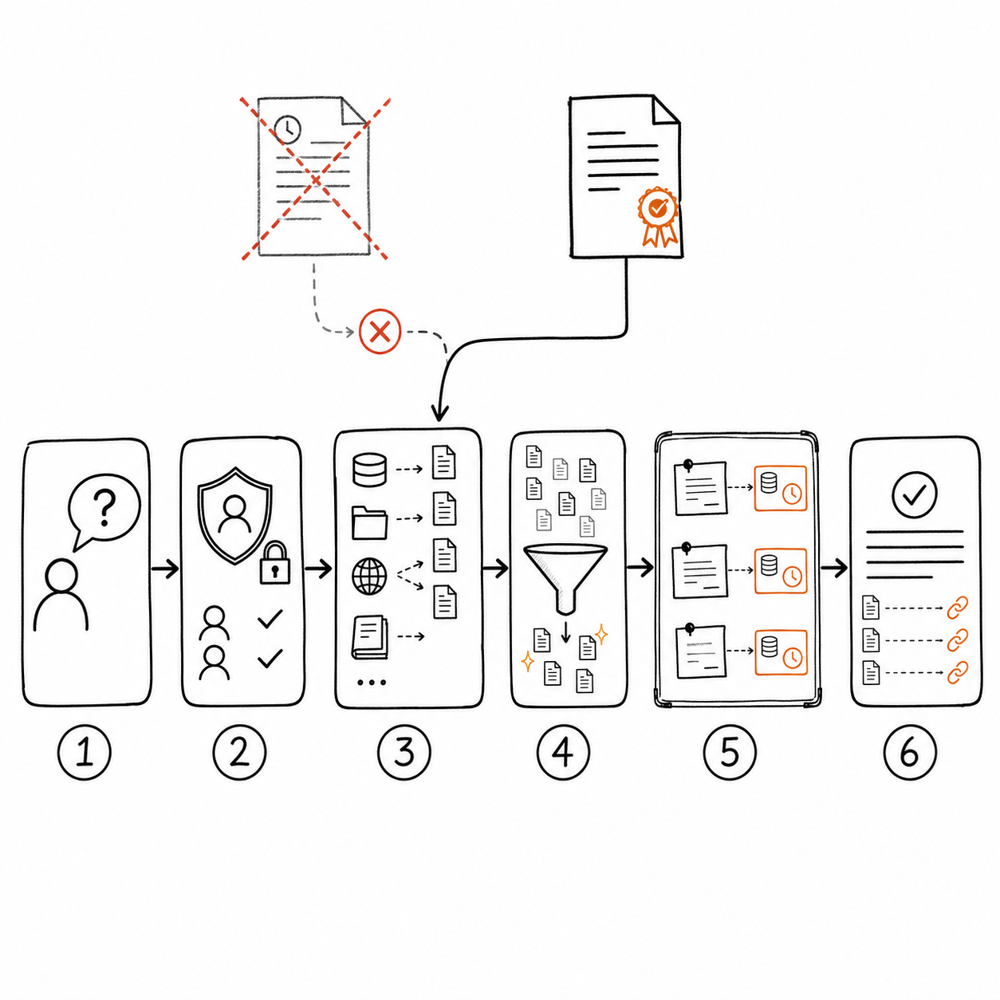

# Retrieval / Knowledge Engineering：让 Agent 找到能支持决策的事实

一个企业制度 Agent 回答：“国内出差住宿标准是每晚 600 元。”

它给出了引用，链接也能打开。用户后来发现，那是两年前的旧制度，而且只适用于另一个职级。系统完成了检索，却没有取得支持当前用户决策的知识。

Retrieval Engineering 关注怎样找到候选信息。Knowledge Engineering 还要处理来源、结构、版本、权限、冲突和生命周期。两者共同回答一个产品问题：Agent 当前使用的事实是否足以支持这次判断。

## 检索结果不等于知识

向量相似度只能说明两段文字在表达上接近。真实产品还要判断：

- 来源是否权威；
- 文档是否仍然有效；
- 用户是否有权访问；
- 内容适用于哪个地区、角色和时间；
- 多个来源是否冲突；
- 结论能否回到原文核查。


[查看 Mermaid 源码](../diagrams/source/book2-02-retrieval-and-knowledge-engineering-01.mmd)

如果缺少过滤和校验，召回越强，系统越可能快速找到一段看起来相关但不能使用的材料。

## 先定义知识责任

产品经理可以把知识分成四类。

| 类型 | 示例 | 主要责任 |
| --- | --- | --- |
| 权威规则 | 制度、合同、价格政策 | 版本、适用范围和冲突处理 |
| 业务事实 | 订单、库存、审批状态 | 实时性、权限和系统一致性 |
| 参考材料 | 操作手册、案例、历史文档 | 来源质量和引用完整性 |
| 推导结果 | 摘要、分类、模型提取字段 | 可追溯性和重新计算 |

业务事实通常应通过工具或业务系统实时查询，不适合长期复制进知识库。制度可以进入索引，但要保存版本、生效时间和适用对象。模型生成的摘要只能作为派生材料，不能覆盖原始来源。

## 一条检索链需要设计什么



*图：查询理解、权限过滤、召回、排序去重、证据组装和回答引用共同组成检索链，过期或不适用的来源应被排除。*

### 查询理解

用户问“住宿能报多少”，系统可能需要补全地区、职级、出差日期和费用类型。缺少这些条件时，检索系统不应假装问题已经完整。

### 范围与权限

权限过滤要发生在召回前后。只在生成答案时要求模型“不泄露”，无法阻止敏感内容已经进入上下文、日志或评估平台。

### 召回

关键词、向量、结构化查询和图关系各有适用范围。精确编号、日期和人名适合关键词或结构化查询；概念性问题适合语义召回。高价值系统通常会组合多路召回，再统一排序。

### 排序与去重

排序不能只优化相关性。权威级别、版本、时效、权限和内容完整性都可能改变优先级。重复切片还会挤占上下文，让模型误以为某个观点得到多个独立来源支持。

### 证据组装

进入上下文的内容应保留来源 ID、标题、版本、时间和定位信息。压缩可以减少 token，不能剪掉判断适用范围所需的限定条件。

### 回答与引用

引用要支持具体结论。只在回答末尾附上几个相关链接，不代表每个结论都能被核查。高风险场景还需要把引用与制度条款、订单字段或业务凭证绑定。

## 知识冲突怎样处理

冲突不是检索噪音，而是一种需要产品行为的状态。

```text
若新旧版本存在明确替代关系，使用当前有效版本并标注生效时间。
若不同来源适用范围不同，先补充用户条件再选择。
若两个同级权威来源直接冲突，展示冲突并转交负责人。
若只能找到非权威材料，说明来源限制，不给出确定业务结论。
```

让模型“选择更合理的一条”会把组织治理问题变成概率判断。明确的版本和权威规则应由确定性系统执行。

## 怎样写 Retrieval / Knowledge PRD

一份可验收的需求至少包括：

```yaml
user_question: 员工查询差旅住宿标准
required_dimensions:
  - region
  - employee_level
  - travel_date
authoritative_sources:
  - travel_policy
freshness:
  policy: versioned
  employee_level: realtime
access_scope: current_user
conflict_behavior: escalate
citation_requirement: claim_level
no_evidence_behavior: abstain
```

还要写清楚知识更新后多久可检索、旧版本是否保留、删除如何传播到缓存和索引，以及用户如何报告错误来源。

## 怎样评估检索与知识

评估应把链路拆开：

- 查询理解是否补齐了必要条件；
- 召回是否包含支持答案的材料；
- 排序是否把当前权威来源放到前面；
- 未授权内容是否完全没有进入结果；
- 回答中的结论是否受引用支持；
- 信息不足和冲突时是否正确拒答或升级；
- 更新、撤回和删除是否在目标时间内生效。

只评最终答案会掩盖两种相反情况：错误检索碰巧得到正确回答，正确检索却在生成时引入错误。两种失败的修复位置不同。

## 常见误区

### 把 RAG 当成一个组件

接入向量数据库只完成了存储和召回的一部分。知识治理、权限、版本、冲突和引用仍然需要产品设计。

### 用更大的 top-k 解决遗漏

召回更多内容会增加覆盖，也会增加噪音和成本。先分析遗漏来自查询、切分、索引、过滤还是排序，再决定调整哪一层。

### 把网页最新时间当成内容有效期

页面更新日期不能证明条款仍然有效。制度需要明确版本和生效关系。

### 只测公开问答

企业系统最危险的失败往往在租户隔离、角色权限、撤回文档和冲突规则。它们必须进入评估集。

## 本章小结

Retrieval 找到候选材料，Knowledge Engineering 决定哪些材料可以成为当前判断的依据。产品经理要定义知识类型、权威来源、适用范围、权限、版本、冲突和引用要求，再用分层评估区分检索失败与生成失败。

## 思考题

1. 当前知识库中，哪些业务事实本应实时查询，却被复制成了静态文档？
2. 两份制度冲突时，系统依据什么决定优先级？
3. 用户权限变化后，缓存、索引和 Trace 中的内容会怎样处理？
4. 线上错误能否定位到查询理解、召回、排序还是生成？

## 延伸阅读

- [Anthropic：Introducing Contextual Retrieval](https://www.anthropic.com/news/contextual-retrieval)，讨论上下文检索怎样减少切片丢失的语义。
- [OpenAI：Retrieval](https://platform.openai.com/docs/guides/retrieval)，介绍语义搜索、向量存储和属性过滤。
- [RAGAS Metrics](https://docs.ragas.io/en/stable/concepts/metrics/available_metrics/)，提供 Context Recall、Faithfulness 等检索与生成评估指标。

<!-- chapter-navigation:start -->
---

[上一篇：Prompt 与 Context Engineering：产品经理到底在设计什么](01-prompt-and-context-engineering.md) · [篇章目录](README.md) · [下一篇：Memory Engineering：让 Agent 记住该记的，也能忘掉该忘的](03-memory-engineering.md)
<!-- chapter-navigation:end -->
