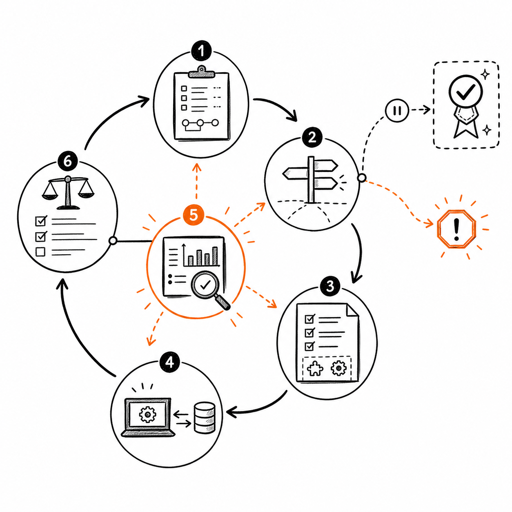
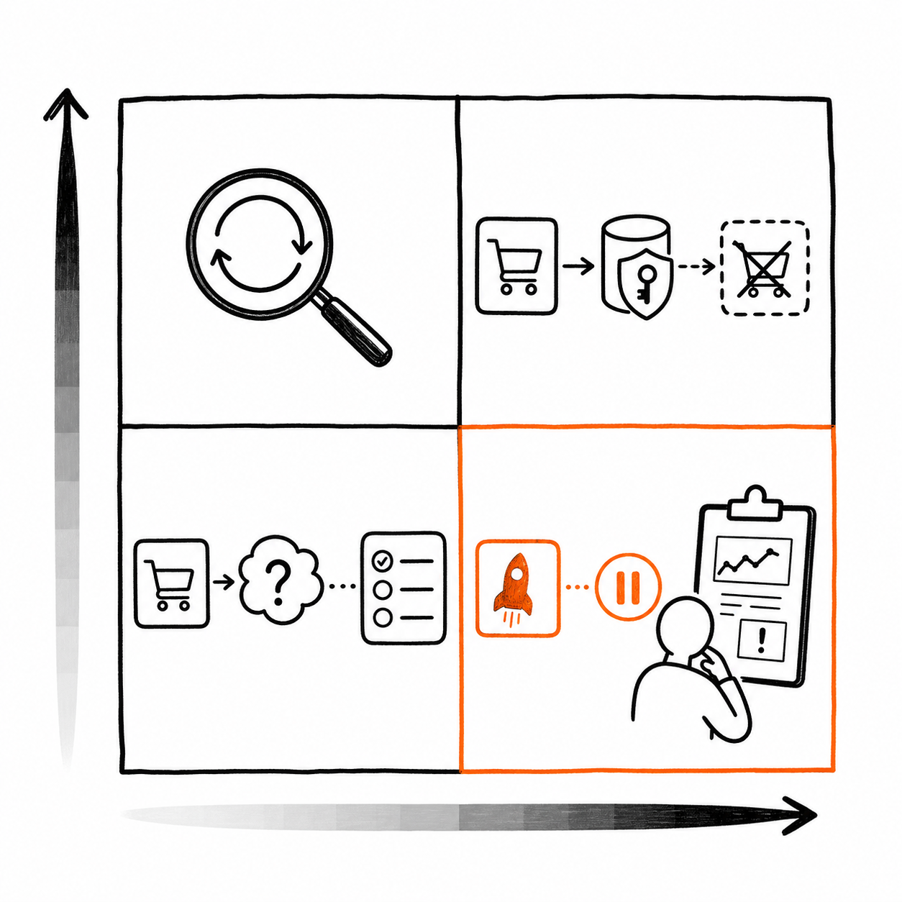

# Tool Loop Engineering：把工具调用做成可控的产品闭环

用户让差旅 Agent 订一张下周去上海的高铁票。Agent 查到车次，选了一班，提交订单，然后回复“已经订好”。

演示到这里很顺。真实产品里还缺很多判断：出发站是否正确，席别是否符合政策，价格有没有超过预算，提交前是否需要确认，支付结果是成功、处理中还是未知，失败后能不能安全重试。

这些判断不会在一次模型调用里完成。模型需要选择工具、生成参数、读取结果，再根据新状态决定下一步。这个反复进行的过程就是 Tool Loop。



[查看 Mermaid 源码](../diagrams/source/book2-04-tool-loop-engineering-01.mmd)

Function Calling 只解决模型怎样用结构化格式提出一次工具调用。Tool Loop Engineering 还要决定工具能否执行、结果如何进入下一轮、什么情况继续、什么情况停止、失败后如何恢复，以及怎样证明任务真的完成。

对 AI 产品经理来说，Tool Loop 不是运行时的内部细节。循环边界直接决定产品的自主程度、成功率、风险、延迟和单任务成本。

## 什么时候需要 Tool Loop

OpenAI 的 Function Calling 文档把一次工具调用拆成五个步骤：向模型提供工具，接收工具调用，在应用侧执行，把工具结果交回模型，再获得最终回复或新的工具调用。最后一步里的“新的工具调用”，让一次 Function Calling 进入循环。

并非所有工具场景都需要开放循环。

**单次调用就够用**，适合路径固定、工具结果可以直接转成答案的任务。比如查询订单状态，系统只需读取一次订单接口，再按确定模板展示。

**固定工作流更合适**，适合步骤可预知、合规要求明确的事务。比如报销申请必须按“校验发票、检查额度、提交审批”执行，模型可以帮助理解材料，但不必决定流程顺序。

**Tool Loop 有价值**，通常是因为任务需要的步骤无法事先完全确定。比如调研一个陌生市场时，第一轮搜索结果会决定下一轮查哪家公司、补哪份报告、何时停止。代码 Agent 也需要根据测试和错误日志调整下一步。

Anthropic 把固定代码路径称为 workflow，把由模型动态决定过程和工具用法的系统称为 agent。它同时提醒，Agent 往往用更高延迟和成本换取任务表现。产品设计应从最简单的可行路径开始，只把确实需要动态判断的部分交给 Loop。

可以用四个问题判断：

- 后续步骤是否依赖上一工具返回的未知结果？
- 工具失败后是否存在多种处理路径？
- 任务是否需要在执行中补信息、改计划或调用不同工具？
- 完成条件能否在运行时通过外部证据判断？

如果四项都是否，固定工作流通常更便宜、更稳定，也更容易验收。

## 一轮 Tool Loop 到底发生了什么



*图：Agent 读取状态、决定下一步、提出工具调用、执行、观察真实结果并更新状态，随后依据完成证据、用户输入和风险条件继续或退出。*

ReAct 论文把推理与行动交错起来：推理用于跟踪和调整计划，行动负责从知识库或环境获取新信息。产品实现不一定公开模型的内部推理，但必须保存可观察的行动、结果和状态变化。

一轮 Tool Loop 至少包含六个产品动作。

### 读取当前状态

模型需要知道用户目标、已完成步骤、工具返回、剩余约束和当前可用工具。这里应使用结构化状态保存金额、对象、授权和任务阶段，不能只依赖对话摘要。

### 决定下一步

模型可以回答、提问、调用工具或停止。产品需要限定它在哪些判断上有自主权。比如模型可以选择搜索关键词，却不能自行扩大数据权限。

### 提出工具调用

模型返回工具名称和参数。这个输出是执行建议，不是已经发生的业务动作。系统仍需校验参数、权限、风险和当前状态。

### 执行并观察

应用执行工具，把结果写回循环。观察结果要让模型分得清成功、失败、处理中和结果未知，也要包含下一步判断所需的业务字段。

### 更新状态

每次行动之后，系统记录做过什么、结果怎样、是否产生副作用，以及任务完成条件有没有变化。长任务还要持久化这些状态，以便暂停和恢复。

### 判断继续还是退出

模型可以建议结束，但运行时需要执行确定性停止规则。达到任务完成、等待用户、触发风险边界、成本超限或重复失败时，系统都应退出当前循环。

这六个动作中，模型主要负责开放判断。权限、参数、状态转换、预算和停止上限更适合由代码负责。

## 工具不是 API 包装，而是 Agent 的产品界面

传统 API 面向开发者，Tool 同时面向模型。参数名、描述、返回值和错误语义都会影响模型能否选对、填对、读懂。

### 一个工具只表达一个清楚动作

`manage_order` 可以查询、取消、退款和改地址，模型需要额外猜测操作模式。拆成 `get_order`、`cancel_order` 和 `request_refund` 后，动作边界更明确，风险策略也更容易分别配置。

反过来，两个动作若在所有场景中都必须连续发生，可以合并。OpenAI 文档建议把固定连续调用组合起来，减少模型本来不需要做的中间决策。

### 不让模型填写系统已经知道的参数

用户刚从订单列表点进某一单，`order_id` 已由界面和会话状态确定，就不应让模型重新生成。模型只提供必须由它理解或提取的参数，身份、权限、业务对象和幂等键由系统注入。

这能减少参数错误，也能防止模型把动作施加到错误对象。

### 参数契约要能被程序校验

JSON Schema 可以约束类型、必填项、枚举和对象结构，但 schema 正确不代表业务参数正确。退款金额即使是合法数字，也可能超过可退款余额。工具执行前至少有三层校验：

1. 结构校验：字段是否存在，类型和格式是否正确；
2. 业务校验：金额、日期、库存和状态是否允许；
3. 授权校验：当前用户能否对当前对象执行这个动作。

模型输出不能替代任何一层。

### 返回值要支持下一次决策

下面这种返回几乎无法支撑循环：

```json
{
  "success": true,
  "message": "操作成功"
}
```

Agent 不知道成功指接口收到请求，还是业务已经完成。更有用的结果会明确业务状态和证据：

```json
{
  "request_id": "refund_123",
  "status": "processing",
  "amount": 280,
  "currency": "CNY",
  "completed": false,
  "retryable": false,
  "next_check_after_seconds": 30
}
```

产品经理应为每个工具定义：

- 成功意味着什么；
- 哪个字段证明业务完成；
- 失败属于可重试、不可重试还是结果未知；
- 失败后允许什么动作；
- 返回内容是否包含敏感信息；
- 结果过大时怎样保存和按需取回。

## Observation 决定下一轮是否还有依据

Tool Loop 的质量很大程度上取决于 Observation，也就是工具执行后交回模型的环境反馈。

Anthropic 在 Agent 实践中强调，每一步都要从环境获取 ground truth。这里的环境事实不能只是一句自然语言摘要，它应尽量来自业务系统、测试结果、文件状态或可核查来源。

以发送邮件为例：

```text
“邮件已发送。”
```

这句话可能来自模型自己的判断，也可能来自接口返回，无法区分。更可靠的 Observation 会包含收件人、消息 ID、服务端状态和时间。最终回复可以简化，但运行时需要保留证据。

Observation 还要控制信息量。搜索、日志和网页工具经常返回大段文本，全部塞回上下文会抬高成本并干扰模型；直接截断又可能丢掉关键证据。常用方案是保存完整结果，只把摘要、预览和取回句柄放进上下文，让模型按需读取。

这里有一个容易忽略的风险：取回工具本身不能再次触发同样的落盘逻辑，否则会形成“保存、取回、再次保存”的新循环。

## Planning、Reflection 与 Tool Loop 的关系

DeepLearning.AI 当前的 Agentic AI 课程把 Tool Use、Planning、Reflection 和 Multi-Agent 作为四类设计模式。它们不是四套互斥架构，可以出现在同一个循环的不同位置。

### Planning 决定下一段路怎么走

计划可以在任务开始时生成，也可以在工具返回后更新。计划的产品价值是显式保存目标、依赖和完成条件，方便恢复与评审。

计划不应变成不可修改的剧本。外部事实变化后，Agent 需要调整后续步骤，但已获得的用户授权不能随着计划改写自动扩大。

### Reflection 用来改进下一次尝试

Reflection 让模型检查已有行动和结果，再决定是否修正。LangChain 的 Reflection 资料也指出，没有外部反馈的自我批评未必比原答案可靠。模型可能只是用另一种说法重复原来的错误。

Reflection 更适合绑定可验证信号：

- 代码是否通过测试；
- 检索结论是否有来源支持；
- 输出是否满足明确评分标准；
- 工具是否返回预期业务状态；
- 用户是否接受当前结果。

如果没有标准和新证据，多转几轮只会增加成本。

### 多 Agent 不是 Tool Loop 的默认升级

单个 Agent 已经可以计划、调用工具和根据结果调整。只有职责、上下文或权限确实需要隔离，或者独立评审能带来可测量收益时，才有理由引入第二个 Agent。

把同一份上下文交给多个模型相互讨论，往往增加调用次数和交接损失，却没有增加环境证据。

## 停止条件比继续能力更重要

能继续调用工具很容易，知道何时停下来更难。一个生产可用的 Loop 至少需要六类退出条件。

### 任务已经完成

完成不能等同于模型说“完成了”。每类任务都要有外部证据，比如订单状态为 `paid`、文件确实存在、测试通过、审批系统返回已提交。

### 需要用户信息或确认

缺少必要参数、高风险动作待确认，或者结果存在业务歧义时，循环应进入等待状态。等待不是失败，也不应通过模型反复提问消耗轮次。

### 当前路径无法继续

权限不足、业务明确拒绝、资源不存在时，重复同一调用不会带来新信息。系统应返回可解释原因，并停止或换到明确允许的替代路径。

### 达到资源上限

轮数、token、时间、工具费用和重试次数都要设上限。固定最大轮数是一道保险，不是完成判断。达到上限时应告诉用户已经做了什么、还缺什么，而不是输出看似完整的猜测。

### 检测到重复或无进展

Agent 连续用相同参数调用同一工具，或者多轮状态没有变化，说明已经进入无进展循环。可以比较工具名称、关键参数、返回状态和完成条件变化，达到阈值后熔断。

### 风险边界被触发

工具越权、参数超过额度、外部内容试图改变指令，或者执行结果处于未知状态时，应停止自动行动。副作用是否已经发生不明确时，直接重试尤其危险。



[查看 Mermaid 源码](../diagrams/source/book2-04-tool-loop-engineering-02.mmd)

## 副作用工具必须考虑恢复



*图：只读操作可以受限重试；副作用增加或结果变得不确定后，需要幂等、执行后核验或人工决定。*

查询天气失败了，可以安全地再查一次。退款请求超时了，系统却不知道对方是否已经受理，此时再次提交可能造成重复退款。

每个工具都需要明确恢复模式。

**只读重试**，适合查询类工具。前提是调用没有副作用，并且重试次数受限。

**幂等执行**，适合同一业务动作可以通过幂等键去重的工具。相同任务和步骤应复用同一个幂等身份，恢复时不能生成新身份。

**执行后验证**，适合工具结果不确定，但可以通过另一条查询路径确认最终状态的场景。验证成功后继续，验证失败或仍不确定时停止。

**人工决定**，适合无法可靠查询状态、重复执行影响又很大的动作。系统保存现场，让用户或运营人员决定是否补偿、重试或终止。

恢复设计要围绕具体 Step，而不是笼统地“重跑整个 Agent”。整段重放可能把已经成功的副作用再次执行。

## 风险、并发和确认要进入 Loop 设计

多个工具调用能否并行，不应由模型一句“同时执行”决定。

天气查询、读取多个公开页面这类独立只读动作通常可以并行。写文件、提交订单、发送消息和修改账户状态应默认串行，除非业务能证明它们互不影响且具备幂等保护。

用户确认也要绑定具体动作和参数：

```text
确认支付 560 元，购买 7 月 30 日 G12 次二等座，乘车人是张三。
```

“是否继续”无法让用户判断风险。确认后如果价格、日期、车次或乘车人变化，原确认应失效。

产品还要明确工具白名单的含义。用户允许某工具免确认，不代表它可以绕过权限、额度和业务校验。免掉的只是重复交互，不是安全控制。

## 产品经理怎样写 Tool Loop PRD

```text
场景：
用户目标：
非目标：
完成证据：

为什么需要 Loop：
- 哪些步骤无法预先确定：
- 哪些 Observation 会改变下一步：

状态：
- 必须结构化保存：
- 可以放在对话：
- 暂停与恢复要求：

工具 1：
- 用户可理解的动作：
- 输入参数：
- 系统注入参数：
- 结构、业务与权限校验：
- 成功状态：
- 完成证据：
- 可重试失败：
- 不可重试失败：
- 结果未知时处理：
- 副作用与恢复模式：
- 风险等级与确认方式：
- 超时与费用：

循环策略：
- 允许模型决定：
- 必须由代码决定：
- 最大轮数：
- 时间、token 与费用上限：
- 无进展检测：
- 并发规则：

退出状态：
- completed：
- waiting_user：
- blocked：
- failed：
- budget_exhausted：
- result_unknown：

用户体验：
- 何时展示进度：
- 确认内容：
- 失败说明：
- 最终结果与证据：

观测与评估：
- 每轮输入状态：
- 工具调用与参数：
- Observation：
- 状态变化：
- 退出原因：
- 单任务成本：
```

PRD 的重点不是规定框架或代码结构，而是让产品、算法、工程、安全和运营对同一条循环达成一致：哪些判断交给模型，哪些规则由系统保证，什么才算完成，出错后谁接手。

## 怎样评估 Tool Loop

只看最终回答是否“像完成了”不够。评估要同时覆盖任务、轨迹、风险和成本。

### 任务结果

- 业务目标是否完成；
- 完成证据是否真实存在；
- 结果是否符合用户约束；
- 需要人工接管时是否保留了可继续的状态。

### 循环轨迹

- 工具选择是否正确；
- 参数是否正确；
- Observation 是否足以支持下一步；
- 是否出现重复调用、无进展或不必要步骤；
- 退出原因是否与真实状态一致。

### 风险控制

- 未授权工具调用数；
- 高风险动作未确认执行数；
- 重复副作用数；
- 结果未知时错误重试数；
- 外部内容改变系统权限或规则的次数。

### 成本与体验

- 成功任务的平均模型轮数；
- 每类工具的调用次数和失败率；
- P50、P95 任务时长；
- 成功任务单位成本；
- 用户等待确认的次数；
- 因进度不透明导致的取消和重复提交。

评测集要包含正常路径，也要故意制造工具超时、空结果、过期数据、权限不足、参数变化、重复返回、长结果和任务中断。Tool Loop 的价值正是在环境变化时调整路径，只测一次成功调用看不到这一点。

## 常见误区

### 把 Function Calling 当成 Agent 已经会用工具

模型能输出合法 JSON，只证明调用格式可解析。工具是否选对、参数是否符合业务、结果是否被正确理解，还需要单独验证。

### 把模型文字当成业务状态

模型说“已退款”不能证明退款完成。最终状态必须来自业务系统或其他可核查证据。

### 所有失败都自动重试

网络抖动可以重试，权限拒绝和业务规则拒绝不会因为重试而改变。副作用结果未知时，盲目重试还可能重复执行。

### 只设置最大轮数

最大轮数只能阻止无限循环，不能识别任务完成、无进展和等待用户。退出状态需要表达真实原因。

### 用 Reflection 替代验证

模型自我批评可以帮助发现问题，无法证明外部动作成功。能跑测试就跑测试，能查业务状态就查状态。

### 工具越多，Agent 能力越强

大量相似工具会增加选择错误和上下文成本。工具集应围绕当前任务动态暴露，并持续评估每个工具是否真的带来任务增益。

## 本章小结

Tool Loop 把一次工具调用变成连续的产品决策：模型根据当前状态提出动作，系统完成参数、权限和风险校验，工具返回环境证据，运行时更新任务状态，再决定继续、等待或停止。

产品经理需要定义的不是“让 Agent 自己循环”，而是循环里的责任边界。工具契约要清楚，Observation 要能支持下一步，完成需要外部证据，副作用要能恢复，轮数和成本要有上限，每一种退出都要让用户知道当前发生了什么。

## 思考题

1. 选择产品中的一个工具。它返回的是技术成功，还是业务完成？
2. 如果工具在超时前已经产生副作用，当前系统会验证、重试还是直接交给人工？
3. 一次用户确认绑定了哪些参数？参数变化后确认会不会自动失效？
4. 当前 Loop 除了最大轮数，还能识别哪些停止原因？
5. 评测失败时，团队能否还原每一轮的状态、调用、Observation 和退出原因？

## 延伸阅读

- [DeepLearning.AI：Agentic AI](https://www.deeplearning.ai/courses/agentic-ai)，从 Reflection、Tool Use、Planning 和 Multi-Agent 四类模式介绍 agentic workflow。
- [ReAct: Synergizing Reasoning and Acting in Language Models](https://arxiv.org/abs/2210.03629)，原始论文，解释推理与行动交错的基本思路。
- [OpenAI：Function Calling](https://platform.openai.com/docs/guides/function-calling)，工具定义、调用流程、参数 schema 与并行调用的官方说明。
- [Anthropic：Building Effective Agents](https://www.anthropic.com/research/building-effective-agents)，讨论 workflow 与 agent 的边界、环境反馈、停止条件和工具设计。
- [LangChain：Reflection Agents](https://blog.langchain.com/reflection-agents/)，展示 Reflection、外部反馈和固定循环上限之间的关系。

<!-- chapter-navigation:start -->
---

[上一篇：Memory Engineering：让 Agent 记住该记的，也能忘掉该忘的](03-memory-engineering.md) · [篇章目录](README.md) · [下一篇：Graph Engineering：把 Agent 的决策过程变成可设计的产品](05-graph-engineering.md)
<!-- chapter-navigation:end -->
