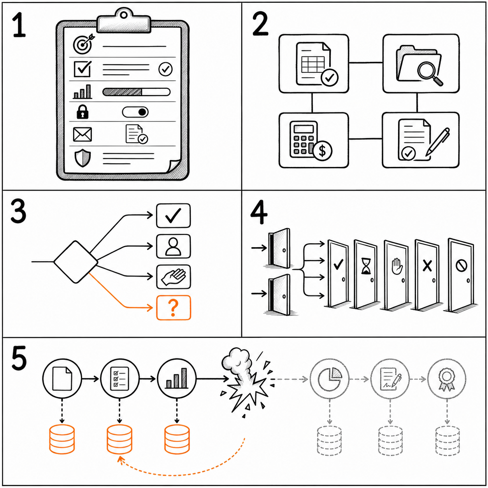
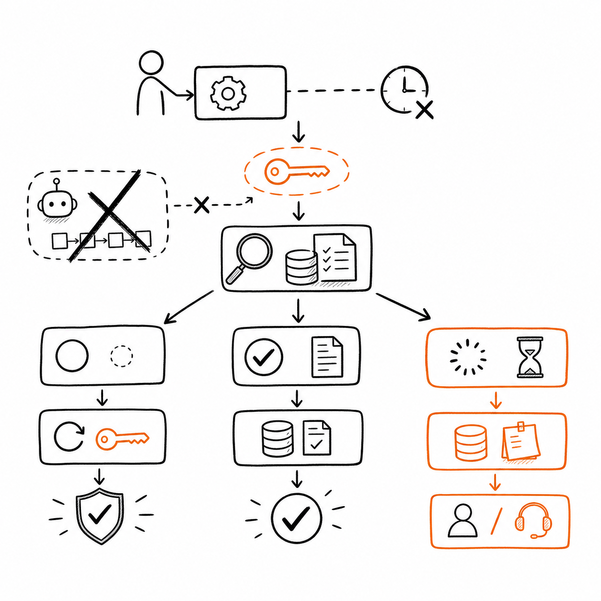

# Graph Engineering：把 Agent 的决策过程变成可设计的产品

一个报销 Agent 收到用户上传的发票后，需要识别票面信息、查询报销制度、检查预算、判断是否需要主管审批，最后创建报销单。

演示时，这条链路可能只需要一句 Prompt：

```text
请检查用户提交的发票，并按照公司制度完成报销。
```

真正上线后，产品经理很快会遇到一组无法只靠 Prompt 回答的问题：

- 发票识别失败后，应该重新识别、请用户补充，还是转人工？
- 制度查询和预算检查能否并行？
- 金额超过多少必须进入主管审批？
- 用户补交材料后，从哪一步继续？
- 创建报销单时服务超时，系统怎样判断是否已经创建成功？
- 制度在任务执行期间发生变化，应该继续使用旧版本还是重新校验？
- 团队怎样还原 Agent 为什么走到当前结果？

这些问题共同指向 Graph Engineering。

Graph Engineering 不是把流程画成一张图，也不是学会某个图框架的 API。它是把 Agent 的任务状态、执行单元、转移条件、循环出口、人工介入和恢复规则设计成一套可执行、可观察、可验证的产品机制。

LangGraph 用 State、Node 和 Edge 提供了一种直接实现方式。产品经理真正需要掌握的，是这些概念背后的产品判断。即使团队没有使用 LangGraph，同样需要回答这些问题。

## 为什么 Agent 需要“图”

传统流程通常假设路径相对稳定：


[查看 Mermaid 源码](../diagrams/source/book2-05-graph-engineering-01.mmd)

Agent 任务的路径更容易受到状态和环境反馈影响。一次工具调用可能失败，检索结果可能互相冲突，用户可能中途修改目标，模型也可能发现原计划无法继续。



[查看 Mermaid 源码](../diagrams/source/book2-05-graph-engineering-02.mmd)

图的价值不在于“看起来更智能”，而在于它迫使团队把隐藏在自然语言中的决定显式化：

- 当前任务处于什么状态；
- 下一步由什么条件决定；
- 哪些步骤可以重做；
- 哪些动作必须先确认；
- 哪些结果可以证明完成；
- 失败后从哪里恢复；
- 什么情况下必须停止。

只要产品存在多步决策、条件分支、循环、并行、等待或恢复，它就已经有一张逻辑上的图。区别只是这张图由团队主动设计，还是散落在 Prompt、代码分支、数据库字段和人的经验里。

## 先统一 Runtime 的核心对象

图中的 State、Node 和 Edge 描述执行机制，产品还需要一组跨界面、运行时、存储、Trace 和运营都一致的业务对象。否则“任务”“会话”“一次执行”和“一个步骤”会被混用，恢复、计费和事故调查都找不到稳定主键。



[查看 Mermaid 源码](../diagrams/source/book2-05-graph-engineering-05.mmd)

| 对象 | 稳定含义 | 关键字段 |
| --- | --- | --- |
| Agent | 一个版本化的运行主体，包含身份、指令、能力与权限边界 | `agent_id`、版本、owner、Skill / Tool、Policy |
| Task | 用户或业务希望完成的目标，与一次聊天消息不同 | `task_id`、goal、constraints、deadline、completion_criteria |
| Run | 对一个 Task 的一次执行尝试；恢复、重试或换版本可产生新 Run | `run_id`、agent_version、status、budget、started_at |
| Step | Run 中可独立观察、持久化和恢复的工作单元 | `step_id`、type、input_ref、status、attempt、checkpoint |
| Action | Step 内一次具体模型、工具或确定性执行 | `action_id`、actor、target、parameters、side_effect、result |
| Artifact | 交给用户或下游消费的产物 | 文档、代码、表格、申请单、结构化结论 |
| Evidence | 证明决策依据、Action 结果或任务完成的记录 | 来源片段、工具回执、测试结果、审批记录、业务状态 |

这些对象不是都要展示给用户，却必须能互相追溯：哪个 Agent 版本为哪个 Task 发起了哪次 Run，哪个 Step 的哪项 Action 生成了某个 Artifact，又由哪些 Evidence 支持。

Artifact 与 Evidence 尤其不能混用。一份“退款已完成”的总结是 Artifact；支付系统的退款状态、交易号和时间才是 Evidence。产物可以通过语言改善，证据必须来自有权威性的外部状态或可复核检查。

Run 的状态应采用有限、可解释的枚举，而不是让每个模块自造文案。

| Run 状态 | 含义 | 是否终态 |
| --- | --- | --- |
| `queued` | 已接受，尚未开始 | 否 |
| `running` | 正在推进且允许产生新 Action | 否 |
| `waiting_input` | 等待用户补充必要信息 | 否 |
| `waiting_approval` | 等待用户或审核人批准具体动作 | 否 |
| `waiting_external` | 等待外部系统、定时器或依赖任务 | 否 |
| `paused` | 已阻止新 Action，并保存可恢复状态 | 否 |
| `cancelling` | 已接受取消，正在处理在途 Action | 否 |
| `cancelled` | 未执行部分已终止，已发生副作用已说明 | 是 |
| `succeeded` | 完成条件已被 Evidence 验证 | 是 |
| `partially_succeeded` | 只完成可交付的一部分，并列出未完成范围 | 是 |
| `failed` | 当前策略无法完成，失败原因和恢复入口已记录 | 是 |
| `result_unknown` | 在途副作用是否生效仍无法确认，禁止盲目重试 | 视核验能力决定 |

状态转换由运行时依据真实事件执行。模型可以建议“需要等待”或“任务完成”，不能直接把 Run 写成 `succeeded`。所有终态都要附 `reason_code`；成功状态绑定完成证据，失败和取消状态绑定已产生的副作用与下一步。

## Graph Engineering 设计的五个对象



*图：State、Node、Edge、Entry/Exit 和 Checkpoint 共同构成一张可执行、可观察和可恢复的任务图。*

LangGraph 官方文档把图的核心概括为 State、Nodes 和 Edges。要把它用于真实产品，还需要同时设计 Entry、Exit 与 Checkpoint。

### State：系统此刻知道什么

State 是当前任务的结构化快照。它不是完整聊天记录，也不是把所有数据塞进一个大对象，而是支持下一步判断所需的最小充分状态。

报销任务可能包含：

```yaml
agent_id: expense-agent
task_id: expense-20260723-001
run_id: run-001
current_step_id: verify-budget
run_status: running
user_goal: 报销出差交通费
invoice_status: validated
policy_version: travel-policy-2026-07
amount: 860
budget_status: sufficient
approval_status: not_required
submission_status: pending
evidence:
  - invoice-check-917
  - budget-query-382
artifacts: []
retry_count: 0
waiting_for: null
```

产品经理设计 State 时，至少要区分六类信息：

| 状态类型 | 回答的问题 | 示例 |
| --- | --- | --- |
| 目标 | 用户最终要完成什么 | 完成交通费报销 |
| 事实 | 当前已确认什么 | 发票金额为 860 元 |
| 进度 | 已经执行到哪里 | 预算检查完成 |
| 控制 | 当前能否继续 | 等待主管审批 |
| 证据 | 结论由什么支持 | 制度版本、查询记录 |
| 约束 | 哪些边界不能突破 | 金额变化后原确认失效 |

State 字段必须有明确来源。模型推断、用户陈述和业务系统事实不能混成同一种“已知信息”。如果 `submission_status: completed` 只是模型生成的文字，而不是报销系统返回的状态，图再清晰也无法保证结果真实。

### Node：一个可独立理解和验证的工作单元

Node 接收当前 State，执行一项工作，再返回状态更新。它可以调用模型、工具或普通代码。

好的 Node 不按技术组件命名，而按清楚的任务责任命名：

- `extract_invoice`：提取发票字段；
- `validate_invoice`：校验字段与真伪；
- `load_policy`：取得当前有效制度；
- `check_budget`：查询可用预算；
- `request_approval`：发起并等待审批；
- `create_claim`：创建报销单；
- `verify_claim`：核验创建结果。

一个 Node 是否应该拆开，可以用四个问题判断：

1. 它是否有独立的输入、输出和完成标准？
2. 它失败后是否需要采用不同的恢复策略？
3. 它是否有不同的权限、成本或风险？
4. 产品是否需要单独观察、评估或人工接管它？

如果四个答案都是否，拆成多个 Node 只会增加状态传递和调试成本。如果一个 Node 同时完成识别、查制度、审批和创建单据，任何一步失败都只能整体重跑，它又过大。

Node 的边界，本质上是责任与恢复边界。

### Edge：什么条件触发下一步

Edge 决定执行完当前 Node 后去哪里。固定 Edge 表示确定顺序，条件 Edge 根据 State 选择下一步。

```text
validate_invoice
  ├─ valid                 -> load_policy
  ├─ missing_information   -> ask_user
  ├─ suspected_fraud       -> human_review
  └─ unrecoverable         -> end_failed
```

条件不能只写成“由模型判断”。产品经理需要继续追问：

- 判断依赖哪些字段和证据？
- 输出有哪些允许值？
- 阈值来自制度、运营策略还是模型推断？
- 无法判断时进入哪条路径？
- 条件变化后，已经做过的决定是否仍然有效？

高风险分支应尽量使用可审计的业务规则。模型可以提取“这是一张交通发票”，金额阈值、审批权限和预算规则应由系统执行。模型适合处理开放判断，不适合代替明确存在的业务规则。

### Entry 与 Exit：从哪里开始，怎样才算结束

一张图可以有多个入口。新任务从资料收集开始，用户补交材料可能从校验节点继续，故障恢复则应从最后一个可信状态继续。

出口也不只有“成功”和“失败”。真实产品通常至少需要：

- `succeeded`：目标已完成且结果经过验证；
- `waiting_input`：缺少用户信息；
- `waiting_approval`：等待外部审批；
- `waiting_external`：等待外部依赖或定时核验；
- `paused`：已停止产生新动作，可从 checkpoint 恢复；
- `result_unknown`：副作用结果暂时无法确认；
- `failed`：任务失败，且当前自动策略无法恢复；
- `cancelled`：用户或系统主动取消；
- `partially_succeeded`：只完成了可交付的一部分。

退出状态要能驱动产品行为。`waiting_input` 应展示需要用户提供什么，`result_unknown` 应阻止盲目重试并进入核验，`failed` 应保留原因与恢复入口。只给用户一句“执行失败”，等于把内部状态重新藏了起来。

### Checkpoint：怎样保住已经完成的工作

Checkpoint 保存执行到某个边界时的 State 和下一步计划。它让长任务能够暂停、恢复、回放和审计。

Checkpoint 不是简单保存聊天记录。一个可恢复的快照至少要能回答：

- 这是哪个任务和哪次运行；
- 哪些 Node 已经完成；
- 每个关键结果由什么证据支持；
- 下一步原本准备执行什么；
- 当前在等待谁或什么；
- 哪些外部动作可能已经产生副作用；
- 恢复时哪些步骤可以重跑，哪些必须先验证。

LangGraph 的持久化层会按执行步骤保存图状态，并用线程标识组织 checkpoint。这个机制支持人工介入、记忆、回放和故障恢复。但框架提供保存能力，不会替团队决定什么状态可信、什么副作用可以重放。

## 从用户任务设计图，而不是从 Node 清单开始

团队第一次设计图时，很容易先列“检索节点、模型节点、工具节点、输出节点”。这种做法从技术组件出发，最后得到的通常是一张能运行、却无法解释产品责任的图。

更稳妥的顺序是从用户任务向下推导。

### 第一步：定义可验证的完成状态

先写清楚“完成”在业务上意味着什么。

报销任务的完成不是“模型生成了报销成功的回复”，而是：

```text
报销系统中存在与本次任务绑定的唯一报销单，
金额、发票、费用类型和审批链与用户确认内容一致，
系统返回可查询的单据编号。
```

如果完成状态无法验证，后续的图只是在编排动作，不是在交付结果。

### 第二步：列出决定结果的关键状态

只保留会改变下一步路径、风险或结果的信息。例如发票是否有效会改变路径，OCR 使用哪个内部模型通常不会。

可以先写一张状态清单：

| 状态 | 来源 | 有效期 | 变化后影响 |
| --- | --- | --- | --- |
| 发票字段 | OCR 加人工校验 | 当前任务 | 重新计算金额与类别 |
| 制度版本 | 制度服务 | 发布版本有效期 | 重新检查合规性 |
| 预算余额 | 财务系统 | 短时有效 | 创建前再次校验 |
| 用户确认 | 交互记录 | 关键参数不变时 | 参数变化后失效 |
| 单据状态 | 报销系统 | 实时查询 | 决定创建、等待或结束 |

这一步会直接暴露哪些字段不能只留在对话文本里。

### 第三步：找出状态发生有意义变化的地方

只有当一项工作会产生可观察的状态变化，或需要独立的风险与恢复边界时，才值得成为 Node。

“思考一下下一步”不是一个好的 Node，因为它没有稳定输出。“生成结构化执行计划并通过 schema 校验”可以成为 Node，因为团队能够检查它产出了什么。

### 第四步：为每个转移写清条件和兜底

每条条件 Edge 都要覆盖未知状态。

错误写法：

```text
如果符合条件就提交，否则继续处理。
```

更可执行的写法：

```text
policy_status == "eligible" and budget_status == "sufficient"
  -> create_claim

policy_status == "ineligible"
  -> explain_rejection

policy_status == "unknown" or budget_status == "unknown"
  -> human_review
```

`unknown` 不是异常噪音，而是产品必须设计的一种状态。没有未知路径时，模型通常会被迫在证据不足的情况下选择一个看似合理的分支。

### 第五步：最后再选择实现框架

路径固定、步骤少、无需暂停恢复的任务，普通函数或队列就够了。只有当状态分支、循环、并行、人工介入和恢复需求真实存在时，图运行时才带来明显价值。

LangGraph 官方也把自己定位为面向长时、有状态 Agent 的低层编排框架，而不是 Prompt 或模型能力的替代品。先上框架再寻找复杂度，通常会让简单产品背上额外的状态与运维成本。

## Workflow、Agent 与 Graph 是什么关系

Workflow 与 Agent 不是两套互斥架构。它们可以出现在同一张图中。

- Workflow 的路径主要由代码预先确定，适合制度明确、风险较高、结果需要稳定复现的环节；
- Agent 的路径由模型根据状态和工具反馈动态决定，适合问题空间开放、步骤无法预先穷举的环节；
- Graph 是承载两者的控制结构，用来表达状态如何流动、何时进入确定路径、何时允许动态决策。



[查看 Mermaid 源码](../diagrams/source/book2-05-graph-engineering-03.mmd)

产品经理不应把整张图都交给模型动态决定。更常见的可靠做法是“确定外壳，动态内核”：入口、权限、审批、提交、验证和退出由系统控制；搜索、分析、计划和工具选择在受限区域内允许模型探索。

## 怎样设计循环、并行和子图

### 循环必须有可观察的进展

循环适合用于资料补充、工具调用、生成与评估，但每一轮都应改变可检查的状态。

一个评估优化循环可以写成：

```text
generate -> evaluate
evaluate.accepted == true  -> finish
evaluate.accepted == false -> revise -> evaluate
```

产品经理还要定义：

- 每轮评价标准是否一致；
- 反馈是否具体到可以指导下一轮；
- 哪个指标证明结果正在改善；
- 连续几轮无进展后停止；
- 最大轮数、时间和成本是多少；
- 达到上限时向用户交付什么。

只有最大轮数，没有无进展检测和降级策略，仍然不是完整的循环设计。

### 并行只用于相互独立的工作

并行能减少延迟，但会引入结果合并、资源竞争和部分失败问题。

制度查询与预算查询可以并行，因为它们读取不同来源，且彼此不依赖。创建报销单与修改预算不能随意并行，因为它们会产生相关副作用。

并行前要确认：

1. 两个 Node 是否读取同一个版本的输入；
2. 是否会修改同一对象；
3. 部分成功后怎样处理；
4. 合并结果发生冲突时由谁决定；
5. 重试其中一支是否会重复另一支的动作。

LangGraph 的图执行支持同一执行步中的并行 Node。框架可以调度并行，产品仍需定义合并语义和失败策略。

### 子图用于隔离责任，不是展示架构复杂度

当一段流程拥有独立 State、权限、评估和恢复边界时，可以封装成子图。例如“发票核验”可以被报销、采购和税务任务复用。

如果子图与主图共享所有状态、权限和失败策略，拆分价值通常有限。子图越多，跨图状态传递和调试成本越高。

## Human-in-the-loop 不是一个审批按钮

人工介入在图中是一种可持久化的等待状态。系统暂停执行，向人展示足够的上下文，收到输入后从明确位置继续。

一个有效的人工介入点需要定义：

- 为什么需要人；
- 人需要看到哪些事实、证据和风险；
- 人可以批准、拒绝还是修改；
- 这次决定绑定哪些参数；
- 等待期间外部状态变化后是否需要重新校验；
- 超时后怎样处理；
- 恢复时从哪个 Node 开始。

LangGraph 的 `interrupt()` 可以暂停图并保存状态，恢复时通过 `Command` 把人的输入交回图中。官方文档特别提醒，包含 interrupt 的 Node 在恢复时会从头重新执行，而不是从代码中断的那一行继续。因此，interrupt 之前的副作用必须具备幂等性，或被拆到独立 Node。

这个细节揭示了一个普遍规则：人工确认不是给现有流程加一个弹窗，而是改变了任务状态机。

## 恢复设计比“能够重试”更重要



*图：请求超时后先用稳定业务标识核验；明确未执行才安全重试，已经执行则直接记录证据，仍不确定则保存现场并等待或交给人工。*

节点失败后直接重试，只适用于无副作用或结果明确失败的动作。

创建报销单时请求超时，至少存在三种真实状态：

1. 请求没有到达，单据未创建；
2. 单据已经创建，只是响应丢失；
3. 系统仍在处理，结果暂时未知。

如果一律重试，第二种情况会创建重复单据。正确的恢复路径是先用稳定业务标识查询：



[查看 Mermaid 源码](../diagrams/source/book2-05-graph-engineering-04.mmd)

每个有副作用的 Node 都应回答：

- 是否有幂等键；
- 能否查询真实结果；
- 重试会不会重复执行；
- checkpoint 保存的是“准备执行”还是“已经完成”；
- 恢复后使用原参数还是重新生成参数；
- 参数变化后原授权是否失效。

LangGraph 的 durable execution 能保存执行进度并从 checkpoint 恢复。它同样要求工作流尽量确定，副作用和非确定操作放进可持久化的 task 或 Node，并为副作用提供幂等性。框架可以避免无意义地重跑已保存步骤，却无法自动判断外部业务动作是否成功。

## 一个最小 LangGraph 示例

下面的代码只用于把产品图映射到 LangGraph 概念。它省略了数据库、权限、幂等和真实工具调用，不能直接作为生产实现。

```python
from typing import Literal, TypedDict

from langgraph.graph import END, START, StateGraph


class ExpenseState(TypedDict, total=False):
    invoice_status: Literal["valid", "missing", "invalid"]
    policy_status: Literal["eligible", "ineligible", "unknown"]
    approval_required: bool
    approval_status: Literal["pending", "approved", "rejected"]
    claim_id: str


def validate_invoice(state: ExpenseState) -> dict:
    ...


def load_policy(state: ExpenseState) -> dict:
    ...


def ask_user(state: ExpenseState) -> dict:
    ...


def end_failed(state: ExpenseState) -> dict:
    ...


def create_claim(state: ExpenseState) -> dict:
    ...


def route_after_validation(
    state: ExpenseState,
) -> Literal["load_policy", "ask_user", "end_failed"]:
    if state["invoice_status"] == "valid":
        return "load_policy"
    if state["invoice_status"] == "missing":
        return "ask_user"
    return "end_failed"


builder = StateGraph(ExpenseState)
builder.add_node("validate_invoice", validate_invoice)
builder.add_node("load_policy", load_policy)
builder.add_node("ask_user", ask_user)
builder.add_node("end_failed", end_failed)
builder.add_node("create_claim", create_claim)

builder.add_edge(START, "validate_invoice")
builder.add_conditional_edges(
    "validate_invoice",
    route_after_validation,
)
builder.add_edge("load_policy", "create_claim")
builder.add_edge("ask_user", END)
builder.add_edge("end_failed", END)
builder.add_edge("create_claim", END)

graph = builder.compile()
```

这段代码展示了 State、Node 和 Edge，却没有完成产品设计。真正上线前，还要补充：

- `ask_user` 是结束本次调用，还是持久化等待并恢复；
- `load_policy` 返回哪个版本，冲突时怎样处理；
- `create_claim` 如何绑定用户确认和幂等键；
- 创建结果怎样核验；
- checkpoint 保存在哪里；
- 每个 Node 的超时、重试和权限策略；
- 图版本升级后，运行中的旧任务怎样兼容。

会写 `add_node` 和 `add_edge`，只是学会表达图。Graph Engineering 的工作，是让这张图在真实业务里可控地运行。

## 产品经理怎样写一份 Graph PRD

Graph PRD 不需要复制工程代码，但必须让产品、算法、工程、设计、测试和运营对状态与路径形成同一理解。

### 1. 用户目标与完成证据

```text
用户目标：

业务完成条件：

必须返回的结果：

支持完成判断的系统证据：

Artifact 与 Evidence：

Agent / Task / Run 的标识与版本：

不属于本任务的范围：
```

### 2. State 字典

| 字段 | 含义 | 来源 | 允许值 | 更新者 | 有效期 | 用户可见 |
| --- | --- | --- | --- | --- | --- | --- |
|  |  |  |  |  |  |  |

重点标出模型推断、用户输入和业务事实，避免它们互相覆盖。

### 3. Node 契约

| Node | 责任 | 输入 | 输出 | 副作用 | 超时 | 重试 | 完成证据 |
| --- | --- | --- | --- | --- | --- | --- | --- |
|  |  |  |  |  |  |  |  |

### 4. Edge 决策表

| 当前 Node | 条件 | 下一 Node | 判断来源 | 未知时路径 |
| --- | --- | --- | --- | --- |
|  |  |  |  |  |

### 5. 人工介入

```text
触发条件：

向用户或审核人展示的信息：

允许的操作：

决定绑定的参数：

超时行为：

恢复入口：
```

### 6. 退出与恢复

| 状态 | 用户看到什么 | 系统保留什么 | 是否可恢复 | 恢复入口 |
| --- | --- | --- | --- | --- |
| succeeded |  |  | 否 |  |
| waiting_input |  |  | 是 |  |
| waiting_approval |  |  | 是 |  |
| waiting_external |  |  | 是 |  |
| paused |  |  | 是 |  |
| result_unknown |  |  | 视核验结果 |  |
| partially_succeeded |  |  | 视情况 |  |
| failed |  |  | 视情况 |  |
| cancelled |  |  | 否 |  |

### 7. 版本与变更

图会持续变化。新增 Node、修改 State 字段或调整 Edge 条件，都可能影响正在运行的任务。PRD 需要说明：

- 图版本如何标识；
- 旧 checkpoint 使用旧图还是迁移到新图；
- 哪些字段可以补默认值；
- 哪些路径变化必须终止旧任务；
- 怎样回滚一次错误的图发布。

## 怎样评估一张图

只看最终成功率，会掩盖路径中的浪费、风险和恢复缺陷。Graph 评估至少包含四层。

### 结果层

- 任务完成率；
- 业务结果正确率；
- 用户一次完成率；
- 人工接管后的最终完成率；
- 错误副作用率。
- Artifact 可交付率与 Evidence 完整率；

### 路径层

- 各 Node 到达率、成功率和耗时；
- 条件 Edge 的选择准确率；
- 平均路径长度；
- 循环次数与无进展循环率；
- 不必要 Node 和重复工具调用占比；
- 并行分支的部分失败率。

### 状态层

- State 字段缺失、过期和冲突率；
- 模型推断被误当成业务事实的比例；
- checkpoint 是否能还原下一步；
- 人工确认与实际执行参数的一致率；
- 状态更新后旧决定是否正确失效。

### 恢复层

- 中断后恢复成功率；
- 恢复后重复执行率；
- 副作用不确定时的正确分流率；
- 从 checkpoint 到继续执行的时间；
- 恢复后重复回复或重复通知率；
- 无法自动恢复时，用户是否获得明确下一步。

测试也应围绕图的路径展开。主路径通过不代表图可靠，至少要覆盖：

- 每条高风险条件 Edge；
- 关键字段为 `unknown` 的路径；
- 每个等待与恢复入口；
- Node 执行前、执行中和执行后的故障；
- 并行分支一个成功、一个失败；
- 图版本变化时的旧 checkpoint；
- 副作用已发生但响应丢失。

## 常见误区

### 把流程图当成 Graph Engineering

流程图只表达了路径。State 来源、Node 契约、恢复语义和验证证据没有定义，图仍然无法执行。

### 所有事情都做成 Node

过细的 Node 会制造大量状态传递和 checkpoint。只有具有独立责任、风险、观察或恢复价值的步骤才需要拆分。

### 让模型决定所有 Edge

模型适合开放判断，权限、金额阈值、合规规则和副作用控制应尽量由确定性系统执行。

### 只设计成功路径

真实任务的大部分产品工作发生在信息不足、等待、冲突、超时和结果不确定时。没有这些路径的图，只适合演示。

### 把聊天记录当成 State

聊天记录包含线索，但不等于结构化、可信、可更新的任务状态。关键业务字段需要明确来源和生命周期。

### 认为 checkpoint 等于安全恢复

保存了状态，不代表可以安全重放。副作用 Node 仍需要幂等键、结果查询和不确定状态处理。

### 为了使用 LangGraph 而使用 LangGraph

固定的短流程用普通代码更简单。框架选择应服务于路径复杂度、持久化、人工介入、观察和维护需求。

## 本章小结

Graph Engineering 把 Agent 从一段隐含流程，变成一套显式的任务状态机。Agent、Task、Run、Step、Action、Artifact 与 Evidence 为界面、运行时、存储、Trace 和运营提供了共同语言。

产品经理需要从可验证的完成状态出发，定义 State 中哪些事实支持下一步判断，把工作拆成有独立责任和恢复边界的 Node，用 Edge 表达确定条件与未知兜底，再补齐入口、出口、人工介入、checkpoint、幂等和版本迁移。

LangGraph 提供了 StateGraph、Node、Edge、持久化和 interrupt 等实现能力，但框架不会替团队做产品判断。即使团队没有使用图框架，仍然要在运行时、状态存储和恢复机制中处理同一组图工程问题。

一张好图的标准不是节点多，也不是分支复杂，而是团队能解释每一步为什么发生，系统能证明任务是否完成，失败后能从可信状态继续，用户始终知道当前发生了什么。

## 思考题

1. 你的 Agent 现在有哪些关键状态只存在于聊天文本中？
2. 哪个 Node 同时承担了过多责任，导致失败后只能整体重跑？
3. 哪条条件 Edge 目前实际由一句模糊 Prompt 决定？
4. 当外部动作结果不确定时，系统会查询、重试还是直接宣布失败？
5. 用户确认后，如果金额、对象或权限发生变化，原确认是否自动失效？
6. 团队能否从一次 checkpoint 还原已完成工作、当前等待和下一步？
7. 如果不用 LangGraph，你的逻辑图目前分散在哪些代码、状态和运营规则里？

## 延伸阅读

- [DeepLearning.AI：AI Agents in LangGraph](https://www.deeplearning.ai/courses/ai-agents-in-langgraph)，适合先理解 Agent 与外围代码的分工，再学习 LangGraph 组件、持久化与 Human-in-the-loop。
- [Coursera：Agentic AI with LangChain and LangGraph](https://www.coursera.org/learn/agentic-ai-with-langchain-and-langgraph)，覆盖有状态工作流、条件逻辑、Reflection、ReAct、多 Agent 与 Agentic RAG，适合需要系统课程和证书的读者。
- [LangGraph：Graph API overview](https://docs.langchain.com/oss/python/langgraph/graph-api)，State、Node、Edge、Reducer 与图执行模型的官方说明，建议作为第一份技术参考。
- [LangGraph：Thinking in LangGraph](https://docs.langchain.com/oss/python/langgraph/thinking-in-langgraph)，从真实任务拆解 State、Node、错误处理与人工介入。
- [LangGraph：Workflows and agents](https://docs.langchain.com/oss/python/langgraph/workflows-agents)，比较 Workflow 与 Agent，并给出路由、并行、Orchestrator-worker 和 Evaluator-optimizer 模式。
- [LangGraph：Persistence](https://docs.langchain.com/oss/python/langgraph/persistence)，说明 checkpoint、线程、状态历史、回放和故障恢复。
- [LangGraph：Interrupts](https://docs.langchain.com/oss/python/langgraph/interrupts)，说明暂停、恢复、人工确认以及 interrupt 前副作用的幂等要求。
- [LangGraph：Use time travel](https://docs.langchain.com/oss/python/langgraph/use-time-travel)，介绍从历史 checkpoint 回放和分叉执行时的行为边界。

<!-- chapter-navigation:start -->
---

[上一篇：Tool Loop Engineering：把工具调用做成可控的产品闭环](04-tool-loop-engineering.md) · [篇章目录](README.md) · [下一篇：Agent Experience Engineering：让用户能够委托、理解和接管](06-agent-experience-engineering.md)
<!-- chapter-navigation:end -->
