# Agent Experience Engineering：让用户能够委托、理解和接管

用户让旅行 Agent 订一张周五去上海的高铁票。界面显示“正在处理”，五分钟后突然弹出付款确认。用户不知道 Agent 查过哪些车次、为什么选这一班，也不知道不确认会不会继续执行。

模型可能选对了车次，工具调用也没有错误，产品体验仍然不成立。Agent 替用户行动时，用户需要理解当前目标、计划、风险和状态，并能在必要时修改、停止或接管。

Agent Experience Engineering 设计的不是聊天框样式，而是人与自主系统之间的委托关系。

> 阅读衔接：入门篇的[交互、信任与控制权](../book1/05-interaction-trust-and-control.md)解释产品应该提供哪些控制。本章继续讨论这些控制怎样绑定真实状态和执行器。

## Agent 体验与普通交互有什么不同

传统软件通常等待用户点击下一步。Agent 会主动规划、调用工具、等待外部系统，并在较长时间后返回。一次交互可能跨越多个页面、设备和时间段。



[查看 Mermaid 源码](../diagrams/source/book2-06-agent-experience-engineering-01.mmd)

产品界面要表达执行状态，而不只是对话内容。

## 委托必须有范围

“帮我处理退款”可能表示查询规则、提出方案，也可能表示直接提交。系统需要确认目标、对象、允许的动作和停止条件。

一份清楚的委托至少包含：

- 要完成的结果；
- 可以访问的数据和系统；
- 可以自动执行的动作；
- 必须再次确认的动作；
- 时间、金额或资源上限；
- 无法完成时怎样处理。

高风险任务不适合用一次宽泛授权覆盖所有后续变化。金额、对象、收件人或公开范围变化后，原确认应失效。

## 计划要帮助用户判断

展示计划的目的不是复述模型思考过程。用户需要看到会影响等待、成本和风险的步骤。

```text
我会先查询订单和退款规则，再给出可选方案。
在你确认具体金额前，我不会提交退款。
预计需要 1 至 2 分钟。
```

固定、低风险的短任务可以不展示完整计划。长任务、不可逆动作和跨系统操作需要更清楚的范围与进度。

## 进度不是一条加载动画

“处理中”无法帮助用户决定是否继续等待。产品应区分：

- 正在执行；
- 等待外部系统；
- 等待用户补充信息；
- 等待审批；
- 结果未知，正在核验；
- 已部分完成；
- 已完成并验证；
- 已失败，可恢复或需要接管。

状态文案必须来自真实运行状态。模型生成一句“快完成了”不能代替调度器和外部系统证据。

## 长任务要分开事件、结果与控制

长任务不是一条持续不断的聊天回复。产品至少要区分四类契约。

| 契约 | 回答的问题 | 最小内容 |
| --- | --- | --- |
| Event stream | 从上次看到以后发生了什么 | `event_id`、`sequence`、`run_id`、`step_id`、类型、时间、摘要与详情引用 |
| Result | 当前最终或阶段性结果是什么 | Run 状态、Artifact、Evidence、未完成范围与下一步 |
| Control | 用户希望执行器做什么 | `command_id`、pause / resume / cancel / handoff、目标 Run、期望版本 |
| Degrade / Query | 实时通道失效时怎样恢复真实状态 | 按 `run_id` 查询快照、从 `last_sequence` 补事件、重连策略 |

Event 应是可排序、可去重的事实记录。网络重连后，客户端用最后确认的 `sequence` 补齐缺口；重复事件不能导致重复通知或重复执行。进度摘要可以由模型生成，但事件类型、Run 状态和动作结果必须来自运行时。

Result 是可查询的当前快照，不等于最后一条 Event。一次运行即使最后收到“模型生成完成”，也只有在完成证据齐全时才能进入 `succeeded`；部分结果要列出已经产生的 Artifact、尚未完成的范围以及是否可以继续。

Control 是发给执行器的命令，不是聊天意图。系统收到取消后先返回“已接受取消”，再根据在途动作进入 `cancelling` 或 `cancelled`；无法撤销的外部副作用必须单独说明。控制命令要有幂等标识和版本检查，防止重连或多端操作重复生效。

SSE、WebSocket、长轮询或普通轮询只是传输选择，不是产品状态源。实时通道中断时，客户端应通过查询接口恢复 Run 快照和缺失事件，不能把“连接断开”显示成“任务失败”，也不能因为收不到流就重新发起整个任务。

## 确认要绑定动作与后果

低质量确认只问“是否继续”。有效确认应显示：

```text
即将提交退款：
订单：A1024
金额：860 元
退回方式：原支付账户
预计到账：3 至 5 个工作日
提交后：不能在本系统内撤销
```

用户确认的是具体动作，不是 Agent 的整体可信度。批量操作还要说明数量、范围和异常处理方式。

## 用户需要四种控制权

**修改**，用户可以改变目标或约束，系统能指出哪些已完成步骤仍然有效。

**暂停**，停止继续产生新动作，并保留可恢复状态。

**取消**，终止尚未执行的步骤，同时说明已经产生的外部结果能否撤回。

**接管**，把当前状态、证据和待办交给用户或人工，而不是要求从头重做。

控制入口必须作用于真实执行器。只在聊天中回复“好的，已停止”，后台任务却继续运行，是严重的体验和安全缺陷。

## 怎样表达不确定性

用户不需要模型给出一个抽象置信度。更有用的是具体说明：

- 哪个事实尚未确认；
- 当前结论基于哪些来源；
- 缺少什么信息；
- 系统接下来会核验、询问还是转人工；
- 用户现在是否需要行动。

“我不确定”不够，“支付平台尚未返回最终状态，我不会重复扣款；你可以等待核验或转人工查询”才支持决策。

## Agent Experience PRD

```yaml
delegated_goal: 完成差旅预订
task_id: travel-task-001
run_id: travel-run-001
visible_plan:
  - 查询合规选项
  - 提交推荐方案
  - 等待具体确认
  - 预订并核验
confirmation:
  bound_fields:
    - itinerary
    - traveler
    - price
    - refund_policy
interrupt_actions:
  - pause
  - resume
  - cancel
  - handoff
status_source: runtime_state
event_stream:
  ordering: sequence
  resume_from: last_acknowledged_sequence
  deduplicate_by: event_id
result:
  artifacts:
    - booking_record
  evidence:
    - provider_receipt
control:
  idempotency_key: command_id
  optimistic_lock: run_version
degrade:
  query_by: run_id
  recover_events_from: last_acknowledged_sequence
completion_evidence:
  - booking_id
  - provider_status
```

产品需求还应覆盖跨端通知、超时、用户失联、多人审批和参数变更后的确认失效。

## 怎样评估 Agent 体验

除了任务完成率，还要观察：

- 用户能否准确说出 Agent 正在做什么；
- 确认前是否理解动作对象和后果；
- 等待状态是否减少重复询问和重复提交；
- 用户修改目标后，系统是否保留有效进度；
- 暂停、取消和接管是否真正改变执行状态；
- 断线重连后事件是否连续、无重复，Run 快照是否与执行器一致；
- 控制命令是否被幂等处理，在途副作用是否被准确说明；
- 失败后用户是否知道下一步；
- 自动化减少了多少操作，又引入了多少监督负担。

可用性测试应包含失败和等待路径。只测一次顺利完成的对话，无法验证用户控制权。

## 常见误区

### 展示模型思维链

用户需要可验证的计划、行动和证据，不需要模型的私有推理过程。过多内部文本还会制造错误解释。

### 每一步都确认

确认过密会让用户机械点击。确认点应跟风险、可逆性和用户预期相关。

### 把自然语言当成唯一界面

金额、对象、权限、进度和批量范围适合结构化展示。聊天可以解释，不能承担所有状态表达。

### 把成功回复当成完成体验

完成页面应给出外部状态、业务凭证、影响范围和后续动作。语言流畅不能证明任务结束。

## 本章小结

Agent Experience Engineering 把委托、计划、事件、状态、结果、确认和控制设计成一套协作界面。用户不需要监督每一个 token，但必须知道系统正在承担什么责任，什么时候需要介入，以及怎样停止或接管。长任务还要能在实时通道失效后恢复真实 Run，而不是重新开始。

## 思考题

1. 用户目前确认的是具体动作，还是一句宽泛的“继续”？
2. 系统显示的进度来自真实状态，还是模型生成的文案？
3. 用户取消后，哪些外部动作已经无法撤回？
4. 长任务失败时，人工能否接着当前状态继续？
5. 实时连接中断并恢复后，界面能否补齐事件而不重复任务？

<!-- chapter-navigation:start -->
---

[上一篇：Graph Engineering：把 Agent 的决策过程变成可设计的产品](05-graph-engineering.md) · [篇章目录](README.md) · [下一篇：Harness + Eval Engineering：把“感觉变好了”变成可发布的证据](07-harness-and-eval-engineering.md)
<!-- chapter-navigation:end -->
