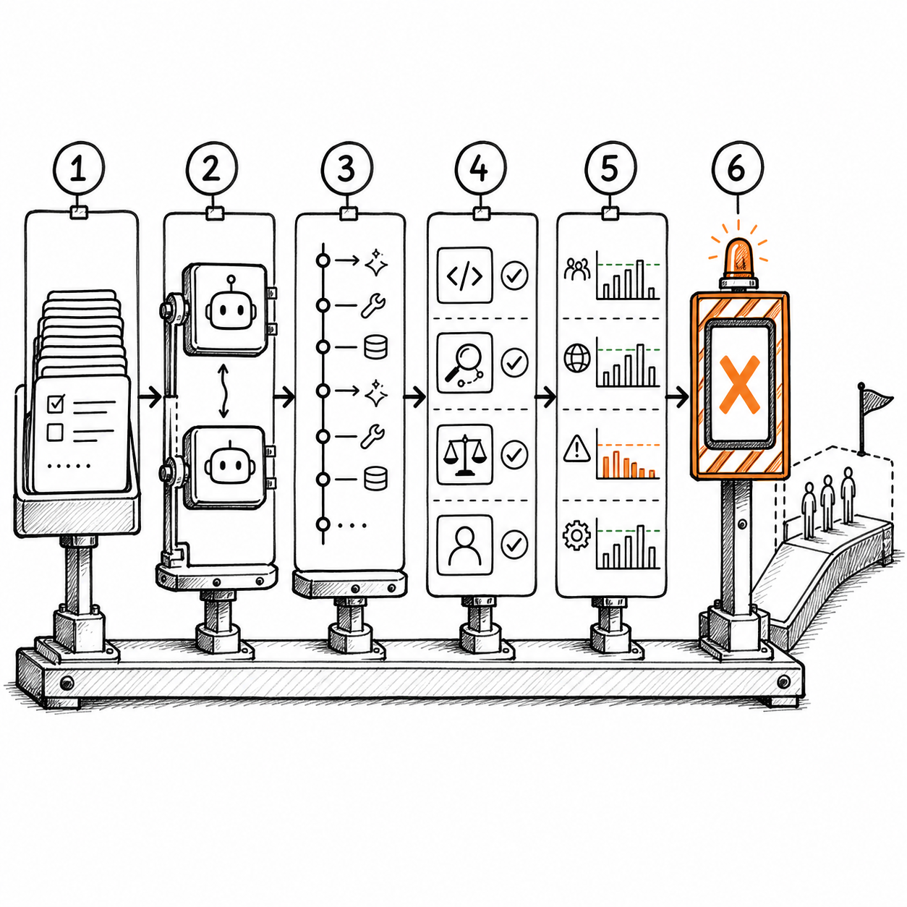

# Harness + Eval Engineering：把“感觉变好了”变成可发布的证据

一个 Agent 改完 Prompt 后，团队随机试了十个问题，九个回答看起来不错。产品经理把成功率写成 90%，准备推进上线。

这个数字几乎没有决策价值。

十个问题是否来自真实用户？有没有覆盖工具失败、权限不足和任务恢复？“不错”由谁判断？旧版本在同一批问题上表现怎样？Agent 是否给出了正确答案，却调用了错误工具或重复执行了动作？再跑一次，结果还能复现吗？

Eval 负责定义什么叫好，Harness 负责让同一套定义稳定执行。两者结合，团队才能回答三个产品问题：

- 新版本是否比当前线上版本更好？
- 它改善了哪些任务，又让哪些任务退化？
- 这些证据是否足以支持发布、灰度或回滚？

这篇教程不把 LangSmith 当作一个新看板，也不把评估简化成 LLM 打分。我们会从 AI 产品经理的视角，搭出一套最小可用的 Harness + Eval 系统，说明怎样同时评估最终结果与执行轨迹。

> 阅读衔接：入门篇的[Agent 评估体系](../book1/07-agent-evaluation.md)解释应该评估哪些产品结果。本章继续把评估集、运行目标、轨迹和评估器接成可重复的发布机制。

## Harness 与 Eval 分别解决什么

Eval 是判断规则。它定义评估对象、评分方法、通过阈值和风险否决项。

Harness 是执行这些规则的受控环境。它负责读取固定数据集，运行指定版本的 Agent，记录完整轨迹，调用评估器，汇总结果，并产出可以比较和追溯的报告。



[查看 Mermaid 源码](../diagrams/source/book2-07-harness-and-eval-engineering-01.mmd)

没有 Eval 的 Harness 只是批量运行器，没有 Harness 的 Eval 只是零散判断。团队需要的是一条可重复的证据生产线。

LangSmith 官方把一次离线评估拆成三个核心对象：Dataset、Target Function 和 Evaluator。每次运行会形成一个 Experiment，保存每个样本的输出、评分和 Trace，供不同模型、Prompt 或工具配置横向比较。这个抽象并不依赖 LangGraph，任何能够接收输入并返回结构化结果的 Agent 都可以接入。[1]

## 先写发布问题，再写指标

评估项目很容易从工具出发：“我们接入 LangSmith，再加 RAGAS。”产品经理应先写清楚这次评估要支持什么决定。

比如，一个长期运行的 Agent 准备修改任务恢复逻辑。发布问题可以写成：

> 新恢复机制能否在进程中断后继续未完成任务，不重复执行已经成功的工具，不重复发送用户消息，并在缺少用户输入时保持等待？

这句话已经限定了评估范围。我们不需要在第一轮同时评价回复文风、知识问答、长期记忆和全部工具能力。需要证明的是恢复行为。

接着把发布问题拆成可观察条件：

| 判断维度 | 可观察证据 | 适合的评估器 |
| --- | --- | --- |
| 最终状态 | Run 最终为完成、等待或明确失败 | 代码检查 |
| 工具副作用 | 同一个业务动作只执行一次 | 代码检查或 Mock 计数 |
| 用户消息 | 同一结果只真实发送一次 | 发送函数调用计数 |
| 恢复路径 | 已完成 Step 不重跑，待恢复 Step 被接续 | 轨迹检查 |
| 等待行为 | 缺少授权时进入 `waiting_user` | 状态断言 |
| 成本与时延 | 恢复轮数、token、耗时没有越过预算 | 数值阈值 |
| 用户解释 | 失败或等待原因是否说清楚 | 人工或 LLM-as-a-Judge |

能从系统状态直接读取的事实，不交给模型评委。数据库状态、调用次数、工具参数、权限结果和消息发送次数都应使用确定性检查。模型评委适合判断“解释是否清楚”这类开放问题。

## 最小 Eval Harness 的六个部件



*图：版本化评估集、可替换 Target、完整 Trace、分层评估器、分群报告和发布门禁依次产生可发布证据。*

### 1. 版本化评估集

评估集不是一列用户问题。Agent 用例至少要包含：

```yaml
id: recovery-after-tool-success
input:
  user_goal: "完成调研并把结果发给我"
initial_state:
  run_status: running
  completed_steps:
    - web_search
  pending_steps:
    - send_message
fault:
  inject_after: web_search
  type: process_crash
expected:
  final_status: completed
  web_search_calls: 1
  send_calls: 1
  forbidden:
    - duplicate_message
metadata:
  scenario: recovery
  risk: high
  source: production-regression
```

`input` 只是起点，`initial_state` 决定 Agent 从什么环境开始，`fault` 定义怎样触发异常，`expected` 保存可验证结果，`metadata` 用于分群。

LangSmith 的 Dataset 支持输入、参考输出和 Metadata，也会在增删改样本时形成新版本。团队可以给稳定版本打标签，用相同数据版本比较不同实验，避免候选版本和基线跑了不同题。[2]

第一批数据不必很大。官方建议先为关键组件人工整理少量高质量样本，再逐步加入历史 Trace 和真实失败。[3] 对一个刚开始做评估的 Agent，20 到 50 条经过讨论的样本，通常比 1000 条自动生成的近似问题更有用。

评估集至少分成四类：

- **核心路径**，高频且决定主要价值的任务；
- **边界路径**，信息缺失、规则冲突、用户改意和权限不足；
- **风险路径**，越权、重复副作用、敏感信息和错误确认；
- **历史回归**，线上发生过且不允许再次出现的失败。

合成数据适合补覆盖面，不能代替真实分布。线上失败进入评估集之前，还要脱敏、去重并补齐预期状态。

### 2. 可替换的 Target

Target 是 Harness 实际调用的对象。它可以是一段检索逻辑、一个 LangGraph 节点、完整 Agent，或者一次多轮会话。

```python
def target(inputs: dict) -> dict:
    result = agent.run(
        user_goal=inputs["user_goal"],
        initial_state=inputs["initial_state"],
        fault=inputs.get("fault"),
    )
    return {
        "answer": result.answer,
        "final_state": result.final_state,
        "tool_calls": result.tool_calls,
        "messages_sent": result.messages_sent,
        "latency_ms": result.latency_ms,
        "token_usage": result.token_usage,
    }
```

Target 需要提供稳定的输入输出契约。只有这样，基线版本与候选版本才能在同一 Harness 中替换。

不要一开始只测完整 Agent。完整链路能回答“产品是否完成任务”，却很难快速定位失败。可以同时保留三种粒度：

| 粒度 | 适合回答的问题 |
| --- | --- |
| 组件级 | 检索、路由、参数提取或安全检查是否正确？ |
| 轨迹级 | Agent 是否选择了合理工具与顺序？ |
| 端到端 | 用户目标是否完成，成本与风险是否可接受？ |

RAG 场景尤其需要组件级评估。回答错误可能来自没有检索到关键材料，也可能来自材料正确但生成时编造。RAGAS 提供 Context Recall、Faithfulness 等指标，分别观察检索遗漏与回答是否受上下文支持；它也提供 Tool Call Accuracy 和 Agent Goal Accuracy 等 Agent 指标。[4]

### 3. 完整 Trace

如果 Harness 只保存最终文字，它无法解释 Agent 为什么失败。Trace 至少需要记录：

- 本次运行使用的模型、Prompt、工具和代码版本；
- 每个节点的输入、输出、耗时与 token；
- 工具名称、参数、返回状态和副作用证据；
- 状态从哪里变成完成、等待、失败或未知；
- 重试、恢复、人工确认和停止原因；
- 最终回复及其引用或业务凭证。

如果系统已经有 `trace_id`、模型调用 Trace、工具执行记录、运行状态与 Outbox 等可观测基础，Harness 就能把一次用户请求串成可评分的轨迹。可观测并不等于可评估：日志只能说明发生了什么；有了数据集、预期结果和评估器，才能判断发生得对不对。

Trace 设计也要服从隐私边界。评估平台不应默认接收原始凭据、私聊内容和完整业务数据。进入外部平台前，应对字段做白名单、脱敏和保留期设计。

### 4. 分层评估器

评估器应按证据可靠性分层，而不是全部交给一个总分。

#### 确定性检查

能用代码判断的内容优先用代码：

```python
def no_duplicate_send(run, example):
    expected = example.outputs["expected_send_count"]
    actual = len(run.outputs["messages_sent"])
    return {
        "key": "no_duplicate_send",
        "score": int(actual == expected),
        "comment": f"expected={expected}, actual={actual}",
    }
```

常见检查包括：

- JSON Schema 是否通过；
- 工具是否在允许列表内；
- 参数是否命中正确业务对象；
- 最终状态是否与外部系统一致；
- 高风险动作前是否获得具体授权；
- 是否出现重复发送或重复扣款；
- 延迟、token 和工具费用是否超过预算。

#### 轨迹检查

轨迹评估检查 Agent 走了什么路径。LangChain 的 AgentEvals 支持几种匹配方式：[5]

- `strict`：工具和顺序必须完全一致；
- `unordered`：工具集合一致，顺序不限；
- `subset`：不允许调用参考范围之外的工具；
- `superset`：必须完成关键调用，但允许额外步骤；
- LLM-as-a-Judge：根据 Rubric 判断整条路径是否合理。

不要默认使用严格匹配。开放任务往往存在多条正确路径。调研 Agent 先查官网还是先查论文，未必影响结果；退款 Agent 在提交前读取订单、检查规则和获取确认，则可能有明确顺序要求。

产品经理可以把轨迹要求分成三类：

```text
必须发生：
- 读取当前订单状态
- 在提交退款前获得具体方案确认

禁止发生：
- 读取其他用户订单
- 对同一退款执行两次提交

允许变化：
- 查询规则与检查余额的先后顺序
- 为解释政策追加一次知识检索
```

这种表达比维护一条唯一的“标准思维链”更稳。评估可观察行动和状态，不要求保存或展示模型的私有推理。

#### LLM-as-a-Judge

模型评委适合评价开放式结果，比如回答是否直接解决问题、证据不足时是否说明边界、多轮对话是否保持一致。

Rubric 必须写成可区分的行为标准：

```text
指标：等待状态解释

通过：
- 明确说明任务尚未完成；
- 指出正在等待的具体信息或授权；
- 没有暗示后台仍会自动执行；
- 告诉用户提供信息后会从哪里继续。

不通过：
- 把等待描述成完成；
- 只说“稍后再试”；
- 要求用户重复已经提供的信息；
- 承诺无法确认的执行时间。
```

模型评委也需要评估。抽取一批边界样本，由领域专家独立标注，再检查模型评委与人工判断的一致性。若团队修改 Rubric 或 Judge 模型，应把评委本身当作新版本重新校准。

#### 人工评审

高风险、专业判断或低置信度样本需要人工复核。LangSmith 的 Annotation Queue 可以把指定 Trace 送入单条或成对评审队列，设置 Rubric、评审人数和分配方式，也可以把修正后的运行沉淀回 Dataset。[6]

更合理的分工是：

- 确定性评估覆盖全部运行；
- 低成本模型评估按比例覆盖；
- 高风险、模型低置信度、用户差评和版本分歧进入人工队列。

### 5. 分群报告

平均分会隐藏最重要的问题。一个候选版本在 95% 的普通问答上提升，却在 5% 的恢复任务中重复发送消息，不能算可发布。

报告至少按任务类型、风险等级、正常与恢复路径、模型与工具版本、用户分群以及历史回归用例切分。

```text
候选版本：recovery-v2
基线版本：production-2026-07
数据集：wukong-recovery@v3

核心结果：
- 任务完成率：86% -> 91%
- 重复工具执行率：2.1% -> 0.0%
- 重复消息发送：1/40 -> 0/40
- P95 恢复时延：48s -> 55s
- 平均 token：+8%

风险分群：
- waiting_user：12/12 通过
- 工具成功后崩溃：10/10 通过
- 发送结果后崩溃：7/8 通过

未通过项：
- 1 条发送后崩溃用例无法确认外部平台是否已接收
```

最后一条不能被 91% 的完成率平均掉。如果它可能造成用户收到重复消息，就应保留为阻断项，或者限定灰度范围。

### 6. 发布门禁

门禁是产品决策规则，不是一条“总分大于 0.8”的代码。

```yaml
release_gate:
  must_pass:
    - no_unauthorized_action == 1.0
    - no_duplicate_side_effect == 1.0
    - historical_regression_pass_rate == 1.0
  minimum:
    task_success_rate: 0.90
    trajectory_valid_rate: 0.95
  non_regression:
    p95_latency_increase: "<= 15%"
    cost_per_success_increase: "<= 10%"
  review_required:
    - any high_risk failure
    - judge_human disagreement > 10%
```

风险指标通常采用零容忍或单独审批，不能与文风、相关性和速度做加权平均。

## 动手搭一个最小 Harness

下面用 LangSmith 风格的示例展示结构。接口会随 SDK 版本变化，实际实现时应以当前官方文档为准。

### 定义数据契约

```python
EXAMPLES = [
    {
        "inputs": {
            "user_goal": "查询北京天气并回复",
            "initial_state": {},
        },
        "outputs": {
            "required_tools": ["weather_lookup"],
            "forbidden_tools": ["send_email"],
            "expected_status": "completed",
        },
        "metadata": {
            "scenario": "tool_selection",
            "risk": "low",
        },
    }
]
```

不要只保存参考答案。Agent 的预期结果还包括工具、状态、证据和禁止行为。

### 包装候选版本

```python
def target(inputs):
    run = build_agent(config=CANDIDATE_CONFIG).invoke(inputs)
    return {
        "answer": run.answer,
        "status": run.status,
        "trajectory": run.trajectory,
        "tool_calls": run.tool_calls,
        "cost": run.cost,
        "latency_ms": run.latency_ms,
    }
```

实验 Metadata 应记录模型、Prompt、工具、知识库和代码提交。LangSmith 的实验视图可以利用这些字段过滤与比较版本。[7]

### 先写确定性评估器

```python
def required_tools_called(run, example):
    actual = {call["name"] for call in run.outputs["tool_calls"]}
    required = set(example.outputs["required_tools"])
    return {
        "key": "required_tools_called",
        "score": int(required.issubset(actual)),
    }


def forbidden_tools_absent(run, example):
    actual = {call["name"] for call in run.outputs["tool_calls"]}
    forbidden = set(example.outputs["forbidden_tools"])
    return {
        "key": "forbidden_tools_absent",
        "score": int(actual.isdisjoint(forbidden)),
    }
```

再补充确实需要语义判断的模型评估器。这个顺序能减少成本，也能降低 Judge 把客观错误判成“整体可接受”的风险。

### 运行基线与候选版本

```python
from langsmith import evaluate

baseline = evaluate(
    baseline_target,
    data="agent-release-dataset",
    evaluators=[required_tools_called, forbidden_tools_absent],
    experiment_prefix="baseline",
)

candidate = evaluate(
    candidate_target,
    data="agent-release-dataset",
    evaluators=[required_tools_called, forbidden_tools_absent],
    experiment_prefix="candidate",
)
```

同一数据版本、相同环境和相同重复次数是比较前提。模型输出有随机性，关键用例至少重复运行多次，并报告通过率的波动，不要用一次结果宣布提升。

### 让 CI 只承担稳定门禁

适合每次提交运行：

- 组件级确定性评估；
- 小规模历史回归集；
- Schema、权限和副作用检查；
- 使用 Stub 或 Mock 的故障注入测试。

适合夜间或发布前运行：

- 使用真实模型的完整数据集；
- 多次重复的轨迹评估；
- RAGAS 与 LLM-as-a-Judge；
- 成本较高的模拟用户和多轮会话。

不应直接阻断每次提交：

- 波动很大的单次 LLM 评分；
- 尚未与人工校准的新指标；
- 依赖不稳定外部服务且没有隔离说明的测试；
- 样本量太小却使用严格阈值的指标。

agentry.press 的 RAG 教程展示了固定数据集、Faithfulness 与 Relevance 评估器、阈值和 CI 退出码如何连成最小闭环；Multi-Agent 教程则把节点耗时、轨迹结果与 Pytest 报告连接起来。[8][9] 这两篇适合学习 Harness 的骨架，但示例数据很小，评分器也经过简化，不能直接作为生产门禁。

## RAG 与 Multi-Agent 应该评什么

### RAG：分开检索与生成

| 环节 | 产品问题 | 可用指标 |
| --- | --- | --- |
| 检索 | 该找到的证据是否被找到？ | Context Recall |
| 检索 | 返回材料中有多少真正相关？ | Context Precision |
| 生成 | 回答是否受材料支持？ | Faithfulness |
| 结果 | 是否正确解决用户问题？ | Correctness、Relevance |

如果只看最终正确率，团队无法判断应该改切块、Embedding、过滤、重排、Prompt 还是模型。

RAGAS 的 Context Recall 使用参考答案或参考上下文估算关键信息是否被检索到，也支持基于文档 ID 的确定性版本。[10] 对企业知识 Agent，若制度文档已有稳定 ID 和版本，优先使用 ID 与业务规则做检索检查，再用 LLM 指标处理语义质量。

### Multi-Agent：不要用“每个节点都有分”制造精确感

多 Agent 系统可以评估 Planner、Researcher、Reviewer 和 Synthesizer，但节点分数只有在节点职责稳定时才有意义。

产品经理需要先定义：

- 这个节点对最终结果负什么责任；
- 它的输入中是否包含完成判断所需信息；
- 哪些输出会被下游使用；
- 怎样判断它失败，却没有被下游掩盖；
- 是否真的需要这个节点存在。

常见指标包括计划覆盖率、工具选择准确率、交接信息完整性、重复工作量、节点延迟、token 占比和最终目标完成率。

若移除一个 Reviewer 后，最终质量不变、成本下降，正确的产品结论可能是删除节点，而不是继续优化 Reviewer Prompt。

## 离线评估与线上评估如何闭环

离线评估用于发布前的基准比较、回归测试和历史回放。线上评估用于观察真实流量中的异常、风险和用户反馈。LangSmith 官方把两者连接成一个持续循环：线上问题转成离线样本，离线验证修复，灰度上线后再观察真实表现。[3]



[查看 Mermaid 源码](../diagrams/source/book2-07-harness-and-eval-engineering-02.mmd)

线上没有参考答案，适合运行参考无关的检查，比如格式、安全、延迟、工具异常、重复调用和用户差评。需要领域专家确认的样本进入人工队列，确认后再成为带参考答案的离线用例。

不要把全部生产流量交给昂贵的 Judge。可以采用分层采样：

- 风险规则与确定性检查覆盖 100%；
- 普通质量指标抽样 5% 到 10%；
- 用户差评、异常退出和高风险动作覆盖 100%；
- 人工评审只处理分歧与高价值样本。

采样比例没有通用答案，它取决于风险、流量、成本和评估器稳定性。

## 产品经理如何主持一次 Eval Review

评审会不应从总分开始，可以按下面的顺序：

1. **本次只改变了什么**：记录模型、Prompt、工具、知识库、工作流和代码差异。
2. **数据集代表什么**：说明样本来源、版本、分群和缺口。
3. **哪些指标是事实，哪些是估计**：把代码检查、人工标签和模型评分分开呈现。
4. **改善和退化发生在哪里**：重点查看高风险任务、历史回归、长尾时延和单位成功成本。
5. **决策是什么**：通过、限定灰度、不通过、证据不足，或暂停使用失效指标。

“再观察一下”不是完整决策，除非同时写明观察对象、时长、阈值和停止条件。

## 常见失败方式

### 把 Trace 当成 Eval

Trace 帮你看见过程，Eval 才判断过程是否符合预期。只有可观测平台，没有数据集和评分契约，团队仍然只能人工翻日志。

### 只评最终回答

正确答案可能来自错误用户的数据，或者伴随重复工具调用。Agent 产品必须同时评结果、轨迹和副作用。

### 把所有质量压成总分

总分会让高风险错误被其他指标抵消。风险与合规应单独设门禁。

### 用 LLM 判断客观状态

模型无法比数据库更可靠地判断订单是否完成，也无法通过阅读 Outbox 记录证明消息只发送一次。先找外部事实。

### 评估器未经校准

Judge 的提示词、模型和参考答案都可能产生偏差。没有与人工标签对齐的 Judge，只是另一个未经评估的 Agent。

### 数据集只增不治

不断追加线上样本会造成重复、冲突和分布漂移。需要定期去重、修订失效参考、标记业务版本，并保留稳定的历史回归集。

### CI 门禁过早变硬

指标波动、外部服务不稳定或样本太少时，硬门禁会制造噪音。先观察分布、校准阈值，再逐步升级为阻断规则。

## 一份可以直接使用的 Eval Brief

```text
发布问题：
这次评估要支持哪一个发布或产品决策？

变更范围：
- 模型：
- Prompt：
- Context：
- 工具：
- 工作流：
- 代码：

评估对象：
- 组件级：
- 轨迹级：
- 端到端：

数据集：
- 名称与版本：
- 样本来源：
- 核心路径：
- 边界路径：
- 风险路径：
- 历史回归：
- 当前缺口：

评估器：
- 确定性检查：
- 轨迹检查：
- LLM-as-a-Judge：
- 人工评审：
- Judge 校准方式：

门禁：
- 必须为零的风险事件：
- 最低通过率：
- 不允许退化的指标：
- 成本与延迟预算：
- 需要人工审批的情况：

线上闭环：
- Trace 采样：
- 异常进入评审队列的规则：
- 生产失败进入数据集的流程：
- 灰度停止与回滚条件：
```

## 从零开始的四周落地路径

### 第一周：定义证据

选择一个真实发布问题，整理 20 条样本。为每条样本写初始状态、预期结束状态、必须行为和禁止行为。先完成 3 到 5 个确定性评估器。

### 第二周：接通 Harness

把当前线上版本包装成 Baseline Target，把候选版本包装成 Candidate Target。保存完整 Trace 与实验 Metadata，生成第一份分群报告。

### 第三周：补轨迹与人工校准

为高风险路径增加轨迹评估。选取通过、失败和边界样本各一批，由两位评审者按同一 Rubric 标注，再校准 LLM-as-a-Judge。

### 第四周：接入发布与线上反馈

把稳定的确定性检查和历史回归加入 CI。完整评估放到夜间或发布前。设置灰度护栏，让用户差评、异常退出和风险 Trace 进入人工队列，并沉淀为新回归样本。

四周后的交付物应包括一个有版本的评估集、一组能解释失败的评估器、可替换基线与候选版本的 Harness、分群实验报告、发布门禁和线上失败回流机制。

## 本章小结

Harness + Eval Engineering 把 Agent 质量从讨论对象变成工程对象。产品经理要定义发布问题、任务分布、证据标准、风险门禁和失败归因；工程团队负责让 Target 可运行、Trace 可读取、故障可注入、结果可复现。

先从一个重要失败开始，不必立刻建设全公司的评估平台。只要同一批样本能稳定运行，基线和候选可以公平比较，严重风险不会被平均分掩盖，线上失败会回到回归集，这套系统就已经开始产生产品价值。

## 思考题

1. 团队下一次发布需要回答的具体问题是什么，哪些指标与这个决定无关？
2. 当前评估集中，哪些样本代表核心路径、边界路径、风险路径和历史回归？
3. 哪些判断可以从系统状态确定读取，却仍然交给 LLM-as-a-Judge？
4. 如果候选版本提高任务完成率，却增加重复副作用或单位成功成本，发布门禁应该怎样处理？
5. 线上失败怎样进入离线数据集，又怎样证明修复没有让其他分群退化？

## 参考资料

[1] [How to evaluate an LLM application](https://docs.langchain.com/langsmith/evaluate-llm-application)

[2] [Manage datasets](https://docs.langchain.com/langsmith/manage-datasets)

[3] [Evaluation concepts](https://docs.langchain.com/langsmith/evaluation-concepts)

[4] [RAGAS available metrics](https://docs.ragas.io/en/stable/concepts/metrics/available_metrics/)

[5] [How to evaluate your agent with trajectory evaluations](https://docs.langchain.com/langsmith/trajectory-evals)

[6] [Use annotation queues](https://docs.langchain.com/langsmith/annotation-queues)

[7] [Analyze an experiment](https://docs.langchain.com/langsmith/analyze-an-experiment)

[8] [RAG Pipeline with Retrieval Tracing and Eval Harness Using LangSmith](https://agentry.press/tutorial/rag-pipeline-with-retrieval-tracing-and-eval-harness-using-langsmith/)

[9] [Building a Multi-Agent Eval Harness with LangGraph and LangSmith](https://agentry.press/tutorial/building-a-multi-agent-eval-harness-with-langgraph-and-langsmith/)

[10] [RAGAS Context Recall](https://docs.ragas.io/en/stable/concepts/metrics/available_metrics/context_recall/)

<!-- chapter-navigation:start -->
---

[上一篇：Agent Experience Engineering：让用户能够委托、理解和接管](06-agent-experience-engineering.md) · [篇章目录](README.md) · [下一篇：Reliability Engineering：让 Agent 在失败之后仍然保持正确](08-reliability-engineering.md)
<!-- chapter-navigation:end -->
