# Reliability Engineering：让 Agent 在失败之后仍然保持正确

一个采购 Agent 提交订单时遇到超时。系统没有收到成功响应，于是自动重试。第二次请求成功，财务后来发现供应商收到了两张相同订单。

从接口角度看，重试修复了超时。从业务结果看，系统制造了重复采购。Agent Reliability Engineering 关心的是：面对模型波动、工具失败、进程中断和外部状态不确定，系统能否保持业务结果正确。

> 阅读衔接：入门篇的[可靠性、安全与成本](../book1/08-reliability-safety-and-cost.md)定义风险和上线门槛。本章聚焦其中的运行时问题：副作用、结果未知、Checkpoint 和恢复协议。

## 可靠性从完成定义开始

如果完成只表示“Agent 返回了一段成功文本”，任何可靠性设计都会失去依据。

```text
订单完成：
采购系统中存在唯一订单；
订单对象、金额和商品与用户确认一致；
供应商已接受；
系统保存可查询的订单编号。
```

完成、失败、等待和结果未知应成为显式状态。结果未知尤其重要，它表示系统不能安全宣布成功，也不能直接重试。

## Agent 系统有哪些故障

| 故障来源 | 例子 | 主要处理方式 |
| --- | --- | --- |
| 模型 | 输出格式错误、错误选工具 | 校验、限制、重新规划 |
| 工具 | 超时、限流、部分成功 | 分类重试、结果查询 |
| 运行时 | 进程崩溃、状态未落库 | Checkpoint、恢复协议 |
| 外部系统 | 最终一致、回执丢失 | 状态核验、等待 |
| 数据 | 版本变化、权限变化 | 重新读取、使旧判断失效 |
| 用户 | 中途改目标、重复提交 | 任务身份、参数版本 |

不能用同一种“自动重试”处理所有故障。

## 重试前先判断副作用

只读查询通常可以按退避策略重试。产生副作用的动作要回答三个问题：

1. 是否有稳定的业务幂等键？
2. 能否查询第一次调用的真实结果？
3. 结果无法确认时，重复执行的后果是什么？



[查看 Mermaid 源码](../diagrams/source/book2-08-reliability-engineering-01.mmd)

幂等记录存在于本地，不代表外部动作只执行一次。评估必须检查真正的发送、扣款或提交边界。

## Checkpoint 保存什么

可恢复快照至少应包含：

- 任务与运行标识；
- 用户目标和当前参数版本；
- 已完成步骤及其证据；
- 正在执行或准备执行的步骤；
- 外部副作用的业务身份；
- 当前等待对象；
- 下一步恢复策略。

聊天摘要不能替代这些字段。摘要适合帮助模型理解历史，不适合证明某个工具是否已经执行。

## 恢复不是重新播放对话

恢复应从最后一个可信状态继续。已经完成且可验证的步骤直接复用；只读步骤可以重跑；副作用不确定的步骤先核验；需要用户信息的任务保持等待。

整轮重新交给模型规划可能生成新的工具参数、新的步骤身份和新的用户回复。它看起来恢复了任务，也可能悄悄重复执行。

## 依赖降级怎样设计

外部服务不可用时，系统可以：

- 延迟并保持任务；
- 切换到经过验证的备用来源；
- 只完成不依赖该服务的部分；
- 转人工；
- 明确失败并保留恢复入口。

降级不能静默改变产品承诺。实时库存不可用时，用昨天缓存的数据继续下单，不是普通降级，而是改变决策依据。

## 可靠性目标怎样写

传统可用率仍然重要，但 Agent 还需要业务正确性指标：

```yaml
task_success_rate: 0.95
duplicate_side_effect_rate: 0
unknown_outcome_rate: <= 0.002
recovery_success_rate: >= 0.99
waiting_state_loss_rate: 0
p95_task_latency_seconds: 45
```

阈值要按任务风险和用户容忍度制定。搜索摘要与资金操作不能共享同一套可靠性目标。

## 故障注入比顺利回放更有价值

评估集应主动在关键边界制造故障：

- 工具执行前崩溃；
- 工具成功但回执丢失；
- 状态落库后、用户消息发送前中断；
- 等待用户确认期间重启；
- 外部数据在执行中发生变化；
- 多个任务同时修改同一对象。

每个用例同时检查最终状态、实际副作用次数、恢复路径和用户可见解释。

## 产品经理的 Reliability Brief

一份可靠性需求应写清：

- 业务完成证据；
- 允许的最终状态；
- 每类工具的副作用与重试规则；
- Checkpoint 边界；
- 结果未知时的处理；
- 依赖降级策略；
- 恢复时间和数据丢失目标；
- 故障注入与发布门禁。

## 常见误区

### 把重试次数当成可靠性

重试只能应对一部分瞬时故障。权限拒绝、业务冲突和结果未知不会因为次数增加而消失。

### 有 Checkpoint 就能恢复

Checkpoint 只保存状态。恢复是否安全取决于步骤身份、外部证据、幂等边界和参数版本。

### 只看最终成功率

一次任务最终成功，过程中可能重复扣款、发出多封消息或越过授权。轨迹和副作用必须一起评估。

## 本章小结

Reliability Engineering 把失败、等待、结果未知和恢复纳入正常产品路径。可靠的 Agent 能证明任务结果，区分可重试与不可重试动作，并从最后一个可信状态继续。

## 思考题

1. 哪个副作用工具超时后最可能产生重复结果？
2. 当前系统怎样表示结果未知？
3. 恢复时会复用原步骤身份，还是重新生成整轮任务？
4. 发布前是否实际注入过进程中断和回执丢失？

<!-- chapter-navigation:start -->
---

[上一篇：Harness + Eval Engineering：把“感觉变好了”变成可发布的证据](07-harness-and-eval-engineering.md) · [篇章目录](README.md) · [下一篇：Safety Engineering：限制 Agent 能做出的不可接受行动](09-safety-engineering.md)
<!-- chapter-navigation:end -->
