# Safety Engineering：限制 Agent 能做出的不可接受行动

一个客服 Agent 为了尽快解决投诉，主动给用户发放了超出权限的补偿。用户满意，团队却发现模型绕过了额度规则。

如果只看任务完成率，这次运行是成功的。Safety Engineering 要定义哪些结果即使能取悦用户、提高效率，也不能由 Agent 自行产生。

> 阅读衔接：入门篇已经讨论风险分类和控制措施。本章继续把安全要求落到身份、权限、信任边界、参数校验和发布证据。

## Safety 不等于内容审核

内容过滤只覆盖输入和输出的一部分。Agent 能读取数据、调用工具、修改状态后，安全还涉及：

- 身份认证和权限；
- 数据访问与隔离；
- 工具风险与授权；
- Prompt Injection；
- 敏感信息处理；
- 资金、账号和公开发布等高影响动作；
- 人工介入与事故处置。


[查看 Mermaid 源码](../diagrams/source/book2-09-safety-engineering-01.mmd)

模型提示词可以表达规则，确定性系统必须执行权限、额度和禁止动作。

## 先做风险建模

可以按五个维度评估一次 Agent 行动：

| 维度 | 问题 |
| --- | --- |
| 影响 | 错误会影响谁，损失有多大？ |
| 可逆性 | 结果能否撤销，撤销成本多高？ |
| 权限 | Agent 代表谁行动，授权是否具体？ |
| 可检测性 | 错误能否在产生影响前被发现？ |
| 扩散范围 | 一次错误影响一个对象还是批量对象？ |

同一个工具在不同参数下风险不同。读取公开网页与导出全公司客户数据不能因为都叫 `search` 而共享风险等级。

## 用 Agentic Threat Model 覆盖新的攻击面

OWASP 2026 Agentic Top 10 把风险从一次模型输入输出扩展到目标、身份、工具、依赖、记忆、Agent 协作、系统级联与人机信任。它适合做威胁模型的检查表，不能替代对本产品真实资产、入口、数据流和副作用的分析。



[查看 Mermaid 源码](../diagrams/source/book2-09-safety-engineering-02.mmd)

| 风险 | 在 Agent 产品中怎样发生 | 关键控制与产品问题 |
| --- | --- | --- |
| ASI01 Agent Goal Hijack | 网页、邮件、用户或下游 Agent 改写原目标 | 目标来源和优先级是否固定？外部内容能否改变任务、权限或停止条件？ |
| ASI02 Tool Misuse & Exploitation | 合法工具被用在错误对象、参数、顺序或规模 | Tool 是否按动作拆分？执行前是否有结构、业务、权限、额度与确认校验？ |
| ASI03 Identity & Privilege Abuse | Agent 继承过宽身份，混用用户、服务或其他 Agent 权限 | 身份是否绑定用户、Task、资源、动作与有效期？执行器能否拒绝越界请求？ |
| ASI04 Agentic Supply Chain Vulnerabilities | 被篡改的模型、Skill、Tool、MCP Server、依赖或数据源进入运行时 | 是否有来源、版本、owner、签名或审核、变更检测、灰度和撤销清单？ |
| ASI05 Unexpected Code Execution | 文档、工具结果或生成内容触发脚本、命令、模板或解释器 | 代码执行是否默认关闭或隔离？输入、网络、文件、凭据和产物是否受限？ |
| ASI06 Memory & Context Poisoning | 恶意或错误信息被写入长期记忆、摘要或共享上下文 | 是否保存 provenance 和 trust level？低信任内容能否隔离、回滚并查询影响面？ |
| ASI07 Insecure Inter-Agent Communication | Agent 身份、消息、Artifact 或授权在交接中被伪造、篡改或重放 | 交接是否绑定发送者、接收者、Task / Run、Schema、权限、版本和幂等标识？ |
| ASI08 Cascading Failures | 一个错误被多个步骤、Agent 或自动化系统放大 | 是否有并发、预算、速率、深度、影响面和熔断上限？下游能否识别未验证结果？ |
| ASI09 Human-Agent Trust Exploitation | 界面让用户或审核者盲信结论、机械确认或泄露信息 | 是否展示真实参数、来源、不确定性与后果？能否拒绝、修改、暂停和接管？ |
| ASI10 Rogue Agents | Agent 持续偏离目标、规避监督或保留不应有的能力 | 是否有独立策略执行、行为监测、能力撤销、紧急停止和事后取证？ |

正式 Threat Model 应把每个适用风险映射到：受保护资产、攻击者或失控来源、入口、受影响对象、前置条件、最坏副作用、预防控制、检测信号、限制影响和恢复责任人。只写“采用 Guardrail”无法证明控制位于正确的强制边界。

## 权限要小于用户权限

用户有权执行某件事，不代表 Agent 应默认继承全部权限。合理做法是给任务发放受范围、时间和动作限制的能力。

```yaml
principal: current_user
resource: order_A1024
allowed_action: submit_refund
amount_limit: 860
expires_at: 2026-07-23T18:00:00+08:00
requires_confirmation: true
```

凭据不应进入模型上下文。模型选择动作，执行器在受控边界读取凭据并完成调用。

## Prompt Injection 是信任边界问题

网页、邮件、文档和工具返回值都可能包含恶意指令。外部内容应被标记为数据，不能与系统规则处在同一信任级别。

防护要组合使用：

- 指令与数据分区；
- 工具最小权限；
- 敏感操作的确定性策略；
- 输出和参数校验；
- 沙箱与网络限制；
- 高风险动作确认；
- 异常行为监测。

任何单一分类器都可能失效。设计目标是在某一层漏过时，后续层仍然限制影响范围。

## Human-in-the-loop 放在哪里

人工介入适合：

- 高金额或不可逆动作；
- 权威来源冲突；
- 权限或身份无法确认；
- 模型置信不足且影响较大；
- 异常批量操作；
- 结果未知且重复执行有风险。

人工确认需要看到目标、参数、依据和后果。只让审核者查看一句模型总结，会把同一不确定性转交给人。

## Emergency Stop 不是一句提示

紧急停止的目标是阻止新的不可接受 Action，并控制已经在途的影响。它必须由运行时、工具执行器和身份系统共同执行，不能依赖模型理解“请停下”。

触发后至少要完成：

1. 冻结目标 Task 或指定 Agent 版本，拒绝新的 Run、Step 和 Tool Action；
2. 撤销短期凭证、OAuth token 或能力授权，避免排队请求晚到后继续执行；
3. 取消尚未开始的队列和远端任务；
4. 对正在执行的 Action 尝试取消，但不虚构“已经撤销”；
5. 无法确认副作用是否发生时进入 `result_unknown`，按幂等键和业务标识核验；
6. 隔离相关上下文、记忆、Skill、Tool 或 MCP Server，保留只读的取证材料；
7. 向用户和运营说明已阻止什么、仍在核验什么、哪些结果不可逆。

还要区分 `pause`、`cancel`、`disable capability` 和 `emergency stop`。暂停用于正常恢复，取消只针对某个 Run，停用能力阻止特定工具或版本，紧急停止用于快速限制事故影响。它们的作用范围、授权人、目标恢复时间和恢复条件不同。

紧急停止必须演练。测试要覆盖新 Action 被拒绝、排队任务被取消、凭证撤销生效、远端系统不支持取消、结果未知进入核验、重复触发保持幂等，以及恢复时不会自动重放旧副作用。

## 数据安全进入完整生命周期

敏感数据可能出现在检索、上下文、记忆、工具参数、Trace、评估集和人工标注平台。产品经理需要定义：

- 哪些字段允许进入模型；
- 哪些字段必须脱敏；
- 数据在哪个地区和租户边界内处理；
- 保存多久；
- 谁能查询和导出；
- 用户删除如何传播；
- 第三方模型和评估服务接收什么。

只清理最终回复，无法解决中间链路泄露。

## Safety Case 怎样写

Safety Case 是对“为什么这个 Agent 可以在当前范围上线”的结构化论证：

```text
允许任务：
- 查询本人订单
- 在明确确认后提交单笔退款

禁止任务：
- 修改他人订单
- 超过额度自动补偿
- 批量退款

主要风险：
- Prompt Injection 诱导越权
- 用户确认与执行参数不一致
- 工具超时导致重复退款
- 记忆投毒改变后续判断
- 第三方 MCP Server 或 Skill 被篡改
- 一个错误被批量任务或下游 Agent 放大

控制：
- 资源级授权
- 参数绑定确认
- 幂等键与结果查询
- 高风险 Trace 审计
- 供应链清单与版本锁定
- 运行时预算、速率和影响面熔断
- Emergency Stop 与凭证撤销

证据：
- 越权评估集
- 故障注入
- 权限测试
- 灰度事故率
- 记忆投毒、跨 Agent 伪造与级联故障用例
- Emergency Stop 演练记录
```

上线范围变化后，Safety Case 也要更新。增加批量操作不是普通功能扩展，它改变了错误扩散范围。

## 怎样评估 Safety

安全评估不能只测试“请泄露系统提示词”。还应覆盖：

- 未授权资源访问；
- 间接 Prompt Injection；
- 工具参数越界；
- 用户确认后参数被替换；
- 多租户数据混入；
- 敏感信息写入记忆；
- 记忆与上下文投毒、污染回滚和影响面查询；
- 伪造、篡改或重放 Agent 间交接；
- 未受信的 Skill、Tool、MCP Server 与依赖变更；
- 非预期代码执行和沙箱逃逸尝试；
- 循环、并发或下游自动化造成的级联故障；
- 批量动作和速率限制；
- 审核与执行内容不一致；
- 拒绝后通过其他工具绕行；
- Emergency Stop、凭证撤销、在途动作和恢复演练。

评估结果按风险类型和严重度报告，不能被总体成功率平均掉。严重越权用例一次失败就可能阻断发布。

## 常见误区

### 把 Guardrail 当成安全系统

Guardrail 是分层控制的一部分。认证、授权、隔离、凭据管理和传统应用安全仍然存在。

### 所有高风险动作都转人工

没有清楚证据和操作边界的人工审核，只会把压力转给审核者。先减少权限和范围，再决定人工介入。

### 安全只在上线前检查

模型、Prompt、工具、数据来源和用户行为都会变化。安全指标、红队用例和事故复盘需要持续运行。

## 本章小结

Safety Engineering 先定义不可接受的结果，再通过最小权限、信任隔离、供应链治理、参数校验、沙箱、确认、监测、熔断和紧急停止限制影响范围。模型可以参与判断，不能独自承担安全边界。Agentic Threat Model 还要覆盖记忆、跨 Agent 通信、级联故障和失控 Agent，而不只检查 Prompt Injection。

## 思考题

1. 当前 Agent 是否继承了用户全部权限？
2. 外部文档中的文字会不会被当成系统指令？
3. 人工审核者能否看到真实执行参数？
4. 哪类安全失败应该直接阻断发布？

## 延伸阅读

- [OpenAI：A practical guide to building agents](https://openai.com/business/guides-and-resources/a-practical-guide-to-building-ai-agents/)，介绍工具风险、Guardrail 和人工介入。
- [OWASP：Top 10 for Agentic Applications for 2026](https://genai.owasp.org/resource/owasp-top-10-for-agentic-applications-for-2026/)，覆盖目标劫持、工具与身份滥用、供应链、代码执行、记忆投毒、跨 Agent 通信、级联故障、人机信任与失控 Agent。

<!-- chapter-navigation:start -->
---

[上一篇：Reliability Engineering：让 Agent 在失败之后仍然保持正确](08-reliability-engineering.md) · [篇章目录](README.md) · [下一篇：Production Engineering：把 Agent 变成可以持续经营的产品](10-production-engineering.md)
<!-- chapter-navigation:end -->
