# Production Engineering：把 Agent 变成可以持续经营的产品

一个团队用两周做出了企业知识 Agent。内部试用回答不错，接入正式数据后却遇到权限同步延迟、成本波动、检索更新不及时和问题无法复现。模型能力没有突然下降，原型缺少生产系统需要承担的责任。

Production Engineering 把能力、体验、评估、可靠性、安全、成本和运营接成一条持续运行的链路。它不替代前面的专项，而是决定这些机制如何共同支持真实用户和真实业务。

> 阅读衔接：入门篇的[上线、运营与持续迭代](../book1/09-launch-operations-and-iteration.md)解释怎样经营上线后的产品。本章继续说明版本、灰度、观测、支持和回滚怎样组成生产系统。

## 从原型到生产发生了什么变化

原型通常面对少量测试用户、固定数据和人工陪伴。生产环境增加了：

- 不同权限和组织边界；
- 长尾输入与恶意输入；
- 外部依赖和版本变化；
- 并发、限流与成本预算；
- 故障恢复和客服支持；
- 发布、灰度与回滚；
- 隐私、审计和合规要求。

生产化不是把服务器扩容，而是补齐产品承诺所依赖的系统机制。

## 一条生产闭环



[查看 Mermaid 源码](../diagrams/source/book2-10-production-engineering-01.mmd)

线上反馈要回到评估集，评估结果要影响发布，严重风险要有明确回滚入口。只有观测而没有处置流程，系统仍然会重复同类失败。

## 版本必须可追溯

一次 Agent 行为可能由多个版本共同决定：

- 模型及参数；
- Prompt 和上下文策略；
- 知识库与索引；
- 工具定义；
- Graph 或工作流；
- 安全策略；
- 评估器。

Trace 应记录能够还原行为的版本组合。只记录模型名称，无法解释一次上线前后为什么出现退化。

## 发布不采用一次性开关

合理发布路径通常包括：

1. 固定评估集比较基线与候选；
2. 对历史回归和风险用例执行硬门禁；
3. 内部或受控用户验证；
4. 小流量灰度；
5. 按任务、用户和风险分群观察；
6. 逐步扩大范围；
7. 保留快速回滚和能力降级。

模型升级也应走同样流程。新模型整体能力更强，不代表它在当前工具、Prompt 和任务分布上一定更好。

## 观测要支持决策

Agent 生产系统需要把一次用户任务串起来：

- 用户目标和会话；
- 每次模型调用；
- 上下文来源；
- 工具参数和结果；
- 状态转换；
- 等待、确认和人工介入；
- token、延迟与费用；
- 最终外部结果。

日志量大不等于可观测。团队要能从用户投诉定位到具体步骤，再找到对应版本、证据和失败类别。

## 成本是产品约束

Agent 成本来自模型 token、检索、工具、沙箱、存储、评估和人工审核。平均每次调用费用通常不能代表单位经济性，因为一次用户任务可能包含多轮循环和失败恢复。

更有用的指标包括：

```text
每个成功任务的总成本
每个被验证结果的成本
按任务类型划分的 token 与工具费用
人工介入率与单次处理成本
失败任务产生的无效成本
成本上升带来的质量增益
```

成本优化不能只裁剪上下文。减少必要证据可能让调用更便宜，却提高错误率和人工处理成本。

## 支持与运营是系统的一部分

当用户报告“Agent 把订单处理错了”，支持团队需要查询任务状态、工具证据和可恢复入口。产品应提供：

- 用户可见任务记录；
- 内部 Trace 查询；
- 任务暂停、重跑、接管和补偿流程；
- 风险事件升级路径；
- 数据更正和删除入口；
- 已知问题与能力边界说明。

无法调查和补救的 Agent 不适合承担高影响任务。

## 生产就绪检查

| 维度 | 最低要求 |
| --- | --- |
| 产品范围 | 支持与不支持的任务清楚 |
| 数据 | 来源、权限、更新和删除可追踪 |
| 执行 | 工具风险、确认和副作用有明确策略 |
| 可靠性 | 完成证据、未知状态和恢复路径已验证 |
| 安全 | 最小权限、隔离、审计和事故响应可用 |
| 评估 | 基线、回归集、风险门禁和线上回流存在 |
| 观测 | 一次任务可以端到端追踪 |
| 成本 | 有单位任务预算与异常告警 |
| 发布 | 支持灰度、降级和回滚 |
| 运营 | 支持团队能够调查、接管和补偿 |

检查表不是上线证明。每一项需要对应运行证据、负责人和失败处置。

## 责任怎样分配

产品经理负责定义任务范围、完成证据、风险等级、用户控制和发布门槛。工程团队负责运行时、状态、工具、观测和恢复。算法或 AI 团队负责模型、上下文和评估方法。安全、法务和业务负责人参与高风险边界。

跨职能不等于责任模糊。每类线上指标和事故必须有明确 owner。

## 常见误区

### 等模型稳定后再做生产工程

模型输出天然存在波动。生产系统要管理这种波动，而不是等待它消失。

### 有 Trace 就算可运营

Trace 只能提供记录。没有失败分类、告警、负责人和处置工具，团队仍然无法及时行动。

### 用平均分决定发布

平均分会隐藏少量严重失败。发布决策要结合任务分群、风险门禁和基线退化。

### 把成本优化成 token 优化

少用 token 可能增加重试、错误和人工成本。单位成功任务成本更接近产品价值。

## 本章小结

Production Engineering 把 Agent 的版本、评估、灰度、观测、成本、支持和回滚接成持续经营系统。生产就绪不由一次演示或一个总分证明，而由团队是否能够发现问题、限制影响、恢复任务并持续改进来证明。

## 思考题

1. 当前能否还原一次线上任务使用的全部版本？
2. 严重退化发生后，可以降级单项能力还是只能整站回滚？
3. 团队衡量的是每次模型调用成本，还是每个成功任务成本？
4. 支持人员能否查询、暂停和接管失败任务？

<!-- chapter-navigation:start -->
---

[上一篇：Safety Engineering：限制 Agent 能做出的不可接受行动](09-safety-engineering.md) · [篇章目录](README.md) · [下一篇：后记：别让 Engineering 变成新的术语清单](11-afterword.md)
<!-- chapter-navigation:end -->
