# Multi-Agent Engineering：把职责拆分变成可验证协作

一个市场研究 Agent 接到任务：判断某个行业是否值得进入，并形成供产品委员会评审的建议。

团队很容易设计出“研究员 Agent、分析师 Agent、批评者 Agent、汇报 Agent”。演示中，它们轮流发言，最后合成一份报告。真实运行时却出现新的问题：多个 Agent 重复搜索同一材料，引用在交接中丢失，批评者没有独立证据，某个 Agent 使用了不该访问的数据，协调者不断追加子任务，最终成本翻倍却没有提高结论质量。

Multi-Agent Engineering 不是给模型分配更多角色名。它要把职责、身份、权限、上下文、任务、交接、预算、失败和完成证据设计成一套可验证的协作机制。

> 阅读衔接：第 5 章已经建立 Agent、Task、Run、Step、Action、Artifact 与 Evidence 对象。本章复用这些对象，不再用一串聊天消息代表协作状态。

## 先证明单 Agent 不够

复杂任务不自动等于多 Agent。一个 Agent 配合清楚的 Workflow、子任务列表和动态 Context，往往更便宜、更容易恢复。

引入第二个 Agent，至少应带来一种可验证增益：

1. **独立新证据**：子任务能够并行探索不同来源，并产出彼此独立的 Evidence；
2. **真实隔离**：职责需要不同身份、数据、Tool、Skill、预算或安全边界；
3. **可测专业能力**：某类任务需要独立 Prompt、Context、模型或评估标准，并且优于单 Agent 基线；
4. **独立审查**：审查者拥有不同证据或验证工具，能发现执行者无法自证的问题。

如果多个 Agent 读取相同 Context、拥有相同权限、调用相同工具，只是用不同角色提示互相讨论，通常增加的是延迟、成本和交接损失。

是否采用多 Agent 可以用一个最小实验判断：先建立单 Agent 基线，再只引入一个明确拆分，比较任务成功、证据覆盖、严重失败、P95 时长和成功任务成本。如果没有稳定增益，就回到更简单结构。

## 选择最小可行的协作拓扑

Anthropic 把 Routing、Parallelization、Orchestrator-workers 和 Evaluator-optimizer 列为常见组合模式。它们不都需要持久化的独立 Agent 身份，但提供了选择协作结构的起点。

| 拓扑 | 适用条件 | 主要风险 |
| --- | --- | --- |
| Router → Specialist | 输入可以被可靠分类，不同类别需要不同能力或权限 | 路由错误、边界任务无人负责 |
| Parallel Workers → Aggregator | 子任务相互独立，可以同时产生新证据 | 重复工作、结果冲突、部分失败 |
| Coordinator → Dynamic Workers | 子任务无法预先穷举，需要根据中间结果继续拆解 | 无限委派、预算失控、协调者成为超级权限主体 |
| Generator → Verifier | 结果有清楚标准或独立验证工具 | 验证者重复生成者偏见，只做语言批评 |
| Peer-to-peer | 真实需要去中心化协商，且有成熟通信与一致性协议 | 环路、死锁、身份伪造、状态难以收敛 |

默认优先中心化 Coordinator，因为它更容易控制任务所有权、预算、取消和最终责任。Peer-to-peer 只有在中心协调确实不满足业务约束时才值得采用，不能因为“更像团队”就增加分布式一致性问题。



[查看 Mermaid 源码](../diagrams/source/book2-11-multi-agent-engineering-01.mmd)

图中的 Coordinator 负责分解、分配、汇总和停止，不代表它拥有全部工具与数据权限。Worker 使用按 Task 授予的最小能力；Artifact 和 Evidence 进入共享 Registry；Verifier 按明确标准检查；最终结果保留来源和未决项。

## Coordinator 负责协调，不是超级 Agent

Coordinator 的产品责任包括：

- 把用户目标转换成可验证子任务；
- 确认依赖关系、责任 Agent、预算、截止时间和完成条件；
- 避免重复分配与循环委派；
- 根据 Worker 状态处理等待、失败和部分结果；
- 调用独立验证并汇总 Artifact 与 Evidence；
- 达到成功、风险、时间或成本条件时停止；
- 向用户说明已完成内容、未解决问题和最终责任边界。

Coordinator 可以提出授权请求，不能凭借“负责全局”自动获得所有 Worker 的凭据。高风险 Tool Action 仍由对应执行器校验 Task、资源、动作、额度和用户确认。否则多 Agent 只是在系统顶部增加一个更难约束的超级用户。

动态创建 Worker 也要有限制。运行时应规定最大委派深度、并发数、总 Worker 数、每类任务预算和允许的 Agent 类型。Worker 默认不能继续创建 Worker；确有需要时，委派能力本身也应是可审计权限。

## 用 Task Contract 代替自然语言转述

Agent 之间的交接至少要形成一份结构化 Task Contract。

```yaml
task_id: market-entry-001
subtask_id: competitor-evidence-003
parent_run_id: run-001
sender_agent:
  id: market-coordinator
  version: 4.2
receiver_agent:
  id: research-worker
  version: 2.7
goal: 找出目标市场前三类竞争者及可核查证据
input_refs:
  - scope-brief-v3
constraints:
  geography: 中国大陆
  cutoff_date: 2026-08-01
capability_grant:
  tools:
    - web_search_readonly
  data_scope:
    - public_sources
budget:
  max_duration_seconds: 600
  max_cost_cny: 20
deliverable:
  schema: competitor-evidence-v2
  evidence_required: true
deadline: 2026-08-13T18:00:00+08:00
idempotency_key: market-entry-001-competitor-evidence-003
```

Contract 还要说明拒绝条件、失败返回和部分完成语义。Worker 发现目标超出权限或证据不足时，应返回结构化阻塞原因，不能擅自扩大范围或用推测补齐。

一次交接必须保留发送者、接收者、Agent 版本、Task / Run 关系和授权来源。没有这些字段，团队无法判断一份结果属于哪个任务，也无法在 Agent 升级后复现行为。

## 交接 Artifact，不交接一整段聊天

把上一个 Agent 的对话全文交给下一个 Agent，会同时引入噪音、Prompt Injection、权限泄露和语义丢失。更稳妥的方式是交付有 Schema 的 Artifact，并单独绑定 Evidence。

一个可复核的 Handoff Package 至少包含：

| 字段 | 作用 |
| --- | --- |
| `artifact_id`、`schema_version` | 稳定标识和兼容性 |
| `producer_agent`、`source_run` | 生产者与执行版本 |
| `content_ref`、`content_hash` | 内容位置与完整性校验 |
| `evidence_refs` | 支持结论的原始证据 |
| `assumptions` | 结论依赖但尚未完全验证的前提 |
| `unresolved_items` | 缺口、冲突和需要下游处理的问题 |
| `freshness`、`expires_at` | 信息何时需要重新验证 |
| `classification`、`allowed_consumers` | 数据级别与可见范围 |

Aggregator 不应只做文字拼接。它要验证 Schema、去重实体、处理冲突、检查 Evidence 覆盖、保留少数意见，并明确哪些结论无法合并。多个 Worker 给出相同观点不等于事实更可靠；如果它们引用同一来源，只能算一份独立证据。

## Context、Memory 与权限按职责隔离

多 Agent 不应默认共享完整对话、长期记忆和全部工具。每个 Worker 只获得完成子任务的最小 Context：目标、输入引用、约束、可用能力、预算和交付协议。

常见隔离边界包括：

- **身份**：每个 Agent 使用独立服务身份或受委托身份，不共享长期凭据；
- **数据**：Context 按用户、租户、Task 和职责过滤，敏感原文不因交接自动复制；
- **工具**：Worker 只能看到当前子任务允许的 Tool 与 MCP Server；
- **记忆**：共享记忆经过来源、权限和信任校验，Worker 的推断不自动升级为组织事实；
- **执行环境**：代码、浏览器和文件任务使用隔离沙箱与输出目录；
- **预算**：时间、token、费用、调用次数和并发分别限制，并由父 Task 汇总。

Coordinator 汇总结果时，也不能借由 Artifact 读取生产者有权访问、自己却无权访问的原始数据。系统应在生产 Artifact 时完成最小化和脱敏，并在消费时再次校验 `allowed_consumers`。

## Inter-Agent Communication 是安全协议

Agent 之间的消息可能被伪造、篡改、重放或注入。结构化 JSON 只能解决解析，不能证明发送者身份和内容可信。

通信协议至少要处理：

- 发送者和接收者身份认证；
- Task、资源与动作级授权；
- 消息 Schema 和版本校验；
- `message_id`、sequence、时间戳与过期时间；
- 幂等与重放防护；
- Artifact hash、签名或受信存储引用；
- 外部内容与 Agent 指令的信任标记；
- 投递、接受、拒绝和处理结果的审计记录。

来自另一个 Agent 的输出仍然是待验证输入，不会因为发送者叫“专家”就获得系统指令权限。MCP 主要处理 Host 与 Server 的能力连接，也不自动提供 Agent-to-Agent 的身份、任务、交接和一致性协议。

## 协作状态必须能够收敛

多 Agent 增加了单 Agent 不存在或不明显的失败方式。

| 失败 | 典型表现 | 运行时控制 |
| --- | --- | --- |
| 委派环路 | A 交给 B，B 又交回 A | 最大深度、父子关系、重复 Task 指纹与环路检测 |
| 重复工作 | 多个 Worker 在不知情时做同一子任务 | 唯一 Task owner、幂等键、租约和共享任务索引 |
| 等待死锁 | 多个 Agent 互相等待对方先完成 | 依赖 DAG、等待图检测、超时与人工解锁 |
| 孤儿 Run | Coordinator 失败后 Worker 继续行动 | lease、heartbeat、父 Run 取消传播与凭证过期 |
| 结果冲突 | Artifact 对同一事实给出不兼容结论 | Evidence 对齐、权威性规则、冲突状态与人工裁决 |
| 级联故障 | 一个错误结果被多个下游 Agent 自动放大 | 未验证标记、传播深度、熔断、影响面和回滚 |
| 同质趋同 | 多个相似 Agent 独立给出相同错误，系统误以为形成共识 | 区分模型、Context 和证据来源，检查证据独立性 |
| 目标冲突 | Worker 为完成局部目标争夺资源、覆盖产物或撤销其他动作 | 目标优先级、资源 owner、写入隔离和人工裁决 |
| 预算爆炸 | Worker 不断扩展搜索或新增 Worker | 父子预算、总并发、成本预留与硬上限 |
| 部分失败 | 一部分 Worker 成功，另一部分超时或被拒绝 | `partially_succeeded`、可交付范围和补做策略 |

父 Task 的状态不能简单等于“所有 Worker 都结束”。Aggregator 要根据必需子任务、可选子任务、Evidence 门槛和部分结果策略计算状态。关键 Worker 失败可能让父 Task `failed`；非关键 Worker 失败则可能得到带缺口的 `partially_succeeded`。

取消也要传播。Coordinator 收到取消后停止创建新子任务，向活动 Worker 发送幂等取消，撤销能力授权，并核验在途副作用。无法确认的 Action 进入 `result_unknown`，不能因为父 Task 已显示取消就假设外部世界没有变化。

### 一致意见不等于独立证据

多个 Worker 使用同一模型、相似 Prompt、相同材料和相同工具时，可能独立地产生同一个错误。这是共因失效，不会因为参与者数量增加而自动消失。三个 Agent 都支持某个结论，只能说明得到三次相似输出，除非它们的证据路径确实独立。

Verifier 或 Aggregator 应记录每个结论依赖的模型、Context、工具和 Evidence。判断是否形成交叉验证时，至少检查：

- 是否读取了不同的一手来源；
- 是否由不共享私有轨迹的角色重新验证；
- 是否使用不同的确定性检查或外部环境；
- 多数意见是否只是复述同一个上游 Artifact。

模型多样性可以降低部分共因风险，不能替代证据独立性。两个不同模型读取同一份错误摘要，仍然可能一起得出错误结论。

### 局部目标必须服从资源所有权

Worker 会围绕自己的 Task 优化。若多个 Task 对同一文件、账号、预算或外部系统都有写权限，局部正确的动作可能互相冲突。运行时需要给共享资源指定 owner，写入前校验版本和租约；跨文件或跨系统的语义冲突无法靠文件锁发现时，应在合并点执行领域校验。

目标冲突不能交给 Agent 自由协商到底。系统应预先定义目标优先级、禁止动作和裁决责任人。没有可验证规则时暂停冲突动作，保留各方 Artifact 和 Evidence，由用户或明确的业务 owner 决定。

## 自动化速度不能超过人的接管能力

多 Agent 可以很快生成代码、报告和决策记录，人却可能逐渐失去对系统的理解。交付速度持续高于审查和吸收速度时会形成理解债：平时看似产出增加，出现严重故障后却没有人能判断影响范围、修改方案或回滚是否安全。

认知投降是另一种风险。负责人只看 Agent 的最终结论，不再检查关键假设、证据和决策，监督会变成形式。增加一个 Reviewer Agent 不能解决这个问题，因为 Reviewer 也可能共享同样的模型偏差和材料缺口。

产品需要把人的理解和接管能力写进运行边界：

- 高风险领域必须有能够解释系统行为并承担决定的 owner；
- 关键架构、权限和数据变更保留人工评审；
- Artifact 提供变更范围、证据、未决项和回滚方式，不能只交付结果；
- 自动生成规模超过审查能力时，限制并发、范围或发布频率；
- 定期抽取任务，要求负责人不依赖 Agent 私有轨迹完成复核和恢复演练。

衡量多 Agent 产能时，应同时报告待审 Artifact、人工评审时长、未理解变更和接管演练结果。任务数量增加而审查积压持续扩大，不是可持续的效率提升。

## 用户不需要加入一个 Agent 群聊

多 Agent 是内部协作结构，不应把协调成本转给用户。用户通常只需要：

- 说明目标并补充真正缺失的信息；
- 看到简洁计划、职责和预计时间；
- 对高风险动作确认一次具体参数；
- 在重要冲突、范围变化或证据不足时做决定；
- 查看进度、结果、来源、未决项并暂停、取消或接管。

产品可以在高级视图展示 Worker、状态和 Trace，但默认体验应围绕一个 Task Thread，而不是要求用户分别与多个 Agent 维持对话。内部角色越多，面向用户的责任主体反而越要清楚。

## 产品经理怎样写 Multi-Agent Brief

```text
用户目标：
单 Agent 基线：
引入多 Agent 的可验证理由：

协作拓扑：
- Coordinator：
- Worker：
- Verifier / Aggregator：

Agent 责任表：
- Agent ID / 版本 / owner：
- 允许任务：
- Context 与数据范围：
- Tool / Skill / MCP：
- 权限与凭证：
- 预算与截止时间：
- 禁止委派：

Task Contract：
- 输入引用：
- 完成条件：
- Artifact Schema：
- Evidence 要求：
- 失败与部分结果：

Handoff Protocol：
- 身份认证与授权：
- Schema / 版本 / hash：
- 幂等、顺序与重放防护：
- 敏感信息与允许消费者：

协调与恢复：
- 最大深度、并发和总 Worker 数：
- 依赖、超时和死锁处理：
- 取消传播与孤儿 Run 处理：
- 冲突、级联故障与 Emergency Stop：
- 资源 owner 与目标冲突裁决：
- 证据独立性检查：

人类监督：
- 系统 owner 与责任边界：
- 人工评审范围和最大积压：
- 接管与恢复演练：
- Artifact 的解释与回滚要求：

用户控制：
- 计划与进度：
- 确认点：
- 暂停、取消与接管：

验证：
- 与单 Agent 基线比较：
- 权限与通信安全：
- 故障注入：
- 成功任务成本与 P95 时长：
```

Brief 的目的不是提前画出所有 Agent，而是证明每次拆分确实建立了独立责任和可验收交付物。

## 怎样评估 Multi-Agent 系统

评估必须保留同任务、同数据、同风险门槛的单 Agent 或固定 Workflow 基线。至少观察五层。

### 任务结果

- 端到端成功率、严重错误率与完成证据；
- `partially_succeeded` 是否准确表达缺口；
- 多 Agent 是否在目标分群产生稳定增益。

### 分工与交接

- 路由和任务拆分准确率；
- Artifact Schema 合格率与 Evidence 覆盖率；
- 交接后关键约束、来源和未决项丢失率；
- 重复工作率、冲突率和无效 Worker 占比。

### 协调与恢复

- 委派深度、fan-out、环路和死锁率；
- Worker 失败、Coordinator 重启和网络分区后的恢复率；
- 取消传播时间、孤儿 Run 数和重复副作用率；
- 错误从一个 Agent 传播到多少下游对象。

### 权限与安全

- 越权数据、Tool 和跨租户访问次数；
- 伪造、篡改和重放消息的拦截率；
- 低信任 Artifact 被误当成系统指令或权威事实的次数；
- 凭证撤销和 Emergency Stop 的实际生效时间。

### 成本与体验

- 成功任务模型调用、token、Tool 与人工总成本；
- P50、P95 时长和等待时间；
- 协调开销占总成本的比例；
- 用户补充、确认和监督次数。

测试集要包含正常协作，也要故意制造一个 Worker 超时、多个结果冲突、Coordinator 重启、重复消息、伪造身份、预算耗尽、取消传播失败和关键 Artifact 过期。只测“多个 Agent 最终能聊天得出答案”，不能证明协作可靠。

## 常见误区

### 角色越多，专业性越强

角色名不会自动产生新能力。专业性需要独立 Context、Tool、权限、评估和结果证据。

### Coordinator 应该拥有全部权限

协调全局不等于执行所有动作。超级权限会把多 Agent 的隔离价值重新合并成单点高风险。

### 多数投票能够证明正确

多个 Agent 可能共享同一模型、Prompt、来源和偏见。投票只统计输出，不验证独立证据。

### 共享全部 Context 能减少交接损失

共享越多也会增加越权、注入、噪音和成本。交接损失应通过 Task Contract、Artifact Schema 和 Evidence 解决。

### Agent 间消息属于内部可信流量

内部 Agent 也可能被外部内容污染、版本漂移或凭证滥用。身份、授权、完整性、重放防护和审计不能省略。

## 本章小结

Multi-Agent Engineering 的起点不是角色数量，而是单 Agent 基线无法满足的独立证据、隔离、专业能力或验证需求。

可靠协作需要最小拓扑、受限 Coordinator、结构化 Task Contract、Artifact 与 Evidence 交接、Context 和权限隔离、安全通信、可收敛状态、预算与级联故障控制。用户只需要围绕一个 Task 理解计划、确认风险和控制结果，不应承担内部组织成本。

多 Agent 的验收标准也不是“多个模型成功对话”，而是在同一任务上比简单方案产生可重复的质量或隔离增益，同时保持权限、成本、延迟、恢复和用户监督在可接受范围内。

## 思考题

1. 当前多 Agent 设计中的每个 Agent 分别带来了什么独立证据、权限隔离或可测能力？
2. 删除 Coordinator 的超级权限后，哪些流程会失败？这暴露了什么授权问题？
3. Agent 交接的是可验证 Artifact，还是一段无法追溯的自然语言？
4. 一个 Worker 失败或超时时，父 Task 应失败、部分成功还是继续？依据是什么？
5. 团队能否检测委派环路、等待死锁、孤儿 Run 和错误级联？
6. 与单 Agent 基线相比，多 Agent 的增益是否覆盖了协调成本与新风险？
7. 多个 Agent 的一致意见来自独立证据，还是来自相同模型、Context 或上游 Artifact？
8. 如果 Coordinator 和主要 Worker 同时不可用，团队中谁能够理解当前状态并安全接管？

## 延伸阅读

- [Anthropic：Building Effective Agents](https://www.anthropic.com/research/building-effective-agents)，讨论 Routing、Parallelization、Orchestrator-workers 和 Evaluator-optimizer 等组合模式，并强调从简单方案开始。
- [OWASP：Top 10 for Agentic Applications for 2026](https://genai.owasp.org/resource/owasp-top-10-for-agentic-applications-for-2026/)，其中 ASI07、ASI08 和 ASI10 分别覆盖不安全 Agent 间通信、级联故障与失控 Agent。
- [LangGraph：Workflows and agents](https://docs.langchain.com/oss/python/langgraph/workflows-agents)，提供 Routing、Parallelization、Orchestrator-worker 和 Evaluator-optimizer 的实现示例；应把示例映射回本章的产品契约再使用。

<!-- chapter-navigation:start -->
---

[上一篇：Production Engineering：把 Agent 变成可以持续经营的产品](10-production-engineering.md) · [篇章目录](README.md) · [下一篇：后记：别让 Engineering 变成新的术语清单](12-afterword.md)
<!-- chapter-navigation:end -->
